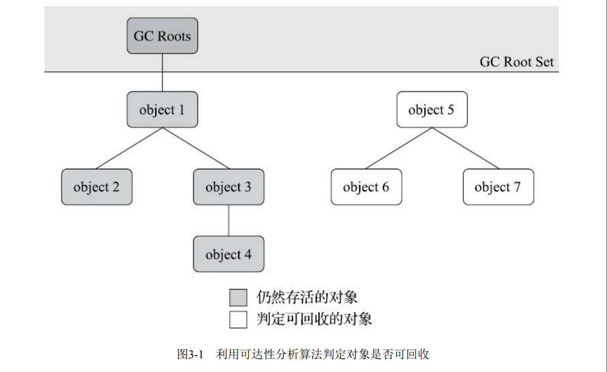

3.2 对象已死？
在堆里面存放着Java世界中几乎所有的对象实例，垃圾收集器在对堆进行回收前，第一件事情就
是要确定这些对象之中哪些还“存活”着，哪些已经“死去”（“死去”即不可能再被任何途径使用的对
象）了。

3.2.1 引用计数算法
很多教科书判断对象是否存活的算法是这样的：在对象中添加一个引用计数器，每当有一个地方
引用它时，计数器值就加一；当引用失效时，计数器值就减一；任何时刻计数器为零的对象就是不可
能再被使用的。笔者面试过很多应届生和一些有多年工作经验的开发人员，他们对于这个问题给予的
都是这个答案。
客观地说，引用计数算法（Reference Counting）虽然占用了一些额外的内存空间来进行计数，但
它的原理简单，判定效率也很高，在大多数情况下它都是一个不错的算法。也有一些比较著名的应用
案例，例如微软COM（Component Object Model）技术、使用ActionScript 3的FlashPlayer、Python语
言以及在游戏脚本领域得到许多应用的Squirrel中都使用了引用计数算法进行内存管理。但是，在Java
领域，至少主流的Java虚拟机里面都没有选用引用计数算法来管理内存，主要原因是，这个看似简单
的算法有很多例外情况要考虑，必须要配合大量额外处理才能保证正确地工作，譬如单纯的引用计数
就很难解决对象之间相互循环引用的问题。
举个简单的例子，请看代码清单3-1中的testGC()方法：对象objA和objB都有字段instance，赋值令
objA.instance=objB及objB.instance=objA，除此之外，这两个对象再无任何引用，实际上这两个对象已
经不可能再被访问，但是它们因为互相引用着对方，导致它们的引用计数都不为零，引用计数算法也
就无法回收它们。
代码清单3-1 引用计数算法的缺陷
cn.locusc.duo.jvm.part2.chapter3.codelist.ReferenceCountingGC31
运行结果:
[Full GC (System) [Tenured: 0K->210K(10240K), 0.0149142 secs] 4603K->210K(19456K), [Perm : 2999K->2999K(21248K)]Heap
def new generation total 9216K, used 82K [0x00000000055e0000, 0x0000000005fe0000, 0x0000000005fe0000)
Eden space 8192K, 1% used [0x00000000055e0000, 0x00000000055f4850, 0x0000000005de0000)
from space 1024K, 0% used [0x0000000005de0000, 0x0000000005de0000, 0x0000000005ee0000)
to space 1024K, 0% used [0x0000000005ee0000, 0x0000000005ee0000, 0x0000000005fe0000)
tenured generation total 10240K, used 210K [0x0000000005fe0000, 0x00000000069e0000, 0x00000000069e0000)
the space 10240K, 2% used [0x0000000005fe0000, 0x0000000006014a18, 0x0000000006014c00, 0x00000000069e0000)compacting perm gen total 21248K, used 3016K [0x00000000069e0000, 0x0000000007ea0000, 0x000000000bde0000)
the space 21248K, 14% used [0x00000000069e0000, 0x0000000006cd2398, 0x0000000006cd2400, 0x0000000007ea0000)No shared spaces configured.

从运行结果中可以清楚看到内存回收日志中包含“4603K->210K”，意味着虚拟机并没有因为这两
个对象互相引用就放弃回收它们，这也从侧面说明了Java虚拟机并不是通过引用计数算法来判断对象
是否存活的。

3.2.2 可达性分析算法
当前主流的商用程序语言（Java、C#，上溯至前面提到的古老的Lisp）的内存管理子系统，都是
通过可达性分析（Reachability Analysis）算法来判定对象是否存活的。这个算法的基本思路就是通过
一系列称为“GC Roots”的根对象作为起始节点集，从这些节点开始，根据引用关系向下搜索，搜索过
程所走过的路径称为“引用链”（Reference Chain），如果某个对象到GC Roots间没有任何引用链相连，
或者用图论的话来说就是从GC Roots到这个对象不可达时，则证明此对象是不可能再被使用的。
如图3-1所示，对象object 5、object 6、object 7虽然互有关联，但是它们到GC Roots是不可达的，
因此它们将会被判定为可回收的对象。

在Java技术体系里面，固定可作为GC Roots的对象包括以下几种：
·在虚拟机栈（栈帧中的本地变量表）中引用的对象，譬如各个线程被调用的方法堆栈中使用到的
参数、局部变量、临时变量等。
·在方法区中类静态属性引用的对象，譬如Java类的引用类型静态变量。
·在方法区中常量引用的对象，譬如字符串常量池（String Table）里的引用。
·在本地方法栈中JNI（即通常所说的Native方法）引用的对象。
·Java虚拟机内部的引用，如基本数据类型对应的Class对象，一些常驻的异常对象（比如NullPointExcepiton、OutOfMemoryError）等，还有系统类加载器。
·所有被同步锁（synchronized关键字）持有的对象。
·反映Java虚拟机内部情况的JMXBean、JVMTI中注册的回调、本地代码缓存等。

除了这些固定的GC Roots集合以外，根据用户所选用的垃圾收集器以及当前回收的内存区域不
同，还可以有其他对象“临时性”地加入，共同构成完整GC Roots集合。譬如后文将会提到的分代收集
和局部回收（Partial GC），如果只针对Java堆中某一块区域发起垃圾收集时（如最典型的只针对新生
代的垃圾收集），必须考虑到内存区域是虚拟机自己的实现细节（在用户视角里任何内存区域都是不
可见的），更不是孤立封闭的，所以某个区域里的对象完全有可能被位于堆中其他区域的对象所引
用，这时候就需要将这些关联区域的对象也一并加入GC Roots集合中去，才能保证可达性分析的正确
性。
目前最新的几款垃圾收集器[1]无一例外都具备了局部回收的特征，为了避免GC Roots包含过多对
象而过度膨胀，它们在实现上也做出了各种优化处理。关于这些概念、优化技巧以及各种不同收集器
实现等内容，都将在本章后续内容中一一介绍。
[1] 如OpenJDK中的G1、Shenandoah、ZGC以及Azul的PGC、C4这些收集器。

3.2.3 再谈引用
无论是通过引用计数算法判断对象的引用数量，还是通过可达性分析算法判断对象是否引用链可
达，判定对象是否存活都和“引用”离不开关系。在JDK 1.2版之前，Java里面的引用是很传统的定义：
如果reference类型的数据中存储的数值代表的是另外一块内存的起始地址，就称该reference数据是代表
某块内存、某个对象的引用。这种定义并没有什么不对，只是现在看来有些过于狭隘了，一个对象在
这种定义下只有“被引用”或者“未被引用”两种状态，对于描述一些“食之无味，弃之可惜”的对象就显
得无能为力。譬如我们希望能描述一类对象：当内存空间还足够时，能保留在内存之中，如果内存空
间在进行垃圾收集后仍然非常紧张，那就可以抛弃这些对象——很多系统的缓存功能都符合这样的应
用场景。
在JDK 1.2版之后，Java对引用的概念进行了扩充，将引用分为强引用（Strongly Re-ference）、软
引用（Soft Reference）、弱引用（Weak Reference）和虚引用（Phantom Reference）4种，这4种引用强
度依次逐渐减弱。
·强引用是最传统的“引用”的定义，是指在程序代码之中普遍存在的引用赋值，即类似“Object
obj=new Object()”这种引用关系。无论任何情况下，只要强引用关系还存在，垃圾收集器就永远不会回
收掉被引用的对象。
·软引用是用来描述一些还有用，但非必须的对象。只被软引用关联着的对象，在系统将要发生内
存溢出异常前，会把这些对象列进回收范围之中进行第二次回收，如果这次回收还没有足够的内存，
才会抛出内存溢出异常。在JDK 1.2版之后提供了SoftReference类来实现软引用。
·弱引用也是用来描述那些非必须对象，但是它的强度比软引用更弱一些，被弱引用关联的对象只
能生存到下一次垃圾收集发生为止。当垃圾收集器开始工作，无论当前内存是否足够，都会回收掉只
被弱引用关联的对象。在JDK 1.2版之后提供了WeakReference类来实现弱引用。
·虚引用也称为“幽灵引用”或者“幻影引用”，它是最弱的一种引用关系。一个对象是否有虚引用的
存在，完全不会对其生存时间构成影响，也无法通过虚引用来取得一个对象实例。为一个对象设置虚
引用关联的唯一目的只是为了能在这个对象被收集器回收时收到一个系统通知。在JDK 1.2版之后提供
了PhantomReference类来实现虚引用。

3.2.4 生存还是死亡？
即使在可达性分析算法中判定为不可达的对象，也不是“非死不可”的，这时候它们暂时还处于“缓
刑”阶段，要真正宣告一个对象死亡，至少要经历两次标记过程：如果对象在进行可达性分析后发现没
有与GC Roots相连接的引用链，那它将会被第一次标记，随后进行一次筛选，筛选的条件是此对象是
否有必要执行finalize()方法。假如对象没有覆盖finalize()方法，或者finalize()方法已经被虚拟机调用
过，那么虚拟机将这两种情况都视为“没有必要执行”。
如果这个对象被判定为确有必要执行finalize()方法，那么该对象将会被放置在一个名为F-Queue的
队列之中，并在稍后由一条由虚拟机自动建立的、低调度优先级的Finalizer线程去执行它们的finalize()
方法。这里所说的“执行”是指虚拟机会触发这个方法开始运行，但并不承诺一定会等待它运行结束。
这样做的原因是，如果某个对象的finalize()方法执行缓慢，或者更极端地发生了死循环，将很可能导
致F-Queue队列中的其他对象永久处于等待，甚至导致整个内存回收子系统的崩溃。finalize()方法是对
象逃脱死亡命运的最后一次机会，稍后收集器将对F-Queue中的对象进行第二次小规模的标记，如果对
象要在finalize()中成功拯救自己——只要重新与引用链上的任何一个对象建立关联即可，譬如把自己
（this关键字）赋值给某个类变量或者对象的成员变量，那在第二次标记时它将被移出“即将回收”的集
合；如果对象这时候还没有逃脱，那基本上它就真的要被回收了。从代码清单3-2中我们可以看到一个
对象的finalize()被执行，但是它仍然可以存活。
代码清单3-2 一次对象自我拯救的演示(cn.locusc.duo.jvm.part2.chapter3.codelist.ReferenceCountingGC31)
运行结果：
finalize method executed!
yes, i am still alive :)
no, i am dead :(

从代码清单3-2的运行结果可以看到，SAVE_HOOK对象的finalize()方法确实被垃圾收集器触发
过，并且在被收集前成功逃脱了。
另外一个值得注意的地方就是，代码中有两段完全一样的代码片段，执行结果却是一次逃脱成
功，一次失败了。这是因为任何一个对象的finalize()方法都只会被系统自动调用一次，如果对象面临
下一次回收，它的finalize()方法不会被再次执行，因此第二段代码的自救行动失败了。
还有一点需要特别说明，上面关于对象死亡时finalize()方法的描述可能带点悲情的艺术加工，笔
者并不鼓励大家使用这个方法来拯救对象。相反，笔者建议大家尽量避免使用它，因为它并不能等同
于C和C++语言中的析构函数，而是Java刚诞生时为了使传统C、C++程序员更容易接受Java所做出的一
项妥协。它的运行代价高昂，不确定性大，无法保证各个对象的调用顺序，如今已被官方明确声明为
不推荐使用的语法。有些教材中描述它适合做“关闭外部资源”之类的清理性工作，这完全是对finalize()
方法用途的一种自我安慰。finalize()能做的所有工作，使用try-finally或者其他方式都可以做得更好、
更及时，所以笔者建议大家完全可以忘掉Java语言里面的这个方法。

3.2.5 回收方法区
有些人认为方法区（如HotSpot虚拟机中的元空间或者永久代）是没有垃圾收集行为的，《Java虚
拟机规范》中提到过可以不要求虚拟机在方法区中实现垃圾收集，事实上也确实有未实现或未能完整
实现方法区类型卸载的收集器存在（如JDK 11时期的ZGC收集器就不支持类卸载），方法区垃圾收集
的“性价比”通常也是比较低的：在Java堆中，尤其是在新生代中，对常规应用进行一次垃圾收集通常
可以回收70%至99%的内存空间，相比之下，方法区回收囿于苛刻的判定条件，其区域垃圾收集的回
收成果往往远低于此。
方法区的垃圾收集主要回收两部分内容：废弃的常量和不再使用的类型。回收废弃常量与回收
Java堆中的对象非常类似。举个常量池中字面量回收的例子，假如一个字符串“java”曾经进入常量池
中，但是当前系统又没有任何一个字符串对象的值是“java”，换句话说，已经没有任何字符串对象引用
常量池中的“java”常量，且虚拟机中也没有其他地方引用这个字面量。如果在这时发生内存回收，而且
垃圾收集器判断确有必要的话，这个“java”常量就将会被系统清理出常量池。常量池中其他类（接
口）、方法、字段的符号引用也与此类似。
判定一个常量是否“废弃”还是相对简单，而要判定一个类型是否属于“不再被使用的类”的条件就
比较苛刻了。需要同时满足下面三个条件：
·该类所有的实例都已经被回收，也就是Java堆中不存在该类及其任何派生子类的实例。
·加载该类的类加载器已经被回收，这个条件除非是经过精心设计的可替换类加载器的场景，如
OSGi、JSP的重加载等，否则通常是很难达成的。
·该类对应的java.lang.Class对象没有在任何地方被引用，无法在任何地方通过反射访问该类的方
法。
Java虚拟机被允许对满足上述三个条件的无用类进行回收，这里说的仅仅是“被允许”，而并不是
和对象一样，没有引用了就必然会回收。关于是否要对类型进行回收，HotSpot虚拟机提供了Xnoclassgc参数进行控制，还可以使用-verbose：class以及-XX：+TraceClass-Loading、-XX：
+TraceClassUnLoading查看类加载和卸载信息，其中-verbose：class和-XX：+TraceClassLoading可以在
Product版的虚拟机中使用，-XX：+TraceClassUnLoading参数需要FastDebug版[1]的虚拟机支持。
在大量使用反射、动态代理、CGLib等字节码框架，动态生成JSP以及OSGi这类频繁自定义类加载
器的场景中，通常都需要Java虚拟机具备类型卸载的能力，以保证不会对方法区造成过大的内存压
力。
[1] Product版、FastDebug版HotSpot虚拟机的差别可参见前文1.6节。

