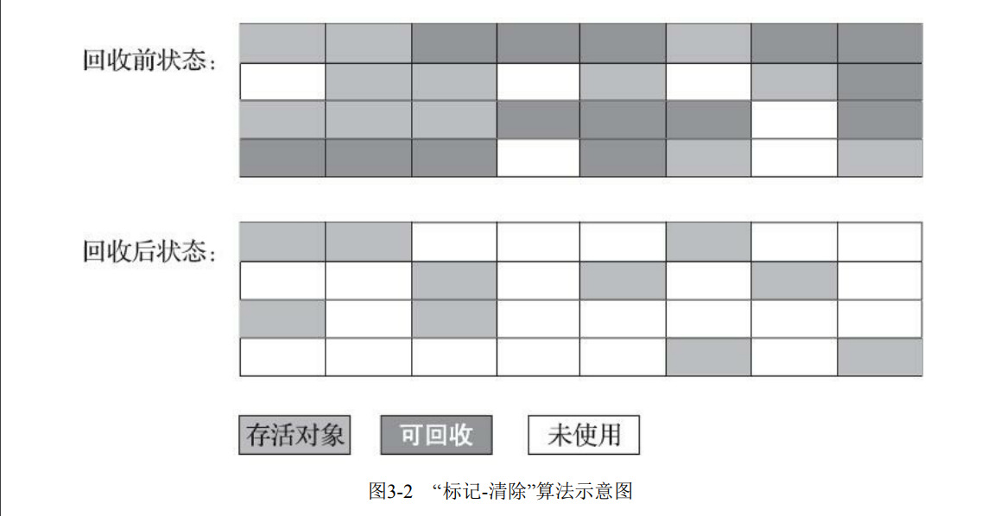
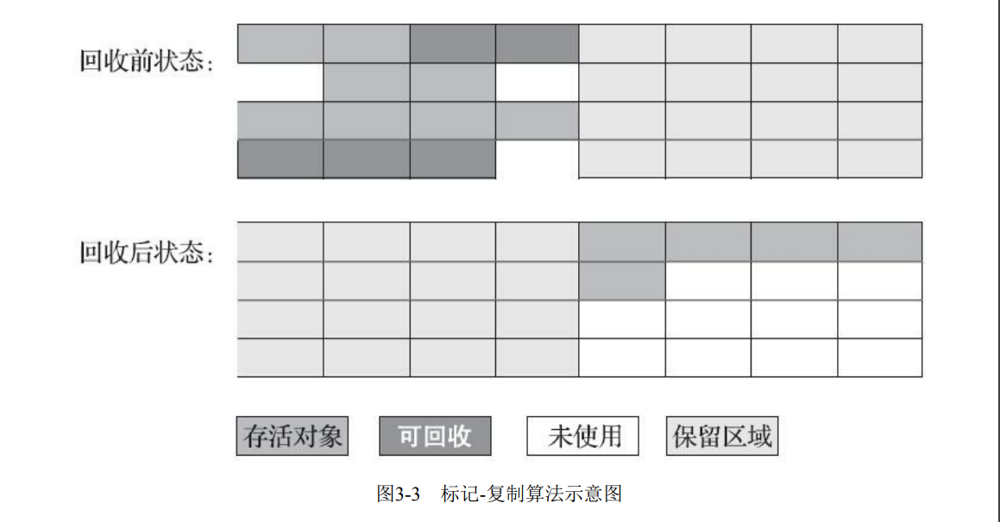
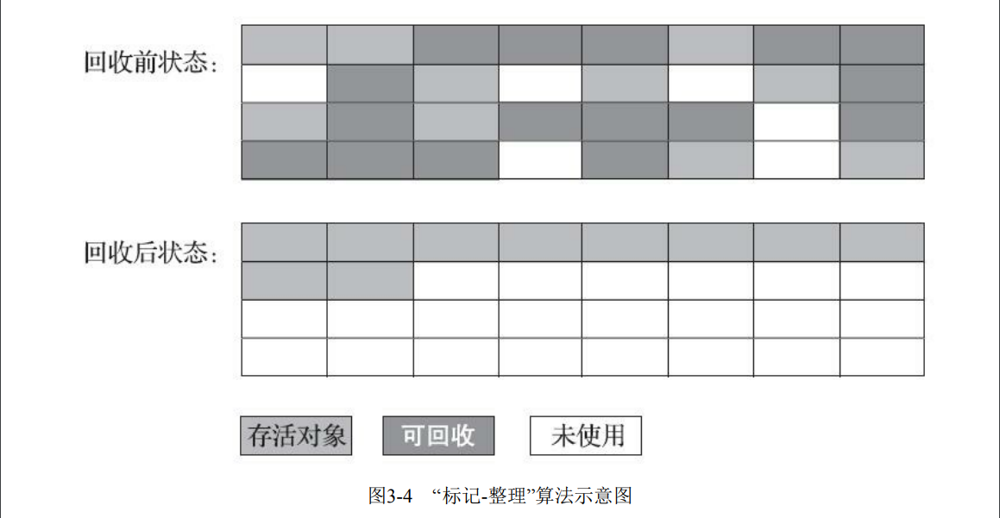

3.3 垃圾收集算法
垃圾收集算法的实现涉及大量的程序细节，且各个平台的虚拟机操作内存的方法都有差异，在本
节中我们暂不过多讨论算法实现，只重点介绍分代收集理论和几种算法思想及其发展过程。如果读者
对其中的理论细节感兴趣，推荐阅读Richard Jones撰写的《垃圾回收算法手册》[1]的第2～4章的相关
内容。
从如何判定对象消亡的角度出发，垃圾收集算法可以划分为“引用计数式垃圾收集”（Reference
Counting GC）和“追踪式垃圾收集”（Tracing GC）两大类，这两类也常被称作“直接垃圾收集”和“间接
垃圾收集”。由于引用计数式垃圾收集算法在本书讨论到的主流Java虚拟机中均未涉及，所以我们暂不
把它作为正文主要内容来讲解，本节介绍的所有算法均属于追踪式垃圾收集的范畴。
[1] 原著名为《The Garbage Collection Handbook》，2011年出版，中文版在2016年由机械工业出版社翻
译引进国内。

3.3.1 分代收集理论
当前商业虚拟机的垃圾收集器，大多数都遵循了“分代收集”（Generational Collection）[1]的理论进
行设计，分代收集名为理论，实质是一套符合大多数程序运行实际情况的经验法则，它建立在两个分
代假说之上：
1）弱分代假说（Weak Generational Hypothesis）：绝大多数对象都是朝生夕灭的。
2）强分代假说（Strong Generational Hypothesis）：熬过越多次垃圾收集过程的对象就越难以消
亡。
这两个分代假说共同奠定了多款常用的垃圾收集器的一致的设计原则：收集器应该将Java堆划分
出不同的区域，然后将回收对象依据其年龄（年龄即对象熬过垃圾收集过程的次数）分配到不同的区
域之中存储。显而易见，如果一个区域中大多数对象都是朝生夕灭，难以熬过垃圾收集过程的话，那
么把它们集中放在一起，每次回收时只关注如何保留少量存活而不是去标记那些大量将要被回收的对
象，就能以较低代价回收到大量的空间；如果剩下的都是难以消亡的对象，那把它们集中放在一块，
虚拟机便可以使用较低的频率来回收这个区域，这就同时兼顾了垃圾收集的时间开销和内存的空间有
效利用。
在Java堆划分出不同的区域之后，垃圾收集器才可以每次只回收其中某一个或者某些部分的区域
——因而才有了“Minor GC”“Major GC”“Full GC”这样的回收类型的划分；也才能够针对不同的区域安
排与里面存储对象存亡特征相匹配的垃圾收集算法——因而发展出了“标记-复制算法”“标记-清除算
法”“标记-整理算法”等针对性的垃圾收集算法。这里笔者提前提及了一些新的名词，它们都是本章的
重要角色，稍后都会逐一登场，现在读者只需要知道，这一切的出现都始于分代收集理论。
把分代收集理论具体放到现在的商用Java虚拟机里，设计者一般至少会把Java堆划分为新生代
（Young Generation）和老年代（Old Generation）两个区域[2]。顾名思义，在新生代中，每次垃圾收集
时都发现有大批对象死去，而每次回收后存活的少量对象，将会逐步晋升到老年代中存放。如果读者
有兴趣阅读HotSpot虚拟机源码的话，会发现里面存在着一些名为“*Generation”的实现，
如“DefNewGeneration”和“ParNewGeneration”等，这些就是HotSpot的“分代式垃圾收集器框架”。原本
HotSpot鼓励开发者尽量在这个框架内开发新的垃圾收集器，但除了最早期的两组四款收集器之外，后
来的开发者并没有继续遵循。导致此事的原因有很多，最根本的是分代收集理论仍在不断发展之中，
如何实现也有许多细节可以改进，被既定的代码框架约束反而不便。其实我们只要仔细思考一下，也
很容易发现分代收集并非只是简单划分一下内存区域那么容易，它至少存在一个明显的困难：对象不
是孤立的，对象之间会存在跨代引用。
假如要现在进行一次只局限于新生代区域内的收集（Minor GC），但新生代中的对象是完全有可
能被老年代所引用的，为了找出该区域中的存活对象，不得不在固定的GC Roots之外，再额外遍历整
个老年代中所有对象来确保可达性分析结果的正确性，反过来也是一样[3]。遍历整个老年代所有对象
的方案虽然理论上可行，但无疑会为内存回收带来很大的性能负担。为了解决这个问题，就需要对分
代收集理论添加第三条经验法则：
3）跨代引用假说（Intergenerational Reference Hypothesis）：跨代引用相对于同代引用来说仅占极
少数。

这其实是可根据前两条假说逻辑推理得出的隐含推论：存在互相引用关系的两个对象，是应该倾
向于同时生存或者同时消亡的。举个例子，如果某个新生代对象存在跨代引用，由于老年代对象难以
消亡，该引用会使得新生代对象在收集时同样得以存活，进而在年龄增长之后晋升到老年代中，这时
跨代引用也随即被消除了。
依据这条假说，我们就不应再为了少量的跨代引用去扫描整个老年代，也不必浪费空间专门记录
每一个对象是否存在及存在哪些跨代引用，只需在新生代上建立一个全局的数据结构（该结构被称
为“记忆集”，Remembered Set），这个结构把老年代划分成若干小块，标识出老年代的哪一块内存会
存在跨代引用。此后当发生Minor GC时，只有包含了跨代引用的小块内存里的对象才会被加入到GC
Roots进行扫描。虽然这种方法需要在对象改变引用关系（如将自己或者某个属性赋值）时维护记录数
据的正确性，会增加一些运行时的开销，但比起收集时扫描整个老年代来说仍然是划算的。
注意 刚才我们已经提到了“Minor GC”，后续文中还会出现其他针对不同分代的类似名词，
为避免读者产生混淆，在这里统一定义：
·部分收集（Partial GC）：指目标不是完整收集整个Java堆的垃圾收集，其中又分为：
■新生代收集（Minor GC/Young GC）：指目标只是新生代的垃圾收集。
■老年代收集（Major GC/Old GC）：指目标只是老年代的垃圾收集。目前只有CMS收集器会有单
独收集老年代的行为。另外请注意“Major GC”这个说法现在有点混淆，在不同资料上常有不同所指，
读者需按上下文区分到底是指老年代的收集还是整堆收集。
■混合收集（Mixed GC）：指目标是收集整个新生代以及部分老年代的垃圾收集。目前只有G1收
集器会有这种行为。
·整堆收集（Full GC）：收集整个Java堆和方法区的垃圾收集。
[1] 值得注意的是，分代收集理论也有其缺陷，最新出现（或在实验中）的几款垃圾收集器都展现出了
面向全区域收集设计的思想，或者可以支持全区域不分代的收集的工作模式。
[2] 新生代（Young）、老年代（Old）是HotSpot虚拟机，也是现在业界主流的命名方式。在IBM J9虚
拟机中对应称为婴儿区（Nursery）和长存区（Tenured），名字不同但其含义是一样的。
[3] 通常能单独发生收集行为的只是新生代，所以这里“反过来”的情况只是理论上允许，实际上除了
CMS收集器，其他都不存在只针对老年代的收集。

3.3.2 标记-清除算法
最早出现也是最基础的垃圾收集算法是“标记-清除”（Mark-Sweep）算法，在1960年由Lisp之父
John McCarthy所提出。如它的名字一样，算法分为“标记”和“清除”两个阶段：首先标记出所有需要回
收的对象，在标记完成后，统一回收掉所有被标记的对象，也可以反过来，标记存活的对象，统一回
收所有未被标记的对象。标记过程就是对象是否属于垃圾的判定过程，这在前一节讲述垃圾对象标记
判定算法时其实已经介绍过了。
之所以说它是最基础的收集算法，是因为后续的收集算法大多都是以标记-清除算法为基础，对其
缺点进行改进而得到的。它的主要缺点有两个：第一个是执行效率不稳定，如果Java堆中包含大量对
象，而且其中大部分是需要被回收的，这时必须进行大量标记和清除的动作，导致标记和清除两个过
程的执行效率都随对象数量增长而降低；第二个是内存空间的碎片化问题，标记、清除之后会产生大
量不连续的内存碎片，空间碎片太多可能会导致当以后在程序运行过程中需要分配较大对象时无法找
到足够的连续内存而不得不提前触发另一次垃圾收集动作。标记-清除算法的执行过程如图3-2所示。

3.3.3 标记-复制算法
标记-复制算法常被简称为复制算法。为了解决标记-清除算法面对大量可回收对象时执行效率低
的问题，1969年Fenichel提出了一种称为“半区复制”（Semispace Copying）的垃圾收集算法，它将可用
内存按容量划分为大小相等的两块，每次只使用其中的一块。当这一块的内存用完了，就将还存活着
的对象复制到另外一块上面，然后再把已使用过的内存空间一次清理掉。如果内存中多数对象都是存
活的，这种算法将会产生大量的内存间复制的开销，但对于多数对象都是可回收的情况，算法需要复
制的就是占少数的存活对象，而且每次都是针对整个半区进行内存回收，分配内存时也就不用考虑有
空间碎片的复杂情况，只要移动堆顶指针，按顺序分配即可。这样实现简单，运行高效，不过其缺陷
也显而易见，这种复制回收算法的代价是将可用内存缩小为了原来的一半，空间浪费未免太多了一
点。标记-复制算法的执行过程如图3-3所示。

现在的商用Java虚拟机大多都优先采用了这种收集算法去回收新生代，IBM公司曾有一项专门研
究对新生代“朝生夕灭”的特点做了更量化的诠释——新生代中的对象有98%熬不过第一轮收集。因此
并不需要按照1∶1的比例来划分新生代的内存空间。
在1989年，Andrew Appel针对具备“朝生夕灭”特点的对象，提出了一种更优化的半区复制分代策
略，现在称为“Appel式回收”。HotSpot虚拟机的Serial、ParNew等新生代收集器均采用了这种策略来设
计新生代的内存布局[1]。Appel式回收的具体做法是把新生代分为一块较大的Eden空间和两块较小的
Survivor空间，每次分配内存只使用Eden和其中一块Survivor。发生垃圾搜集时，将Eden和Survivor中仍
然存活的对象一次性复制到另外一块Survivor空间上，然后直接清理掉Eden和已用过的那块Survivor空
间。HotSpot虚拟机默认Eden和Survivor的大小比例是8∶1，也即每次新生代中可用内存空间为整个新
生代容量的90%（Eden的80%加上一个Survivor的10%），只有一个Survivor空间，即10%的新生代是会
被“浪费”的。当然，98%的对象可被回收仅仅是“普通场景”下测得的数据，任何人都没有办法百分百
保证每次回收都只有不多于10%的对象存活，因此Appel式回收还有一个充当罕见情况的“逃生门”的安
全设计，当Survivor空间不足以容纳一次Minor GC之后存活的对象时，就需要依赖其他内存区域（实
际上大多就是老年代）进行分配担保（Handle Promotion）。
内存的分配担保好比我们去银行借款，如果我们信誉很好，在98%的情况下都能按时偿还，于是
银行可能会默认我们下一次也能按时按量地偿还贷款，只需要有一个担保人能保证如果我不能还款
时，可以从他的账户扣钱，那银行就认为没有什么风险了。内存的分配担保也一样，如果另外一块
Survivor空间没有足够空间存放上一次新生代收集下来的存活对象，这些对象便将通过分配担保机制直
接进入老年代，这对虚拟机来说就是安全的。关于对新生代进行分配担保的内容，在稍后的3.8.5节介
绍垃圾收集器执行规则时还会再进行讲解。
[1] 这里需要说明一下，HotSpot中的这种分代方式从最初就是这种布局，和IBM的研究并没有什么实
际关系。这里笔者列举IBM的研究只是为了说明这种分代布局的意义所在。

3.3.4 标记-整理算法
标记-复制算法在对象存活率较高时就要进行较多的复制操作，效率将会降低。更关键的是，如果
不想浪费50%的空间，就需要有额外的空间进行分配担保，以应对被使用的内存中所有对象都100%存
活的极端情况，所以在老年代一般不能直接选用这种算法。
针对老年代对象的存亡特征，1974年Edward Lueders提出了另外一种有针对性的“标记-整
理”（Mark-Compact）算法，其中的标记过程仍然与“标记-清除”算法一样，但后续步骤不是直接对可
回收对象进行清理，而是让所有存活的对象都向内存空间一端移动，然后直接清理掉边界以外的内
存，“标记-整理”算法的示意图如图3-4所示。
标记-清除算法与标记-整理算法的本质差异在于前者是一种非移动式的回收算法，而后者是移动
式的。是否移动回收后的存活对象是一项优缺点并存的风险决策：

如果移动存活对象，尤其是在老年代这种每次回收都有大量对象存活区域，移动存活对象并更新
所有引用这些对象的地方将会是一种极为负重的操作，而且这种对象移动操作必须全程暂停用户应用
程序才能进行[1]，这就更加让使用者不得不小心翼翼地权衡其弊端了，像这样的停顿被最初的虚拟机
设计者形象地描述为“Stop The World”
[2]。
但如果跟标记-清除算法那样完全不考虑移动和整理存活对象的话，弥散于堆中的存活对象导致的
空间碎片化问题就只能依赖更为复杂的内存分配器和内存访问器来解决。譬如通过“分区空闲分配链
表”来解决内存分配问题（计算机硬盘存储大文件就不要求物理连续的磁盘空间，能够在碎片化的硬盘
上存储和访问就是通过硬盘分区表实现的）。内存的访问是用户程序最频繁的操作，甚至都没有之
一，假如在这个环节上增加了额外的负担，势必会直接影响应用程序的吞吐量。
基于以上两点，是否移动对象都存在弊端，移动则内存回收时会更复杂，不移动则内存分配时会
更复杂。从垃圾收集的停顿时间来看，不移动对象停顿时间会更短，甚至可以不需要停顿，但是从整
个程序的吞吐量来看，移动对象会更划算。此语境中，吞吐量的实质是赋值器（Mutator，可以理解为
使用垃圾收集的用户程序，本书为便于理解，多数地方用“用户程序”或“用户线程”代替）与收集器的
效率总和。即使不移动对象会使得收集器的效率提升一些，但因内存分配和访问相比垃圾收集频率要
高得多，这部分的耗时增加，总吞吐量仍然是下降的。HotSpot虚拟机里面关注吞吐量的Parallel
Scavenge收集器是基于标记-整理算法的，而关注延迟的CMS收集器则是基于标记-清除算法的，这也从
侧面印证这点。
另外，还有一种“和稀泥式”解决方案可以不在内存分配和访问上增加太大额外负担，做法是让虚
拟机平时多数时间都采用标记-清除算法，暂时容忍内存碎片的存在，直到内存空间的碎片化程度已经
大到影响对象分配时，再采用标记-整理算法收集一次，以获得规整的内存空间。前面提到的基于标
记-清除算法的CMS收集器面临空间碎片过多时采用的就是这种处理办法。
[1] 最新的ZGC和Shenandoah收集器使用读屏障（Read Barrier）技术实现了整理过程与用户线程的并发
执行，稍后将会介绍这种收集器的工作原理。
[2] 通常标记-清除算法也是需要停顿用户线程来标记、清理可回收对象的，只是停顿时间相对而言要
来的短而已。