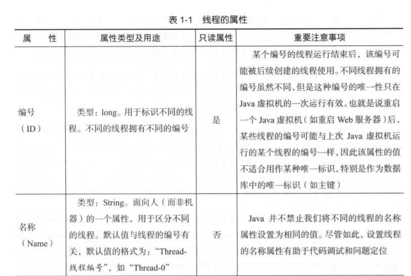
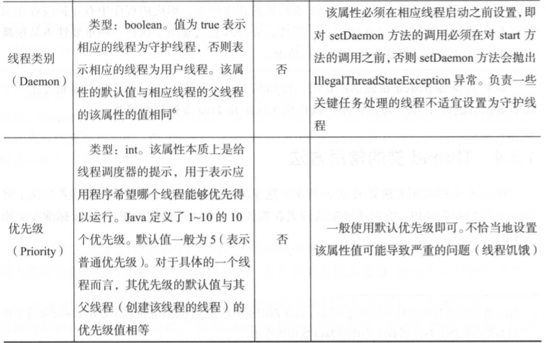
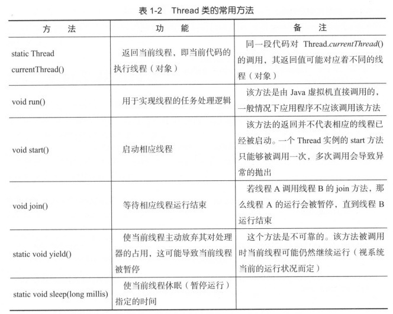
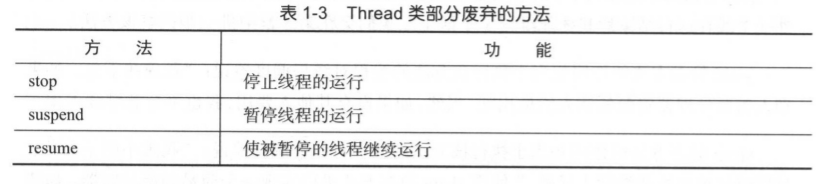
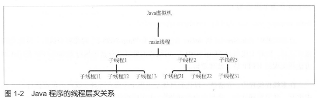

### 第一章 走进Java世界中的线程
#### 1.1 进程、线程与任务

进程(Process)是程序的运行实例
清单1-1 一个简单的 Java 程序(chapter1.codelist.SimpleJavaApp)

linux系统查看进程命令
ps -ef | grep "SimpleJavaApp" | grep - v "grep"

上述命令的输出类似如下：
viscent 8037 6596 0 19 : 24 pts/6 00:00:00 java chapter1.codelist.SimpleJavaApp

进程是程序是向操作系统申请资源(如内存空间和文件句柄)的基本单位
线程(Thread)是进程中可独立执行的最小单位
例如, 一个实现从服务器上下载大文件功能的程序为了提高其文件下载效率可以使用多个线程,
这些线程各自独立地从服务器上下载大文件中的一段数据.

一个进程可以包含多个线程. 同一个进程中的所有线程共享该进程中的资源如内存空间和文件句柄等
进程和线程之间的关系, 就好比一个营业中的饭店与其正在工作的员之间的关系。
一个营业中的饭店对外为顾客提供餐饮服务, 而这种服务最终是通过该饭店
的员工实现的, 这些工作中的员工有的在迎宾, 有的在烹调, 有的给顾客上菜
们在其工作过程中共享该饭店的资源, 如食材、餐具、清洁用具等

线程所要完成的计算就被称为任务, 特定的线程总是在执行着特定的任务.
任务代表线程所要完成的工作, 它是一个相对的概念

#### 1.2 多线程编程简介

##### 1.2.1 什么是多线程编程
函数式编程(Functional Programming)中的函数是基本抽象单位, 面向对象编程中的
类(class)是基本抽象单位. 类似地, 多线程编程就是以线程为基本抽象单位的一种编
程范式(Paradigm). 但是, 多线程编程又不仅仅是使用多个线程进行编程那么简单, 其
自身又有其需要解决的问题. 当然, 多线程编程和面向对象编程是可以相容的, 即我们
可以在面向对象编程的基础上实现多线程编程, 事实上 Java 平台中的一个线程就是一个对象

##### 1.2.2 为什么使用多线程
Web服务器(如Apache Tomcat)常常在同一时间内会收到多个HTTP请求, 为了避多
个请求的处理快慢影响到其他请求的处理, 绝大多数服务器都会采用 些专门的线程
(工作者线程)负责请求处理, 这些线程各自处理分配给它的请求, 从而使得一个请求处
理的快慢不会对其他请求的处理产生影响(当然, 这里的"不影响"是相对的). 这有点
像快餐店在点餐顾客多的情况下多开几条点餐线, 以减少每个顾客的等待时间.

#### 1.3 Java线程API简介
Java标准库类java.lang.Thread就是Java平台对线程的实现. Thread类或其子类的一
个实例就是一个线程

##### 1.3.1 线程的创建、启动与运行
每个线程都有其要执行的任务. 线程的任务处理逻辑可以在Thread类的run实例方
法中直接实现或者通过该方法进行调用, 因此run方法相当于线程的任务处理逻辑的入口
方法, 它由Java虚拟机在运行相应线程时直接调用, 而不是由应用代码进行调用

运行一个线程实际上就是让Java虚拟机执行该线程的run方法, 从而使相应线程的任
务处理逻辑代码得以执行. 为此, 我们首先要启动线程Thread类的start方法的作用是启
动相应的线程. 启动一个线程的实质是请求Java虚拟机运行相应的线程, 而这个线程具
体何时能够运行是由线程调度器(Scheduler)决定的. 因此, start方法调用结束并不意
味着相应线程已经开始运行, 这个线程可能稍后才被运行, 甚至也可能永远不会被运行.

Thread类的两个常用构造器Thread()和Thread(Runnable target). 相应地, Java
语言中创建线程有两种方式。 一种是使用上述第 个构造器: 定义Thread类的子类, 在该
子类中覆盖(Override)run方法并在该方法中实现线程任务处理逻辑; 另一种是使用上述
第2个构造器:创建一个java.lang.Runnable接口的实例, 并在该实例的run方法中实现任
务处理逻辑, 然后以改Runnable接口实例作为构造器的参数直接创建(new)一个Thread类的实例

在Java平台中, 每个线程均可以有自己的名字, 这个名字便于我们(人)区分不同的线程
假设我们要创建一个处理任务为打印一行欢迎信息的简单线程
如清单1-2和清单1-3所示的代码分别展示了用上述两种方法创建相应的线程

清单1-2 以定义Thread类子类的方式创建线程
chapter1.codelist.WelcomeApp.threadTest1
```
1.Welcome! I`m main.
2.Welcome! I`m Thread-0.
```

清单1-3 以创建Runnable接口实例的方式创建线程
```
1.Welcome! I`m main.
2.Welcome! I`m Thread-0.
```

不管是采用哪种方式创建线程, 一旦线程的run方法执行(由Java虚拟机调用)结束,
相应的线程的运行也就结束了. 当然, run方法执行结束包括正常结束(run方法返回)以
及代码中抛出异常而导致的中止. 运行结束的线程所占用的资源（如内存空间）会如同其
Java对象一样被Java虚拟机垃圾回收

线程属于"一次性用品", 我们不能通过重新调用一个已经运行结束的线程的start
方法来使其重新运行. 事实上, start方法也只能够被调用一次, 多次调用同一个Thread
实例的start方法会导致其抛出IllegalThreadStateException异常

任意一段代码都可以通过调用Thread.currentThread()来获取这段代码的执行线程

清单1-4 应用代码直接调用线程的run方法(避免这样操作)
chapter1.codelist.WelcomeApp.threadTest3
线程的run方法总是由Java虚拟机直接调用的. 尽管如此, Java语言并不阻
止我们直接调用run方法, 这是因为: 首先, 线程在Java平台中也是一个对象, 其次毕竟
run方法也是一个public但是, 多数情况下我们不能这样做, 因为这样做有违创建
线程(对象)的初衷. 例如, 运行如清单1-4所示的程序(改自清单 1-3 ), 我们可以看到
该程序的输出类似如下:
```
2.Welcome! I`m main.
1.Welcome! I`m main.
2.Welcome! I`m Thread-0.
```
因此, 如果我们没有启动线程, 而是在应用代码中直接调用线程的run方法的话, 那么这个
线程的run方法其实运行在当前线程(即run方法的调用方代码的执行线程)之中而不是
运行在其自身线程之中, 从而违背了创建线程的初衷.

##### 1.3.2 Runnable接口
Runnable接口只定义了一个方法.
```java
@FunctionalInterface
public interface Runnable {
    public abstract void run();
}
```

Runnable接口可以被看作对任务进行的抽象, 任务的处理逻辑就体现在run方法之中
Thread类实际上是Runnable接口的一个实现类, 其对Runnable接口的实现如图1-1所示.
```java
public class Thread implements Runnable {
    @Override
    public void run() {
        if (target != null) {
            target.run();
        }
    }
}
```
Thread类的run方法中实现的逻辑是如果target不为null, 那么就调用target.run(),
否则它什么也不做, 其中, 实例变量target类型为Runnable如果相应的线程实例是通
过构造器Thread(Runnable target)创建的, 那么target的值为构造器中的数值, 否则target
的值为null. 因此, Thread类所实现的任务处理逻辑是要么什么也不做(target为null),
要么直接执行target所引用的Runnable实例所实现的任务处理逻辑. Thread类的run方法
的这种处理逻辑决定了创建线程的两种方式: 一种是在Thread子类的 run方法中直接实
现任务处理逻辑, 另一种是在一个Runnable实例中实现任务处理逻辑, 诙逻辑由Thread
类的run方法负责调用

扩展阅读: 线程两种创建方式的区别
从面相对象编程的角度来看: 
第一种创建方式(创建Thread类的子类)是一种基于
继承(Inheritance)的技术, 第一种创建方式(以Runnable接口实例为构造器参数直接通
new创建Thread实例)是一种基于组合(Composition)的技术. 由于组合相对继承来
说, 其类和类之间的搞合性(Coupling)更低, 因此它也更加灵活, 一般我们认为组合是
优先选用的技术

从对象共享的角度来看:
第一种创建方式意味着多个线程实例可以共享同一个
Runnable在某些情况下这可能导致程序的运行结果出乎我们的意料. 例如, 在如清单
1-5所示的程序中, 我们分别以第一种和第二种方式各自创建了若干线程, 假设这个程
序运行在处理器个数为4的主机上, 那么该程序的输出中的"CountingTask":"后面跟的数
字最大的数也可能仍小于800(=2*4*100), 而"CountingTread:"后面跟的数字始终都
是100. 对于这个结果的解释会涉及我们将在第2章中提到的竞态和线程安全这两个概念
清单1-5 线程的两种创建方式的区别
chapter1.codelist.ThreadCreationCmp

从对象创建成本的角度来看:
Java中的线程实例是一个"特殊"的Runnable实例,
因为在创建它的时候Java虚拟机会为其分配调用栈空间,内核线程等资源. 因此, 创建
一个线程实例比起创建一个普通的Runnable实例来说, 其成本要相对昂贵一点. 所以,
如果创建Runnable实例再将其作为方法参数传递给其他对象使用
(JDK标准库中有不少API都使用了Runnable接口)
而不必利用它来创建相应的线程(即第二种线程创建方式)
即可满足我们的计算需要, 那么就不要创建线程实例

##### 1.3.3 线程属性
线程的属性包括线程的编号(ID)、名称(Name)、线程类别(Daemon)和优先级(Priority)
详情如表1-1所示


通过名称属性, 我们可以为每个线程设置一个便于区分不同线程的名称. 虽然Java
虚拟机并不要求每个钱程的名称都不同, 但是设置该属性有助于程序调试和问题定位
因此, 我们建议为每个线程都设置一个简短而又能够体现其作用或其实现的功能的名称

线程的属性除了编号外, 其他属性都是可读写的属性, 即Thread类提供了相应的get
方法和set方法用于读取或者设置相应的属性. 例如, getName方法可返回线程的名称属
性值而setName方法则可以设置线程的名称属性值

Java线程的优先级属性本质上只是一个给线程调度器的提示信息, 以便于线程调度器
决定优先调度哪些线程运行, 它并不能保证线程按照其优先级高低的顺序运行. 注意,Java
线程的优先级使用不当或者滥用, 可能导致某些线程永远无法得到运行, 即产生了线程饥
饿(Thread Starvation). 因此, 线程的优先级并不是设置得越高越好,
一般情况下使用普通优先级即可, 不必设置线程的优先级属性

按照线程是否会阻止Java虚拟机正常停止, 我们可以将Java中的线程分为守护线程
(Daemon Thread)和用户线程(User Thread, 也称非守护线程)线程的daemon属性用
于表示相应线程是否为守护线程, 用户线程会阻止Java虚拟机的正常停止, 即Java
虚拟机只有在其所有用户线程都运行结束(即Thread.run()调用未结束)的情况下才能正
常停止, 而守护线程则不会影响Java虚拟机的正常停止, 即应用程序中有守护线程在运
行也不影响Java虚拟机的正常停止. 因此, 守护线程通常用于执行一些重要性不是很高
的任务, 例如用于监视其他线程的运行情况

如果Java虚拟机是被强制停止的, 比如在Linux系统下使用kill命令强制终止
Java虚拟机进程, 那么即使是用户线程也无法阻止Java虚拟机的停止
Java虚拟机正常停止指不是通过System.exit调用也不是通过强制终止进程(如在Linux系统下使
kill命令停止Java进程)实现的Java虚拟机停止
具体命令为: kill -9 PID, 其中参数PID为Java进程的进程ID


##### 1.3.4 Thread类的常用方法
表1-2 Thread类的常用方法
Thread类的常用方法如表1-2所示, 这里列出这些方法只是为了便于读者快速了解
Thread类的相关API, 它并不能取代读者在阅读本书和工作过程中阅读Java标准库文档(JavaDoc)


Java中的任何一段代码总是执行在某个线程之中, 执行当前代码的线程就被称为当前线程,
Thread.currentThread()可以返回当前线程, 由于同一段代码可能被不同的线程执行,
因此当前线程是相对的, 即Thread.currentThread()的返回值在代码实际运行的时候可能对
应着不同的线程(对象)
join 方法的作用相当于执行该方法的线程和线程调度器说:"我得先暂停下, 到另一
个线程运行结束后我才能继续(干活)", 我们会在第五章中进一步讲解该方法.
yield 静态方法的作用相当于执行该方法的线程对线程调度器说:"我现在不急, 如果
别人需要处理器资源的话先给他用吧", 当然, 如果没有其他人要用, 我也不介意继续占用.
sleep 静态方法的作用相当于执行该方法的线程对线程调度器说: "我想小憩一会儿,
过段时间再叫醒我继续干活", 使用sleep静态方法可以实现一个简易的倒计时器,
如清单1-6所示
清单1-6 简易的倒计时器
chapter1.codelist.SimpleTimer

##### 1.3.5 Thread类的一些废弃方法
由于Java虚拟机实现得有些问题, 因此Thread类的有些方法已经被废弃(Deprecated)了
在新写的代码中应该避免使用这些方法. 部分废弃的方法如表1-3所示

虽然表1-3的有些方法并没有相应的替代品, 即实现同样功能的其他方法: 但是, 停
止线程以及暂停和继续运行线程这些功能我们可以使用其他办法来实现.详情请参见本书
的第


#### 1.4 无处不在的线程
Java平台本身就是－个多线程的平台, 除了Java开发人员自己创建和使用的线程(
即Thread 类或其子类的实例), Java平台中其他由Java虚拟机创建、使用的线程也随处可见
当然, 这些线程也是各自有其处理任务.

Java虚拟机启动的时候会创建一个main线程, 该线程负责执行Java程序的入口方法
(main方法), 如清单1-7所示
清单1-7 Java代码的执行线程
chapter1.codelist.JavaThreadAnywhere
利用currentThread方法打印出当前线程的线程名. 其执行时输出如下:
```
The main method was executed by thread: main
The doSomething method was executed by thread: main
Do something with Java Thread AnyWhere
```
从上面的输出可以看出, 类JavaThreadAnywhere的main方法以及类Helper
doSomething方法均由main线程负责执行. 这里, main线程的处理任务就是清单1-7
中main方法所实现的处理逻辑, 包括打印当前线程的线程名称等

Web应用中的servlet类的doGet、doPost等方法也总是由确定的线程负责执行的
(具体与所使用的Web容器有关), 如清单1-8所示
chapter1.codelist.EchoServlet.doGet
如清单1-8所示的Servlet类在处理一个HTTP GET请求时, 其输出可能如下所示(以
Tomcat作为Web容器):
```
// 书中输出
This request was handled by thread:http-8080-2 
// 自己输出
This request was handled by thread:http-bio-8080-exec-1
```

这说明此时EchoServlet的doGet方法在名为"http-8080-2"的线程中执行, 因此我们
也可以说, 此时上述名为"http-8080-2"的线程的处理任务就是执行EchoServlet的doGet
方法所实现的HTTP请求处理逻辑
在多线程编程中, 弄清楚一段代码具体是由哪个(或者哪种)线程去负责执行的这点
很重要, 这关系到性能、线程安全等问题. 本书的后续章节会体现这点
Java虚拟机垃圾回收器(Garbage Collector)负责对Java程序中不再使用的内存空间
进行回收, 而这个回收的动作实际上也是通过专门的线程(垃圾回收线程)实现的, 这些
线程由Java虚拟机自行创建. 从垃圾回收的角度看, Java平台中的线程可以分为垃圾回
收线程和应用线程, 应用线程由Java应用程序开发者创建. 例如, 如清单1-2所示的程序
所创建的线程就是应用线程
为了提高Java代码的执行效率, Java虚拟机中的JIT(Just In Time)编译器会动态地将
Java字节码(Byte Code)编译为Java虚拟机宿主机处理器可直接执行的机器码(本地代码)
这个动态编译的过程实际上是由Java虚拟机创建的专门的线程负责执行的
Java平台中的钱程随处可见, 这些线程各自都有其处理任务

#### 1.5 线程的层次关系
线程与线程之间总是存在一些联系, 假设线程A执行的代码创建了线程B,
那么, 习惯上我们称线程B为线程A的子线程, 相应地线程A
就被称为线程B的父线程. 例如, 清单1-2中的线程welcomeThread是main线程的子线
程, main线程是该线程的父线程. 子线程所执行的代码还可以创建其他线程,因此一个
子线程也可以是其他线程的父线程. 所以, 父线程、子线程是一个相对的称呼

线程间的这种父子关系就被称为线程的层次关系.

由于Java虚拟机创建的main线程也被称为主线程, 
负责执行Java程序的入口方法main方法, 因此main方法中直接创建
的线程都是main线程的子线程, 这些子线程所执行的代码又可能创建其他线程
因此, 这就形成了 Java 程序的线程层次关系. 如图1-2所示


在Java平台中, 一个线程是否是一个守护线程默认取决于其父线程:
默认情况下父线程是守护线程, 则子线程也是守护线程; 父线程是用户线程
另外, 父线程在创建子线程后启动子线程之前可以调用该线程的setDaemon方法,
将相应的线程设置为守护线程(或者用户线程)

优先级:
一个线程的优先级默认值为该线程的父线程的优先级, 即如果我们没有设置或者更改
一个线程的优先级, 那么这个线程的优先级的值与父线程的优先级的值相等

Java平台中并没有API用于获取一个线程的父线程, 


