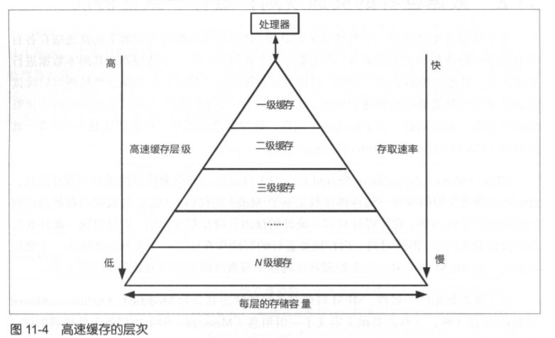
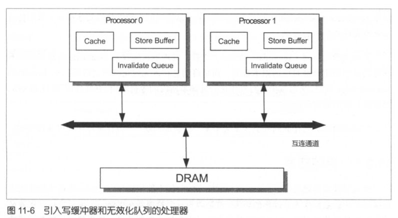

### 11.多线程编程的硬件与Java内存模型
许多硬件部件都有这样一个特点-硬件设计者引入一个部件是为了解决某些问题,
然而这些部件自身又会引入新的问题, 为了解决这些新的问题, 硬件
设计者又引入了其他部件, 因此, 掌握这些部件之间的这种关系有助于我们更好地理解相关部件

Java内存模型是对Java多线程程序的正确性进行推理的理论基础, 了解Java
内存模型有助于编写正确的多线程程序以及进行代码复审

#### 11.1 填补处理器与内存之间的鸿沟: 高速缓存

#### 11.2 数据世界的交通规则: 缓存一致性协议
多个线程并发访问同一个共享变量的时候, 这些线程的执行处理器上的高速缓存各自
都会保留一份该共享变量的副本, 这就带来一个新问题-一个处理器对其副本数据进行
更新之后, 其他处理器如何"察觉"到该更新并做出适当反应, 以确保这些处理器后续读
取该共享变量时能够读取到这个更新, 这就是缓存一致性问题, 其实质就是如何防止读脏
数据和丢失更新的问题, 为了解决这个问题, 处理器之间需要一种通信机制-缓存一致
性协议(Cache Coherence Protocol)

在多个钱程共享变量的情况下, MESI协议已经能够保障一个线程
对共享变量的更新对其他处理器上运行的线程来说是可见的

#### 11.3 硬件缓冲区: 写缓冲器与无效化队列
MESI协议解决了缓存一致性问题, 但是其自身也存在一个性能弱点-处理器执行
写内存操作时, 必须等待其他所有处理器将其高速缓存中的相应副本数据删除并接收到这
些处理器所回复 Invalidate Acknowledge(副本删除完成)/Read Response 消息之后才能将数据写入高速缓
为了规避和减少这种等待造成的写操作的延迟Latency, 硬件设计者引人了写缓冲
器和无效化队列, 如图 11-6 所示

写缓冲器的引入使得处理器在执行写操作的时候可以不等待Invalidate-Acknowledge消息
从而减少了写操作的延时, 这使得写操作的执行处理器在其他处理器回复
Invalidate Acknowledge/Read Response消息这段时间内能够执行其他指令,
从而提高了处理器的指令执行效率

引人无效化队列(Invalidate Queue)之后, 处理器在接收到Invalidate消息之后井不
删除消息中指定地址对应的副本数据, 而是将消息存入无效化队列之后就回复Invalidate
Acknowledge消息, 从而减少了写操作执行处理器所需的等待时间, 有些处理器(比如 x86)
可能没有使用无效化队列

写缓冲器和无效化队列的引人又会带来一些新的问题-内存重排序和可见性问题

#### 11.3.1 存储转发
这种处理器直接从写缓冲器中读取数据来实现内存读操作的技术被称为存储转发(Store
Forwarding)存储转发使得写操作的执行处理器能够在不影响该处理器执行读操作的情
况下将写操作的结果存入写缓冲器
#### 11.3.2 再探内存重排序
