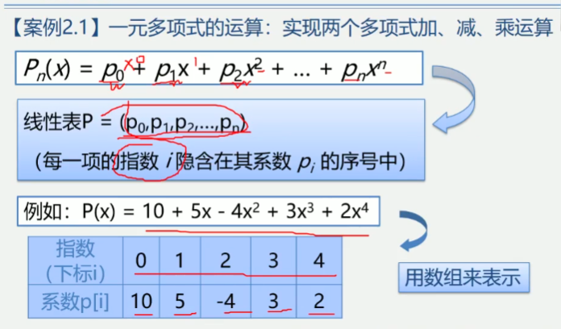
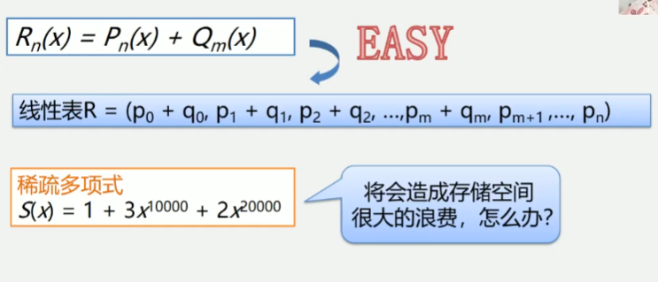
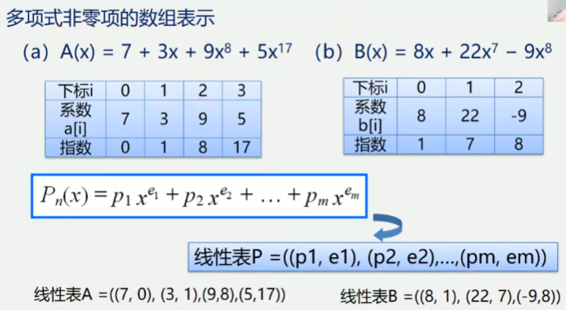
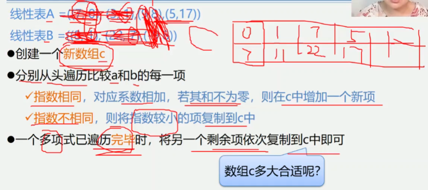
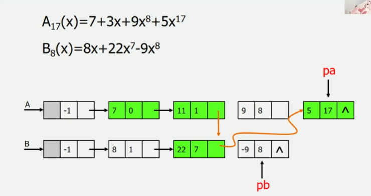
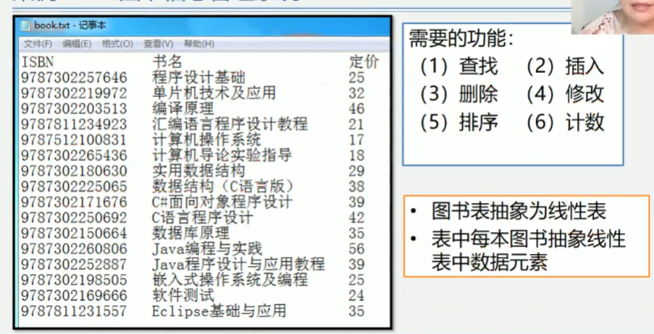
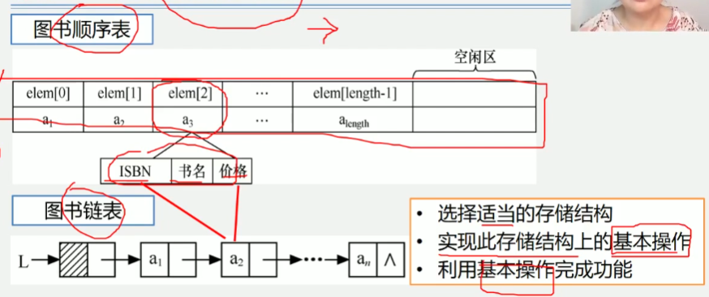

2.2案例引入
1.一元多项式的运算: 实现两个多项式加, 减, 乘运算

稀疏多项式的运算

顺序存储结构存在问题
    1.存储空间分配不灵活
    2.运算空间复杂度高
链式存储结构

2.图书信息管理系统

总结
    1.线性表中数据元素的类型可以为简单类型, 也可以为复杂类型
    2.许多实际应用问题所涉的基本操作有很大相似性, 不应为每个具体应用单独编写一个程序
    3.从具体应用中抽象出共性的逻辑结构和基础操作(抽象数据类型), 然后实际其存储结构
    和基本操作
    