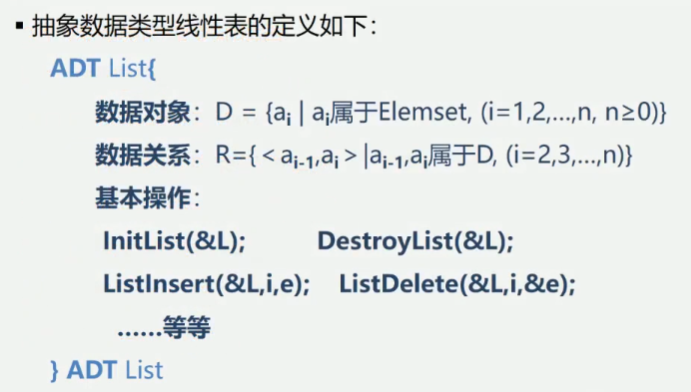
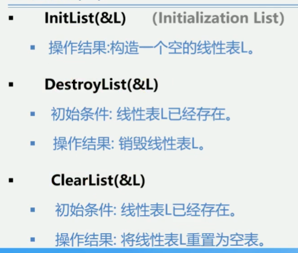
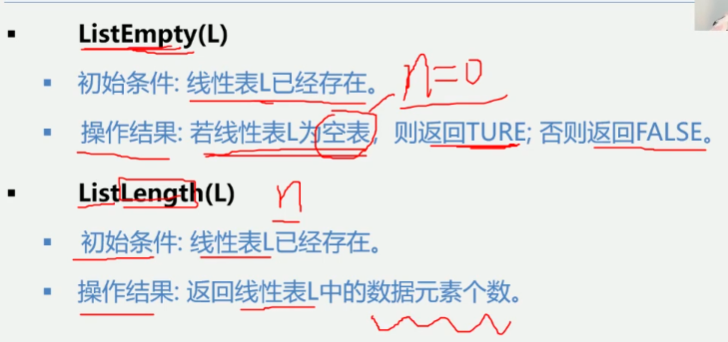
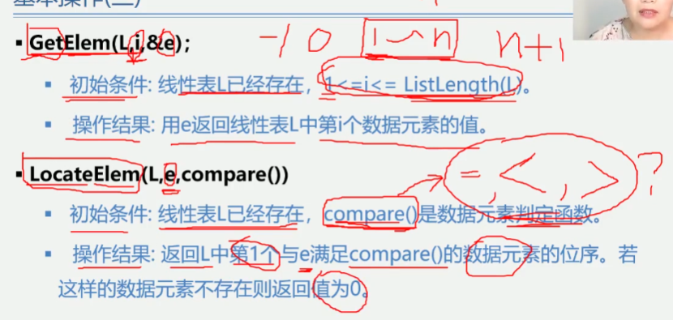
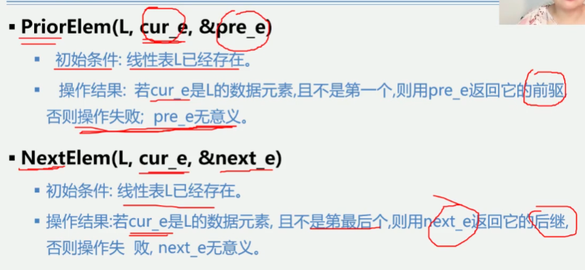
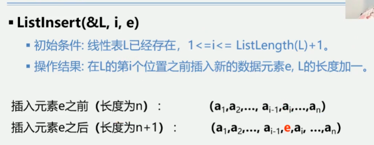
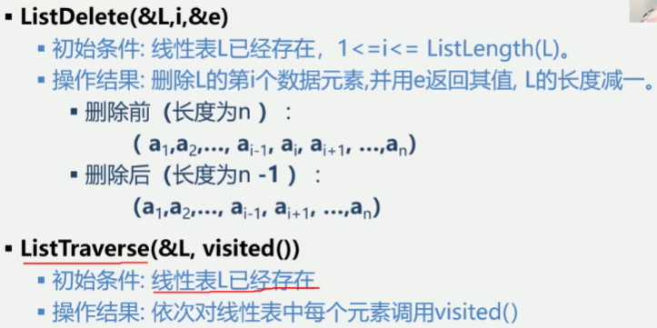

2.3线性表的类型定义

基本操作
初始化, 销毁, 删除所有数据元素

长度

获取

返回前驱后继

插入

删除指定下标和遍历(执行一个遍历操作函数)

以上所提及的运算是逻辑结构上定义的运算, 只要给出这些运算的功能是"做什么", 至于"如何做"
等实现细节, 只有待确定了存储结构之后才考虑.

后续课程中将学习线性表的存储及在存储结构上的各操作的实现
2.4 线性表的顺序表示和实现
2.5 线性表的链式表示和实现