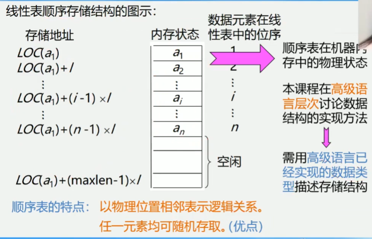
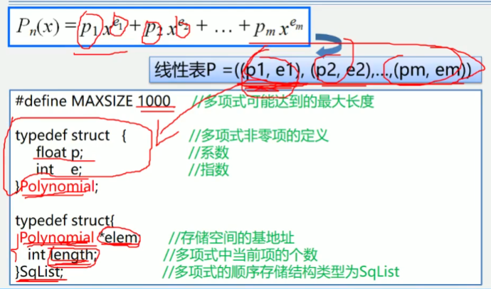
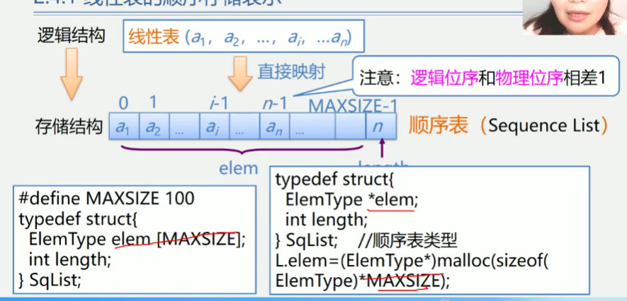
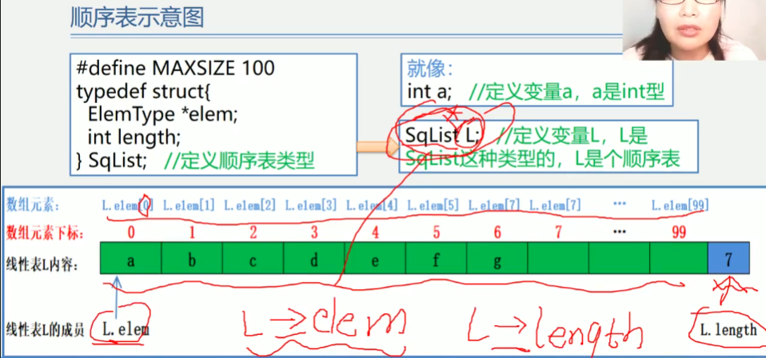
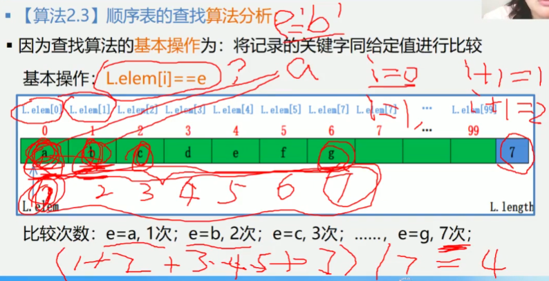
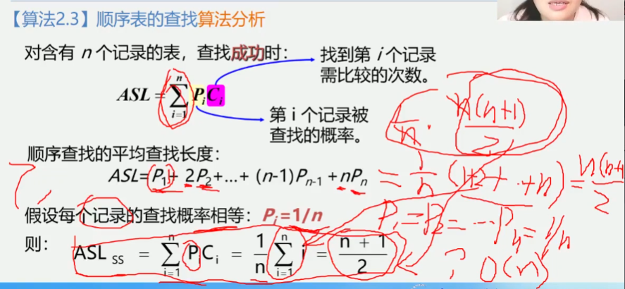
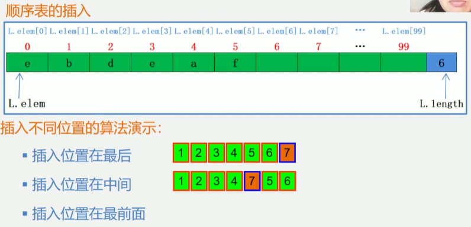
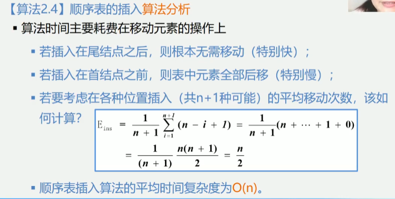

2.4 线性表的顺序表示和实现1

1.在计算机内, 线性表有两种基本的存储结构
顺序存储结构和链式存储结构

2.接下来我们分别讨论这两种存储结构, 以及对应存储结构下实现各操作的算法
    2.4 线性表的顺序表示和实现
    2.5 线性表的链式表示和实现
    
2.4.1 线性表的顺序存储表示
线性表的顺序表示又称为顺序存储结构或顺序映像.
顺序存储定义: 把逻辑上相邻的数据元素存储在物理上相邻的存储单元中的存储结构
线性表:(a1,a2, ... ,ai-1,ai,ai+1, ... ,an)
      物理存储:
      |a1|a2|...|ai-1|ai|ai+1|...|an|
      简言之, 逻辑上相邻, 物理上也相邻
      
线性表的第一个数据元素a1的存储位置, 称作线性表的起始位置或基地址

例如: 线性表(1,2,3,4,5,6)的存储结构:
[1|2|3|4|5|6]是一个典型的线性表顺序存储结构
依次存储, 地址连续中间没有空出存储单元
[1|2| | |3|4|5|6]不是一个线性表顺序存储结构
地址不连续, 中间存在空的存储单元
线性表顺序存储结构占用一片连续的存储空间, 
知道某个元素的存储位置就可以计算其他元素的存储位置

1.顺序表中元素存储位置的计算
[a1|a2|...|ai-1|ai|ai+1|...|an]
如果每个元素占用9个存储单元, a1存储位置是2000单元, 则ai+1存储位置是? 2008单元
假设线性表的每个元素需占l个存储单元, 则第i+1个数据元素的存储位置和第i个数据元素的
存储位置之间满足关系:
LOC(ai+1) = LOC(a1) + l
由此, 所有数据元素的存储位置均可由第一个数据元素的存储位置得到
LOC(ai) = LOC(a1) + (i-1) * l

2.线性表顺序存储结构图示


顺序表(元素)
    1.地址连续
    2.依次存放
    3.随机存取
    4.类型相同
相似的数据结构: 数组(元素) 用一维数组表示顺序表
线性表长可变(删除)
数据长度不可动态定义
    用一变量表示顺序表的长度属性

C语言中以为数组的定义方式
    类型说明符 数组名[常量表达式]
说明: 常量表达式中可以包含常量和符号常量, 不能包含变量
即C语言中不允许对数组的大小动态定义
```
#define LIST_INIT_SIZE 100 // 线性表存储空间的初始分配量
typedef struct {
    ElemType elem[LIST_INIT_SIZE];
    int length; // 当前长度
} SqList
```

3.多项式的顺序存储结构类型定义

4.图书表的顺序存储结构类型定义


-----类C语言有关操作补充之后
高级语言中线性表使用数组表示
注意: 逻辑位序和物理位序相差1


顺序表的示意图



2.4.2
线性表的基本操作

函数结果状态代码
```
// 函数结果状态代码
#define True 1
#define FALSE 0
#define OK 1
#define ERROR 1
#define INFEASIBLE -1
#define OVERFLOW -2 // 溢出

// Status 是函数的类型, 其值时函数结果状态代码
typedef int Status;
typedef char ElemType;

算法2.1 线性表L的初始化(参数用引用)
// 构造一个空的顺序表L
Status InitList_Sq(SqList &L) {
    // 为顺序表分配空间
    L.elem = new ElemType[MAXSIZE];
    // 存储分配失败, 没有获得地址 溢出
    if(!L.elem) exit(OVERFLOW);
    // 空表长度为0
    L.length=0;
    return OK;
}

销毁线性表L
void DestroyList(SqList &L) {
    if(L.elem) delete L.elem; //释放存储空间
}

清空线性表L
void ClearList(SqList &L) {
    L.length=0; // 将线性表的长度置为0
}

求线性表L的长度
int GetLength(SqList L) {
    return (L.length);
}

判断线性表L是否为空
int IsEmpty(SqList L) {
    if(L.length==0) return 1;
    else return 0;
}

算法2.2 顺序表的取值 (根据位置i获取相应位置数据元素的内容)
int GetElem(SqList L, int i, ElemType &e) {
    if(i<1 || i>L.length) return ERROR;
    // 去任意一个位置的元素都可以使用下表访问这种机制叫做随机存取
    e=L.elem[i-1];
    return OK;
}
```

按值查找
例如: 在图书表中, 按照给定书号进行查找, 确定是否存在该图书
如果存在输出是第几个元素, 如果不存在输出0
算法2.3 顺序表的查找
顺序表的查找
1.在线性表L中查找与指定值e相同的数据元素的位置
2.从表的一端开始, 逐个进行记录的关键字和给定值的比较. 找到,返回该元素的位置序号,
未找到, 返回0.
```
int LocateElem(SqList L, ElemType e) {
    // 在线性表L中查找值为e的数据元素, 返回其序号(是第几个元素)
    for(i=0;i<L.length;i++) {
        // 查找称成功, 返回序号
        if(L.elem[i]==e) return i+1;
    }
    // 查找失败, 返回0;
    return 0;
}

int LocateElem(SqList L, ElemType e) {
    // 在线性表L中查找值为e的数据元素, 返回其序号(是第几个元素)
    i=0;
    while(i< L.length&&L.elem[i]!=e) i++;
    if(i<L.length) return i+1; //查找成功, 返回序号
    // 查找失败, 返回0;
    return 0;
}
```
顺序表的查找算法分析:
因为查找算法的基本操作为: 将记录的关键字同给定值进行比较
比较的次数和查找的值有关系
基本操作: L.elem[i]==e


平均查找长度ASL(Average Search Length):
为确定记录在表中的位置, 
需要给定值进行比较的关键字的个数的期望值叫做查找算法的平均查找长度



顺序表的插入

1.插入位置在最后 找现有数组最后一个元素的位置, 放在后面
2.插入位置在中间 插入位置的元素以及后面的元素往后挪
3.插入位置在前面 所有元素往后挪

线性表的插入运算是指在表的第i(1<=i<=n+1)个位置上, 插入一个新节点e,
是长度为n的线性表(a1, ..., ai-1, ai, ..., an)变成长度n+1的线性表
(a1, ..., ai-1, e, ai, ..., an)
算法思想:
    1.判断插入位置i是否合法.
    2.判断顺序表的存储空间是否已满, 若已满返回ERROR.
    3.将第n至第i位的元素依次向后移动一个位置, 空出第i个位置
    4.将要插入的新元素放入第i个位置.
    5.表长加1, 插入成功返回OK.
```
Status ListInsert_Sq(SqList &L, int i, ElemType e) {
    if(i<1 || i>L.length + 1) return ERROR; // i值不合法
    if(L.length==MAXSIZE) return ERROR; // 当前内存空间已满
    for(j=L.length - 1;j>=i-1;j--) {
        L.elem(j+1)=L.elem(j); // 插入位置及之后的元素后移
    }
    L.elem(i-1)=e; // 将新元素e放入第i个位置
    L.length++; // 表长增1
    return OK;
}
```
算法时间主要耗费在移动元素的操作上
1.若插入在尾结点之后, 则根本无需移动(特别快);
2.若插入在首结点之前, 则表中元素全部后移(特别慢);
3.若要考虑在各种位置插入(共n+1种可能)的平均移动次数, 如何计算
n为最后一个元素的位置, 那么插入在n+1的位置移动次数为0, 插入在n的位置移动次数为1,
插入在n-1的位置移动次数为2;
移动次数(x) = n + 1 - 插入位置(i)



顺序表的删除
删除的位置在最后 直接删除
删除的位置在中间 将后面的元素前挪
删除位置在最前面 所有的元素前挪

线性表的删除运算是指将表的第i(1<=i<=n)个结点删除
使长度为n的线性表 (a1, ..., ai-1, ai, ai+1, ..., an)
变成长度为n-1的线性表(a1, ..., ai-1, ai+1, ..., an)

算法思想:
1.判断删除位置i是否合法(合法值为1<=i<=n).
2.将欲删除的元素保留在e中.
3.将第i+1至第n位的元素依次向前移动一个位置.
4.表长减1, 删除成功返回OK.
```
Status ListDetele Sq(SqList &L, int i) {
    if(i<1 || i>L.length) return ERROR; // i值不合法
    for(j=i;j<=L.length-1;j++) {
        L.elem[j-1]=L.elem[j]; // 被删除元素之后的元素前移
    }
    L.length--; // 表长减1
    return OK;
}
```
算法时间主要耗费在移动元素的操作上
1.若删除尾结点, 则根本无需移动(特别快)
2.若删除首结点, 则表中n-1个元素全部前移(特别慢)
3.若要考虑在个各种位置删除(共n种可能)的平均移动次数, 该如何计算
删除第一个位置的元素那么移动次数为n-1次, 删除第二个位置的元素那么移动次数为n-2次
移动次数(x) = n - i(删除位置);


总结:
顺序表(线性表的顺序存储结构)的特点
1.利用数据元素的存储位置表示线性表中相邻数据元素之间的前后关系,
即线性表的逻辑结构与存储结构一致
2.在访问线性表时, 可以快速地计算出任何一个数据元素的存储地址,
因此可以粗略地认为, 访问每个元素所花时间等
这种存取元素的方法被称为随机存取法
重点学习了插入, 删除, 查找
顺序表的操作算法分析
1.时间复杂度
    查找, 插入, 删除算法的平均时间复杂度为O(n)
2.空间复杂度
    显然, 顺序表操作算法的空间复杂度S(n)=O(1)
    (没有占用辅助空间)

优点:
1.存储密度大(结点本身所占存储量/结点结构所占存储量)
2.可以随机存取表中任一元素
缺点
1.在插入、删除某一预元素时, 需要移动大量元素
2.浪费存储空间
3.属于静态存储形式, 数据元素的个数不能自由扩充