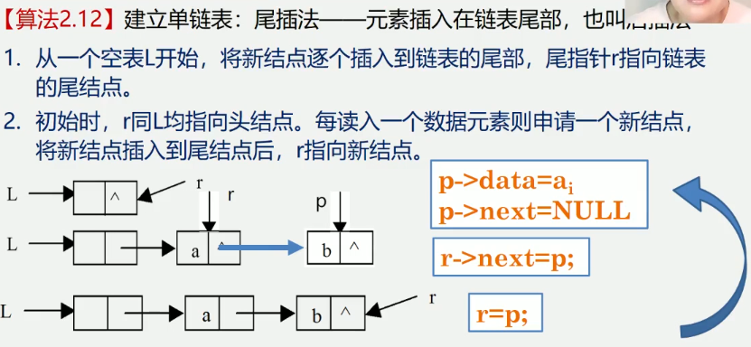

2.5 线性表的链式表示和实现
知识回顾:
    顺序表的特点: 以物理位置相邻表示逻辑关系
    顺序表的优点: 任一元素均可随机存取
    顺序表的缺点: 进行插入和删除操作时, 需移动大量的元素. 存储空间不灵活
    
链式存储结构:
    结点在存储器中的位置是任意的, 即逻辑上相邻的数据元素在物理上不一定相邻

线性表的链式表示又称为非顺序映像或链式映像

用一组物理位置任意的存储单元来存放线性表的数据元素
这组存储单元既可以是连续的, 也可以是不连续的, 甚至是零散分布在内存中的任意位置上的
链表中元素的逻辑次序和物理次序不一定相同

例子1
链表的每个结点包含数据域和指针域(存储的地址称之为链或指针)
由这样的若干个结点构成的结构称之为链表
记录第一个元素的地址称为头指针, 根据头指针可以顺藤摸瓜找到后面的结点
单链表是由头指针唯一确定, 因此单链表可以用头指针的名字来命名


例子2
各结点由两个域组成
数据域: 存储元素数值数据
指针域: 存储直接后继结点的存储位置
[数据|指针]


与链式存储有关的术语
1.结点: 数据元素的存储映像, 由数据域和指针域两部分组成
[数据域|指针链]
2.链表: n个结点由指针域组成一个链表, 它是线性表的链式存储映像, 称为线性表的链式存储结构

3.单链表,双链表,循环链表
    1.单链表: 结点只有一个指针域的链表, 称为单链表或线性链表
    2.双链表: 结点有两个指针域的链表, 称为双链表
    3.循环链表: 首尾相接的链表称为循环链表

4.头指针, 头结点和首元结点
    1.头结点: 是指向链表中第一个结点的指针
    2.首元结点: 是指链表中存储第一个数据元素a1的结点
    3.头结点: 是在链表的首元结点之前附设的一个结点

上面例子中的链表存储结构示意图有以下两种形式


讨论1: 如何表示空表
无头结点时, 头指针为空时表示空表
有头结点时, 当头结点的指针域为空时表示空表


讨论2: 在链表中设置头结点有什么好处
1.便于首元结点的处理
    首元结点的地址保存在头结点的指针域中, 所以在链表的第一个位置上的操作和其他位置一致
    无须进行特殊处理
2.便于空表和非空表统一处理
    无论链表是否为空, 头指针都是指向头结点的非空指针, 因此空表和非空表的处理也就统一了
    
讨论3: 头结点的数据域内装的是什么
头结点的数据域可以为空, 也可存放线性表长度等附加信息, 但此结点不能计入链表的长度值


链表(链式存储结构)的特点
(1) 结点在存储器中的位置是任意的, 即逻辑上相邻的数据元素在物理上不一定相邻
(2) 访问只能通过头指针进入链表, 并通过每个结点的指针域依次向后顺序扫描其余结点
所以寻找第一个结点和最后一个结点所花费的时间不等(这种存取元素的方法被称为顺序存取法)
顺序表->随机存取   链表->顺序存取


2.5.1 单链表的定义和表示
知识回顾:


带头结点的单链表
单链表是由表头唯一确定, 因此单链表可以用头指针的名字来命名若头指针是L, 则把链表称为表L


单链表的存储结构
```
typedef struct Lnode { // 声明结点的类型和指向结点的指针类型(这里的Lnode表示结构类型)
    ElemType data; // 结点的数据域
    struct Lnode *next; // 结点的指针域 嵌套定义
} Lnode, *LinkList; // LinkList为指向结构体Lnode的指针类型(这两个都是类型),
                    // 这里的Lnode表示为上面的结构类型取的名称

定义时:
Lnode *L; (表示指向Lnode类型的指针)
LinkList L; (上面的类型声明中*表示指针类型, 所以定义不需要再加*, 是一种便捷方式)
```


定义链表L: LinkList L;
定义结点指针p: LNode *p <-> LinkList p
虽然这两种方式的都可以代表链表类型, 但是通常L代表整个链表, 指针p代表某个结点


例子, 存储学生学号, 姓名, 成绩的单链表结点类型定义如下:
```
typedef Struct student {
    char num[8]; // 数据域
    char name[8]; // 数据域
    int score; // 数据域
    struct student *next; // 指针域
} Lnode, *LinkList;

为了统一链表的操作, 通常这样定义:
typedef Struct student {
    ElemType data; // 数据域
    struct Lnode *next; // 指针域
} Lnode, *LinkList;
```


2.5.2 单链表基本操作的实现
单链表的初始化(算法2.6) (带头结点的单链表)
    即构造一个如图的空表
算法步骤
    1.生成新结点作头结点, 用头指针L指向头结点.
    2.将头结点的指针域置空
算法描述
```
Status InitList_L(LinkList &L) {
    // new的结果是指向结点的一个指针
    L = new LNode; 或L = (LinkList)malloc(sizeof(LNode));
    // 指针变量操作某一个成员使用->
    L -> next = NULL;
    return OK;
}
```

补充单链表的几个常用简单算法
补充算法1 -> 判断链表是否为空:
空表: 链表中无元素, 称为空链表(头指针和头结点仍然在)
算法思路: 判断头结点指针域是否为空
```
int ListEmpty(LinkList L) { // 若L为空表, 则返回1, 否则返回0
    if(L -> next) { // 非空
        return 0;
    } else {
        return 1;
    }
}
```


补充算法2 -> 单链表的销毁: 链表销毁后不存在
算法思路: 从头指针开始, 依次释放所有的结点
```
算法: 销毁单链表
Status DestoryList_L(LinkList &L) { // 销毁单链表L
    Lnode *p; // 用来操作当前需要删除的结点 或LinkList p;
    while(L) {
        p = L; // 将当前结点地址赋值给p
        L = L -> next; // 将L所指结点的Next域赋值给L
        delete p;
    }
    return OK;
}
```


补充算法3 -> 清空链表
链表仍存在, 但链表中无元素, 成为空链表(头指针和头结点仍然在)
算法思路: 依次释放所有结点, 并将头结点指针域设置为空
```
Status ClearList(LinkList& L) {
    Lnode *p, *q; // 或LinkList p,q; (p当前删除的结点, q指针p的下一个结点)
    p = L -> next; // L为头结点, 这里获取首元结点
    while(p) { // 没到表尾
        q = p -> next;
        delete p;
        p = q;
    }
    L -> next = NULL; // 头结点指针域为空
    return OK;
}
```


补充算法4 -> 求单链表的表长
算法思路: 从首元结点开始, 依次计数所有的结点
```
int ListLength_L() { // 返回L中数据元素的个数
    LinkList p;
    p = L -> next; // p指向第一个结点
    i = 0;
    while(p) { // 遍历单链表, 统计结点数
        i ++;
        p = p -> next;
    }
    return i;
}
```


知识回顾

单链表的基本操作
    1.单链表的销毁
    2.清空单链表
    3.求单链表的表长
    4.判断链表是否为空

取值: 取单链表中第i个元素的内容
查找
    1.按值查找: 根据指定数据获取数据所在的位置(地址)
    2.按值查找: 根据指定数据获取数据所在的位置序号
插入: 在第i个结点前插入新结点
删除: 删除第i个结点
单链表的建立:
    1.头插法
    2.尾插法
 
算法2.7  取值-取单链表中第i个元素的内容
算法思路: 分别取出表中第3个元素和第15个元素
从链表的头指针出发, 顺着链域next逐个结点往下搜索, 知道搜索到第i个结点为止
因此, 链表不是随机存取结构, 是顺序存取结构

算法步骤:
    1.从第1个结点(L->next)顺链扫描, 用指针p指向当前扫描到的结点, p初值p = L->next.
    2.j做计数器, 累计当前扫描过的结点数, j初值为1.
    3.当p指向扫描到的下一结点时, 计数器j加1.
    4.当j==i时, p所指的结点就是要找的第i个结点
```
// 获取线性表L中的某个数据元素的内容, 通过变量e返回
Status GetElem_L(LinkList L, int i, ElemType& e) {
    p = L -> next; j = 1; // 初始化 p获取首元结点
    while(p&&j<i) { // 向后扫描, 直到p指向第i个元素p为空
        p = p -> next; ++j;
    }
    if(!p || j>i) { return ERROR; // 第i个元素不存在
    e = p -> data; // 取第i个元素
    return OK;
}
```

算法2.8 按值查找-根据指定数据获取该数据所在的位置(地址)
分别查找值为30和值为15的元素
找到返回p, 未找到返回0

算法步骤:
    1.从第一个结点起, 依次和e相比较
    2.如果找到一个其值与e相等的数据元素, 则返回其在链表中的"位置"或地址
    3.如果查遍整个链表都没有找到其值和e相等的元素, 则返回0或"NULL"
```
Lnode *LocateElem_L(LinkList L, Elemtype e) {
    // 在线性表L中查找值为e的数据元素
    // 找到, 则返回L中值为e的数据元素的地址, 查找失败返回NULL
    p = L -> next; // 获取首元结点
    while(p && p -> data != e) {
        p = p -> next;
    }
    return p;
}
```

算法2.8变化 按值查找-根据指定数据获取该数据位置序号
算法描述
// 在线性表L中查找值为e的数据元素的位置序号
```
// 在线性表L中查找值为e的数据元素的位置序号
int LocateElem_L(LinkList L, Elemtype e) {
    // 返回L中值为e的数据元素的位置序号, 查找失败返回0;
    p = L -> next; j=1;
    while(p && p -> data != e) {
        p = p -> next; 
        j++;
    }
    if(p) return j;
    else return 0;
}
```

算法2.9 插入-在第i个结点前插入值为e的新结点

算法步骤:
    1.首先找到ai-1的存储位置p.
    2.生成一个数据域为e的新结点s.
    3.插入新节点:
        1.新结点的指针域指向结点ai
        2.结点ai-1的指针域指向新结点

1.s -> next = p -> next
2.p -> next = s
思考: 步骤1和2能互换吗 先执行2, 后执行1, 可以吗
不可以, 会丢失ai的地址

```
// 在L中第i个元素之前插入数据元素e
Status ListInsert_L(LinkList &List, ElemType e) {
    p = L; j = 0;
    // 寻找第i-1个结点, p指向i-1结点
    while(p && j < i - 1) {
        p = p -> next;
        ++j;
    }
    // i大于表长(元素个数, 这里应该考虑的是必须存在后继的情况)+1或者小于1, 插入位置非法
    if(!p || j > i - 1) {
        return ERROR;
    }
    // 生成新结点s, 将结点s的数据域置为e
    s = new LNode;
    s -> data = e;
    // 将结点s插入L中
    s -> next = p -> next;
    p -> next = s;
    return OK;
}
```

算法2.10 删除-删除第i个结点

算法步骤:
    1.首先找到ai-1的存储位置p, 保存要删除的ai的值
    2.令p->next指向ai+1
    3.释放结点ai的空间

```
// 将线性表L中第i个数据元素删除
Status ListDelete_L(LinkList &L, int i, ElemType &e) {
    p=L; j=0; LNode *q;
    // 寻找第i个结点, 并令p指向其前驱
    while(p -> next && j < i - 1) {
        p = p -> next;
        ++j;
    }
    // 删除位置不合理
    if(!(p -> next) || j < i - 1) {
        p = p -> next;
        ++j;
    }
    // 临时保存被删结点的地址以备释放
    q = p -> next; // 这里拿到的是ai
    // 改变删除结点前驱结点的指针域
    p -> next = q -> next; // ai-1的next域赋值为ai+1的地址
    // 保存删除结点的数据域
    e = q -> data;
    // 释放删除结点的空间
    delete q;
    return OK;
}
```

单链表的查找、插入、删除算法时间效率分析
1.查找
因线性表只能顺序存取, 即在查找时要从头指针找起, 查找的时间复杂度为O(n)
2.插入和删除
因线性链表不需要移动元素, 只能修改指针, 一般情况下时间复杂度为O(1)
但是, 如果要在单链表中进行前插和删除操作, 由于要从头查找前驱结点, 所耗时间复杂度为O(n)

单链表的建立
算法2.11 建立单链表-头插法-元素插入在链表头部, 也叫前插法
1.从一个空表开始, 重复读入数据
2.生成新节点, 将读入数据存放到新结点的数据域中
3.从最后一个结点开始, 依次将各结点插入到链表的前端


```
void CreateList_H(LinkList &L, int n) {
    L = new LNode;
    L -> next = NULL; // 先建立一个带头结点的单链表
    for(i=n; i>0; --i) {
        p = new LNode; // 生成新节点 p=(LNode*)malloc(sizeof(LNode));
        cin >> p -> data; // 输入元素值sanf(&p -> data);
        p -> next = L -> next; // 插入到表头
        L -> next = p;
    }
}
算法时间复杂度是O(n)
```

算法2.12 建立单链表-尾插法-元素插入在链表尾部, 也叫后插法
1. 从一个空表L开始, 将新结点逐个插入到链表尾部, 尾指针r指向链表的尾结点
2. 初始时, r同L均指向头结点. 每读入一个数据元素则申请一个新节点, 将新结点插入到尾结点后
r指向新结点

```
// 正位序输入n个元素的值, 建立带表头结点的单链表L
void CreateList_R(Link &L, int n) {
    L = new LNode;
    L -> next = NULL;
    r = L; // 尾指针r指向头结点
    for(i=0;i<n;i++) {
        p = new LNode;
        cin >> p -> data; // 生成新结点, 输入元素值
        p -> next = NULL;
        r -> next = p; // 插入到表尾 个人理解这里同时会让L -> next 指向p
        r = p; // r指向新放入尾结点
    }
}
算法时间复杂度尾O(n)
```