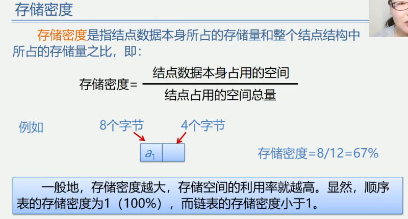
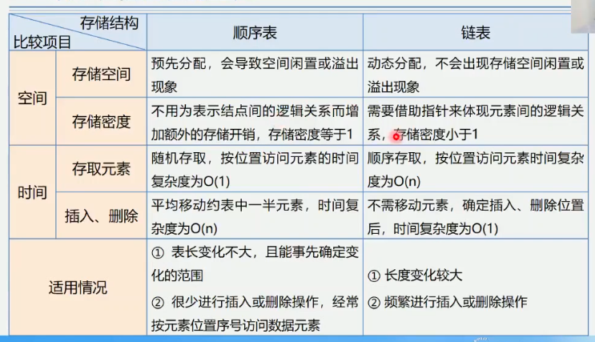

2.6 顺序表和链表的比较
1.链式存储结构的优点
    1.结点空间可以动态申请和释放
    2.数据元素的逻辑次数靠结点的指针来指示, 插入和删除时不需要移动数据元素
2.链式存储结构的缺点:
    1.存储密度小, 每个结点的指针域需额外占用存储空间, 当每个结点的数据域所占字节不多时,
    指针域所占存储空间的比重显得很大
    2.链式存储就结构是非随机存储结构, 对任一结点的操作都要从头指针依指针链查找到该结点,
    这增加了算法复杂度
    
存储密度
    存储密度是指结点数据本身所占的存储量和整个结点结构所占的存储量之比;
    即: 存储密度=结点数据本身所占用的空间/结点占用的空间总量

一般地, 存储密度越大, 存储空间的利用率就越高, 显然, 顺序表的存储密度为1(100%),
而链表的存储密度小于1.

