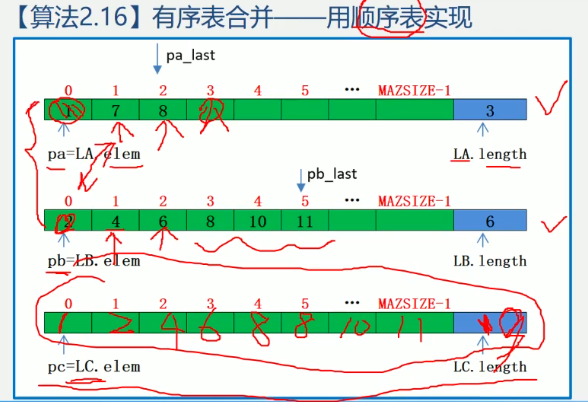
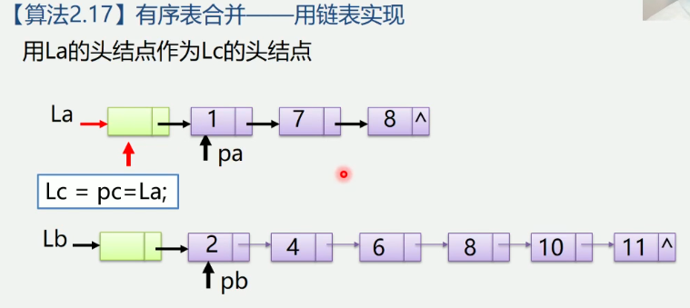
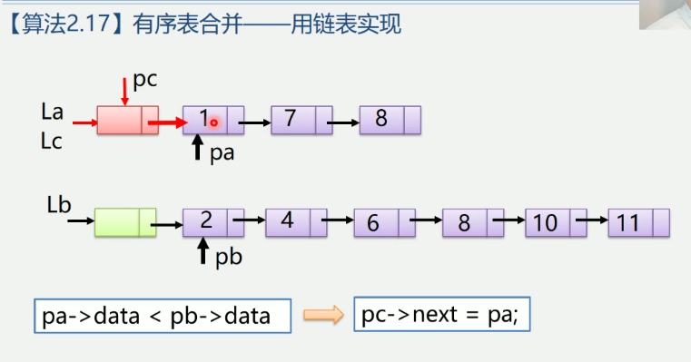
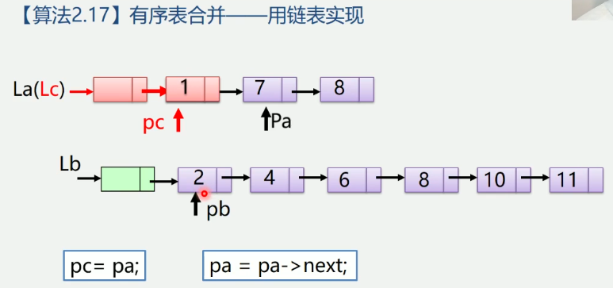
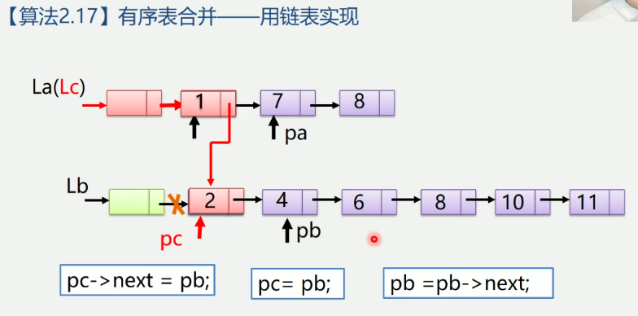
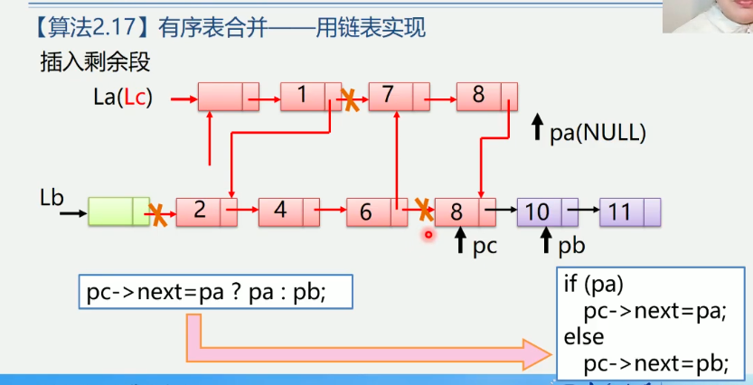
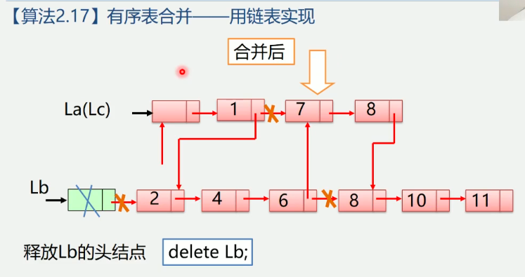

2.7 线性表的应用
2.7.1 线性表的合并:
    1.问题描述
    假设利用两个线性表La和Lb分别表示两个集合A和B, 现要求一个新的集合A=A U B
    La=(7,5,3,11) Lb(2,6,3) -> La=(7,5,3,11,2,6)
    2.算法步骤
    依次取出Lb中的每个元素, 执行以下操作:
    1.La中查找该元素
    2.如果找不到, 则将其插入La的最后
```
void union(List &La, List Lb) {
    La_Len = ListLength(La);
    Lb_Len = ListLength(Lb);
    for(i = 1; i <= Lb_len; i++) {
        GetElem(Lb,i,e);
        if(!LocateElem(La, e)) {
            ListInsert(&La, ++La_len, e);
        }
    }
}
算法的时间复杂度是: O(ListLength(La) * ListLength(Lb))
```

2.7.2 有序表的合并
    1.问题描述:
    已知线性表La和Lb中的数据元素按值非递减有序排列, 现要求将La和Lb归并为一个新的线性表Lc，
    且Lc中的数据元素仍按值非递减有序排列
    La=(1,7,8) Lb(2,4,6,8,10,11) -> Lc(1,2,4,6,7,8,8,10,11)
    2.算法步骤
    1.创建一个空表Lc
    2.依次从La或Lb中"摘取"元素值较小的结点插入到Lc表的最后, 直至其中一个表变空为止
    3.继续将La或Lb其中一个表的剩余结点插入在Lc表的最后
算法2.16 有序表合并-用顺序表实现
```
void MergeList_Sq(SqList LA, SqList LB, SqList &LC) {
    pa = LA.elem; // 指针pa和pb的初值分别指向两个表的第一个元素
    pb = LA.elem; 
    LC.length = LA.length + LB.length; // 新表长度为待合并两表的长度之和
    LC.elem = new ElemType[LC.length]; // 为合并后的新表分配一个数组空间
    pc = LC.elem; // 指针pc指向新表的第一个元素
    pa_last = LA.elem + LA.length - 1; // 指针pa_last指向LA表的最后一个元素
    pb_last = LB.elem + LB.length - 1; // 指针pb_last指向LB表的最后一个元素
    while(pa <= pa_last && pb <= pb_last) { 两个表都非空
        if(*pa <= *pb) { // 依次"摘取"两表中值较小的结点
            *pc++ = *pa++;
        } else {
            *pc++ = *pb++;
        }
    }

    while(pa <= pa_last) *pc ++ = *pa ++; //LB表已到达表尾, 将LA中剩余元素加入LC
    while(pb <= pb_last) *pc ++ = *pb ++; //LA表已到达表尾, 将LB中剩余元素加入LC
} // MergeList_sq
算法的时间复杂度是: O(ListLength(La) + ListLength(Lb))
算法的空间复杂度是: O(ListLength(La) + ListLength(Lb))
```


算法2.17 有序表合并-用链表实现
用La的头结点作为Lc的头结点






```
pa 对应 La的操作结点
pb 对应 Lb的操作结点
pc 对应 Lc的操作结点
void MergeList_L(LinkList &La, LinkList &Lb, LinkList &Lc) {
    pa = La -> next;
    pb = Lb -> next;
    pc = Lc = La; // 用La的头结点作为Lc的头结点
    while(pa && pb) {
        if(pa -> data <= pb -> data) {
            pc -> next = pa;
            pc = pa;
            pa = pa -> next;
        } else {
            pc -> next = pb;
            pc = pb;
            pb = pb -> next;
        }
    }
    pc -> next = pa ? pa : pb; // 插入剩余段
    delete Lb; // 释放Lb的头结点
}
算法的时间复杂度: O(ListLength(La) + ListLength(Lb))
// 最坏时间复杂度A和B全部元素合并
算法空间复杂度: O(1)
// 因为Lc是基于原始空间, 只是改变指针指向
```
