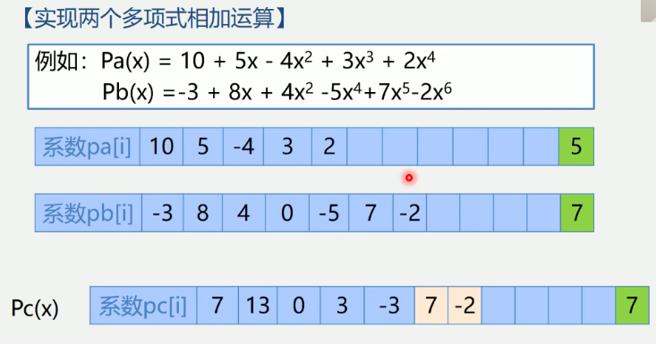
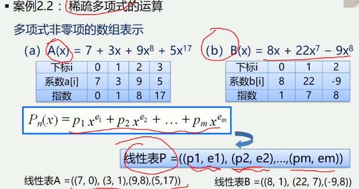
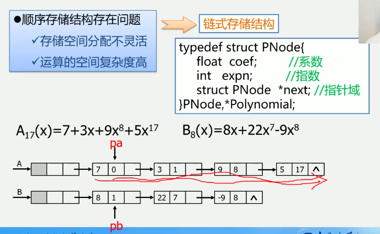

2.8 案例分析与实现
案例2.1 一元多项式的运算: 实现两个多项式的加减乘除运算



案例2.2 稀疏多项式的运算

线性表A = ((7, 0), (3, 1), (9, 8), (5, 17))
线性表A = ((8, 1), (22, 7), (-9, 8))
线性表C = ((7, 0), (11, 1), (22, 7), (5, 17))
1.创建一个新数组c
2.分别从头遍历比较a和b的每一项
    1.指数相同, 对应系数相加, 若其和不为零, 则在c中增加一个新项
    2.指数不相同, 则将指数较小的项复制到c中
3.一个多项式已遍历完毕时, 将另一个剩余项依次复制到c中即可
新数组分配多大空间合适?
1.存储空间分配不灵活
2.运算的空间复杂度高

链式存储结构

```
typedef struct PNode {
    float coef; // 系数
    int expn; // 指数
    struct PNode *next; // 指针域
} PNode, *Polynomial;
```
多项式创建-算法步骤
1.创建一个只有头结点的空链表
2.根据多项式的项的个数n, 循环n次执行以下操作;
    1.生成一个新结点*s
    2.输入多项式当前项的系数和指数赋给新结点*s的数据域
    3.设置一前驱指针pre, 用于指向待找到的第一个大于输入项指数的结点的前驱,
    pre初值指向头结点
    4.指针q初始化, 指向首元结点
    5.循链向下逐个比较链表中当前结点与输入项指数, 找到第一个大于输入项指数的结点*q
    6.将输入项结点*s插入到结点*q之前
```
// 建立链表
void CreatePolyn(Polynomial &P, int n) {
    // 输入m项的系数和指数, 建立表示多项式的有序链表P
    P = new PNode;
    P -> next = NULL; // 先建立一个带头结点的单链表
    for(i=1; i<=n; ++i) { // 依次输入n个非零项
        s = new PNode; // 生成新结点
        cin >> s -> coef >> s -> expn; // 输入系数和指数
        pre = P; // pre用于保存q的前驱, 初值为头结点
        q = P -> next; // q初始化, 指向首元结点
        while(q && q -> expn < s -> expn) { // 找到第一个大于输入项的指数项*q
            pre = q;
            q = q -> next;
        }
        s -> next = q; // 将输入项s插入到q和其前端结点pre之间
        pre -> next = s;
    }
}
```
多项式相加 - 算法分析

算法步骤:
    1.指针p1和p2初始化, 分别指向Pa和Pb的首元结点.
    2.p3指向和多项式的当前结点, 初值为Pa的头结点.
    3.当指针p1和p2均未达到相应表尾时, 则循环比较p1和p2所指结点相应的指数值
    (p1 -> expn 与 p2 -> expn), 有下列三种情况:
        1.当p1 -> expn == p2 -> expn时, 则将两个结点中的系数相加
            1.若和不为零, 则修改p1所指结点的系数值, 同时删除p2所指结点
            2.若和为零, 则删除p1和p2所指结点
    4.将非空多项式的剩余段插入到p3所指结点之后.
    5.释放Pb的头结点
    
    
案例2.3 图书信息管理系统

```
strct Book {
    char id[20] // ISBN
    char name[20] //书名
    int price; // 定价
}

typedef struct { // 顺序表
    Book *elem;
    int length;
} SqList;

typedef struct LNode { // 链表
    Book data;
    struct LNode *next;
} LNode, *LinkList;
```