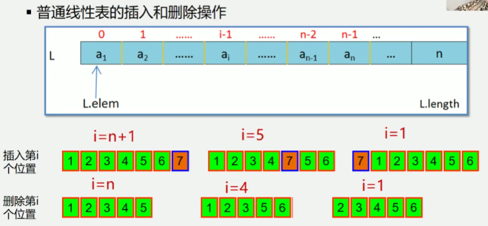
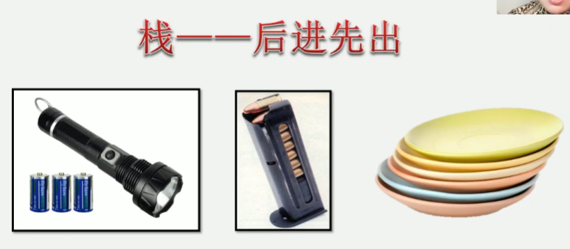
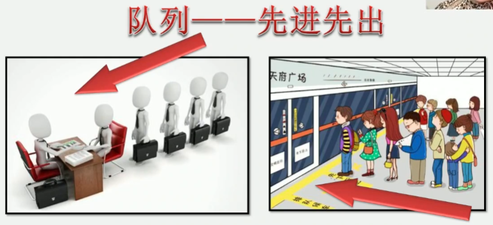
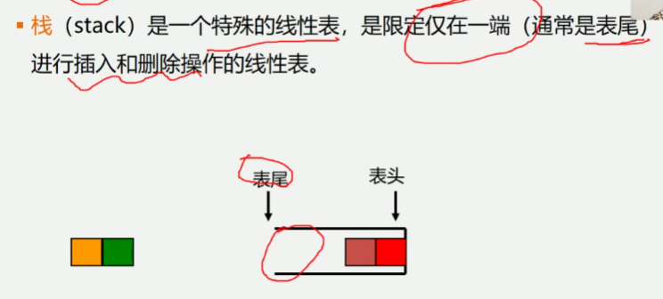
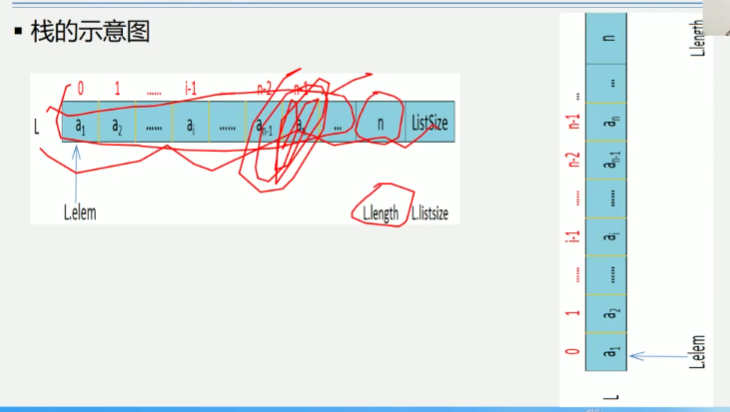
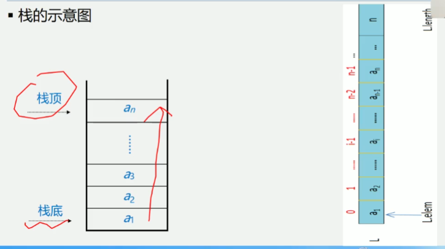
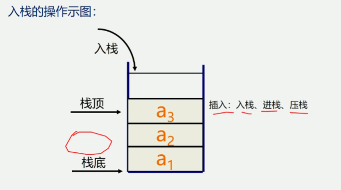
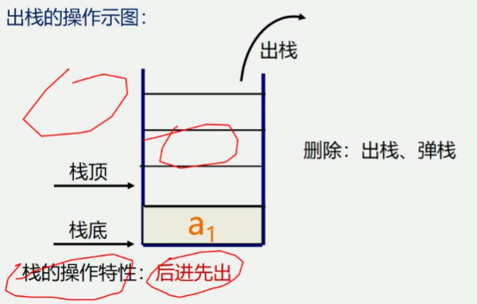
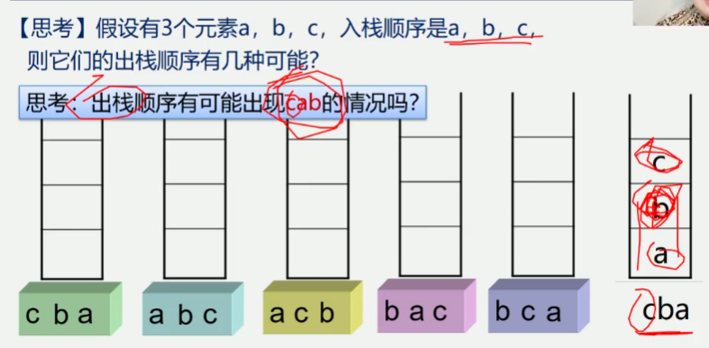
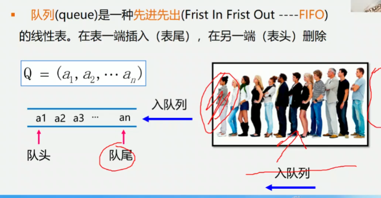

3.1 栈和队列的定义和特点
1.栈和队列是两种常用的、重要的数据结构
2.栈和队列是限定插入和删除只能在表的"端点"进行的线性表

```
线性表                 栈                       队列
Insert(L, i, x)       Insert(S, n+1, x)        Insert(Q, n+1, x)
1 <= i <= n+1
Delete(L, i)          Delete(S, n)             Delete(Q, 1)
1 <= i <= n
```


由于栈的操作具有先进后出的固有特性, 使得栈成为程序设计中的有用工具, 另外
如果问题求解的过程具有"后进先出"的天然特征的话, 则求解的算法中也必然需要利用"栈"
1.数制转换
2.括号匹配的检验
3.行编辑程序
4.迷宫求解
5.表达式求解
6.八皇后问题
7.函数调用
8.递归调用的实现


由于队列的操作具有先进先出的特性, 使得队列成为程序设计中解决类似排队问题的有用工具
1.脱机打印输出: 按申请的先后顺序依次输出.
2.多用户系统中, 多个用户排成队, 分时地循环使用Cpu个主存
3.按用户的优先级排成多个队, 每个优先级一个队列
4.实时控制系统中, 信号按接收的先后顺序依次处理
5.网络电文传输, 按到达的时间先后顺序依次进行


3.1.1栈的定义和特点
1.栈(stack) 是一个特殊的线性表, 是限定在仅在一端(通常是表尾)
进行插入和删除操作的线性表
2.又称为先进先出(Last In First Out)的线性表, 简称LIFO结构


栈的相关概念
栈是仅在表尾进行插入、删除操作的线性表
表尾(即an端)称为栈顶Top; 表头(a1端)称为栈底Base
例如: 栈 s = (a1, a2, a3, ..., an-1, an)
            a1称为栈底元素            an称为栈顶元素
插入元素到栈顶(即表尾)的操作, 称为入栈.
从栈顶(即表尾)删除最后一个元素的操作, 称为出栈.
"入" = 压入 = PUSH(X)  "出" = 弹出 = POP(y)






思考 假设有3个元素a, b, c, 入栈顺序是a, b, c则它们的出栈顺序有几种可能

思考 出栈顺序有可能出现cab的情况吗
不可能因为只要c先出栈, 那么栈当前的顺序一定是ba, 所以只能是cba

1.定义 限定只能在表的一端进行插入和删除运算的线性表(只能在栈顶操作)
2.逻辑结构 与同线性表相同, 仍为一对一关系
3.存储结构 用顺序栈和链栈存储均可, 但以顺序栈更常见
4.运算规则 只能在栈顶运算, 且访问结点时依照后进先出(LIFO)的原则
5.实现方式 关键是编写入栈和出栈函数, 具体实现依顺序栈和链栈的不同而不同

栈与一般线性表有什么不用
栈与一般线性表的区别: 仅在于运算规则不同.
一般线性表
逻辑结构:一对一
存储结构:顺序表, 链表
运算规则:随机存取
栈
逻辑结构:一对一
存储结构:顺序表, 链表
运算规则:后进先出(LIFO)


3.1.2队列的定义和特点
队列(queue)是一种先进先出(First In First Out - FIFO)
的线性表, 在表一端插入(表尾), 在另一端(表头)删除
Q = (a1,a2,...an)

队列的相关概念
1.定义 只能在表的一段进行插入运算, 在表的另一端进行删除运算的线性表(头删尾插)
2.逻辑结构 与同线性表相同, 仍为一对一关系
3.存储结构 顺序队或链队, 以循环顺序队列更常见
4.运算规则 只能在队首和队尾运算, 且访问结点时依照先进先出(FIFO)的原则
5.实现方式 关键是掌握入队和出队操作, 具体实现依顺序队或链队的不同而不同