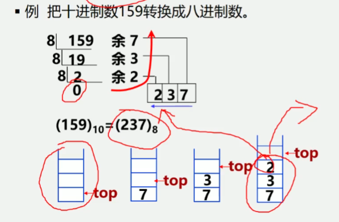
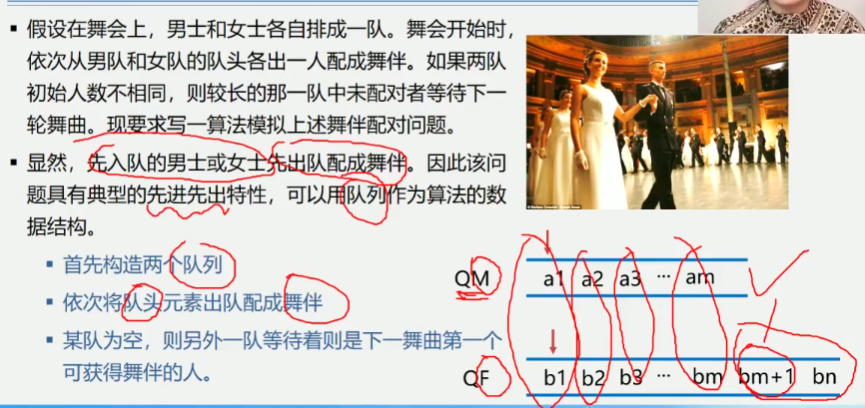

3.2 案例引入
栈:
案例3.1: 进制转换
案例3.2: 括号匹配的检验
案例3.3: 表达式求值
队列:
案例3.4: 舞伴问题

1.十进制整数N向其他进制数d(二、八、十六)的转换是计算机实现计算的基本问题
转换法则: 除以d倒取余
该转换法则对应于一个简单算法原理:
n=(n div d) * d + n mod d
其中: div为整除运算, mod为求余运算

例3.1: 把十进制159转换成八进制数.

例3.2: 假设表达式中允许包含两种括: 圆括号和方括号
其嵌套顺序随意, 即:
1.([] ()) 或 [([] [])] 为正确格式;
2.[(]] 为错误格式
3.([()) 或 (()])为错误格式

解决:
1.可以利用一个栈结构保存每个出现的左括号, 当遇到右括号时,
从栈中弹出左括号, 检验匹配情况
2.再检验过程中, 若遇到以下几种情况之一, 就可以得出括号不匹配的结论
(1)当遇到某一个右括号时, 栈已空, 说明到目前为止, 右括号多于左括号;
(2)从栈中弹出的左括号与当前检验的右括号类型不同, 说明了出现括号交叉情况;
(3)算术表达式输入完毕, 但栈中还没有匹配的左括号, 说明左括号多于右括号;

例3.3: 表达式求值
1.表达式求值是程序设计语言编译中一个最基本的问题, 它的实现也需要运用栈
2.这里介绍的算法是由运算符优先级确定运算顺序的对表达式求值算法-算符优先算法
表达式的组成
1.操作数(operand): 常数, 变量.
2.运算符(operator): 算术运算符, 关系运算符和逻辑运算符.
3.界限符(delimiter): 左右括弧和表达式结束符.
任何一个算术表达式都由操作数(常量, 变量)、算术运算符(+、-、*、/)和界限符(括号, 
表达式结束符'#'、虚设的表达式起始符‘#’)组成, 后者统称为算符
例如: #3 * (7 - 2) #
为了实现表达式求值, 需要设置两个栈:
一个是算符栈OPTR, 用于寄存运算符.
另一个称为操作数栈OPND, 用于寄存运算数金和运算结果
求值的处理过程是自左至右扫描表达式的每一个字符
1.当扫描到的是运算数, 则将其压入栈OPND,
2.当扫描的是运算符时
    1.若这个运算符比OPTR栈顶运算符的优先级高, 则入栈OPTR, 继续向后处理
    2.若这个运算符比OPTR栈顶运算符的优先级低, 则从OPND栈中弹出两个运算数, 从栈
    OPTR中弹出栈顶运算符进行运算, 并将运算结果压入栈OPND
3.继续处理当前字符, 直到遇到结束符为止

例3.4 舞伴问题
1.假设在舞会上, 男士和女士各自排成一队, 舞会开始时, 依次从男队和女队的对头各出一人配成舞伴
如果两队的初始人数不相同, 则较长的那一队中未配对者等待下一轮舞曲, 现要求写一算法模拟上述舞伴配对问题
2.显然, 先入队的男士或女士先出队配成舞伴, 因此该问题具有典型的先进先出特性, 可以用队列作为算法的数据结构
    1.首先构造两个队列
    2.依次将对头元出队配成舞伴
    3.某队为空, 则另外一队等待着则是下一舞曲第一个可获得舞伴的人.
