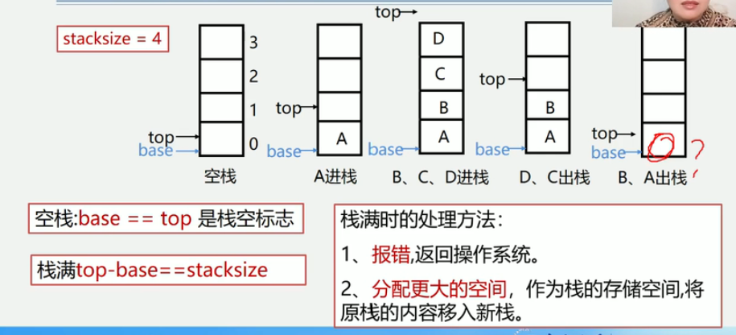

3.3 栈的表示和操作的实现

3.3.1 栈的抽象数据类型的类型定义
```
ADT Stack {
    数据对象:
        D = {ai | ai ∈ ElemSet, i = 1,2,...,n, n >= 0 }
    数据关系:
        R1 = {< ai - 1, ai > | ai - 1, ai∈D, i=2,...,n}
        约定an端为栈顶, a1端为栈底.
    基本操作:
        初始化, 进栈, 出栈, 取栈顶元素等
} ADT Stack
```

InitStack(&S) 初始化操作
操作结果: 构造一个空栈S
DestroyStack(&S) 销毁操作
初始条件: 栈S已存在
操作结果: 栈S被销毁
StackEmpty(S) 判定S是否为空栈
初始条件: 栈S已存在
操作结果: 若栈S为空栈, 则返回TRUE, 否则FALSE
StackLength(S) 求栈的长度
初始条件: 栈S已存在
操作结果: 返回S的元素个数, 即栈的长度
GetTop(S, &e) 取栈顶元素
初始条件: 栈S已存在且非空
操作结果: 用e返回S的栈顶元素
ClearStack(&S) 栈置空操作
初始条件: 栈S已存在
操作结果: 将S清为空栈
Push(&S, e) 入栈操作
初始条件: 栈S已存在
操作结果: 插入元素e为新的栈顶元素
Pop(&S, &e) 出栈操作
初始条件: 栈S已存在且非空
操作结果: 删除S的栈顶元素an, 并用e返回其值

栈的表示和实现
由于栈本身就是线性表, 于是栈也有顺序存储和链式存储两种实现方式
1.栈的顺序存储-顺序栈
2.栈的链式存储-链栈
3.3.2 顺序栈的表示和实现
存储方式: 同一般线性表的顺序存储结构完全相同
利用一组地址连续的存储单元依次存放自栈底到栈顶的数据元素, 栈底一般在低地址端.
    1.附设top指针, 指示栈顶元素在顺序栈中的位置.
    2.另设base指针, 指示栈底元素在顺序栈中的位置.
    但是为了方便操作, 通常top指示真正的栈顶元素之上的下标地址
    3.另外, 用stacksize表示栈可使用的最大容量


空栈: base == top是栈空标志
栈满: top - base = stacksize
栈满(满栈再取为上溢出, 空栈再取为下溢出)时的处理方法:
1.报错, 返回操系统
2.分配更大的空间作为栈的存储空间, 将原栈的内容移入新栈


使用数组作为顺序栈存储方式的特点:
    简单, 方便、但易产生溢出(数组大小固定)
    1.上溢(overflow): 栈已经满, 又要压入元素
    2.下溢(underflow): 栈已经空, 还要弹出元素
注: 上溢(内存空间不足)是一种错误, 使问题的处理无法进行, 而下溢一般认为是一种结束条件, 即问题处理结束

顺序栈的表示
```
#define MAXSIZE 100
typedef struct {
    SElemType *base; // 栈底指针
    SElemType *top; // 栈顶指针
    int stacksize; // 栈可用最大容量
} SqlStack
```
两个指针相减(必须指向同一元素)是指针所指的两个元素之间差几个元素


算法3.1顺序栈的初始化
```
Status InitStack(SqStack &S) { // 构造一个空栈
    S.base = new SElemType[MAXSIZE]; // 或
    // S.base = (SElemType*)malloc(MAXSIZE*sizeof(SElemType));
    if (!S.base) exit (OVERFLOW); // 存储分配失败
    S.top = S.base; // 栈顶指针等于栈低指针
    S.stacksize = MAXSIZE;
    return OK;
}
```


算法补充: 顺序栈判断栈是否为空
```
Status StackEmpty(SqStack S) {
    if(S.top == S.base) {
        return TRUE;
    } else {
        return FALSE;
    }
    return OK;
}
```


算法补充: 求顺序栈长度
```
init StackLength(SqStack S) {
    return S.top - S.base;
}
```


算法补充: 清空顺序栈
```
Status ClearStack(SqStack S) {
    if(S.base) {
        S.top = S.base;
    }
    return OK;
}
```


算法补充: 销毁顺序栈
```
init DestoryStack(SqStack &S) {
    if(S.base) {
        delete S.base; // 数组回归内存
        S.stacksize = 0; // 结构类型的值设置为空
        S.base = S.top = NULL;
    }
    return OK;
}
```


算法3.2 顺序栈的入栈
1.判断是否栈满, 若满则出错(上溢)
2.元素e压入栈顶
3.栈顶指针加1
```
Status Push(SqStack &S, SElemType e) {
    if(S.top - S.base == S.stacksize) { // 栈满
        return ERROR
    }
    *S.top = e; // *S.top 代表操作top所指的这一空间
    S.top++;
    // 相当于*S.top ++ = e
    // *S.top的优先级更高
    return OK;
}
```


算法3.3 顺序栈的出栈
1.判断是否栈空, 若空则出错(下溢)
2.获取栈顶元素e
3.栈顶指针减1
```
Status Pop(SqStack &S, SElemType &e) {
    // 若栈不空, 则删除S的栈顶元素, 用e返回其值, 并返回OK;
    // 否则返回ERROR
    if(S.top == S.base) { // 等价于 if(StackEmpty(S))
        return ERROR;
    }
    e = *--S.top;
    // 相当于 --S.top 先指针下移
    // e = *S.top 去除当前指针所指的位置赋值给e
    return OK;
}
```


3.3.3 链栈的表示和实现
链栈的表示
链栈是运算受限的单链表, 只能在链表头部进行操作
```
typedef struct StackNode {
    SElemType data;
    struct StackNode *next;
} StackNode, *LinkStack;
LinkStack S;
```

注意: 链栈中指针的方向
1.链表的头指针就是栈顶
2.不需要头结点
3.基本不存在栈满的情况
4.空栈相当于头指针指向空
5.插入和删除仅在栈顶处执行

算法3.5 链栈的初始化
```
void InitStack(LinkStack &S) {
    // 构造一个空栈, 栈顶指针置为空
    S = NULL;
    return OK;
}
```

补充算法: 判断链栈是否为空
```
Status StackEmpty(LinkStack S) {
    if(S==NULL) return TRUE;
    else return FALSE;
}
```

算法3.6 链栈的入栈
```
Status Push(LinkStack &S, SElemType e) {
    p = new StackNode; // 生成新结点p
    p -> data = e; // 将新结点数据域设置为e
    p -> next = S; // 将新结点插入栈顶
    S = p; // 修改栈顶指针
    return OK;
}
```


算法3.7 链栈的出栈
```
Status Pop(LinkStack &S, SElemType &e) {
    if(S==NULL) return ERROR;
    e = S -> data;
    p = S; // 这里是为了记录需要释放的空间, 因为下面S取出后会被重新赋值为向下的一个结点
    S = S -> next;
    delete p;
    return OK;
}
```


算法3.8 取栈顶元素
```
SElemType GetTop(LinkStack S) {
    if(S!=NULL)
    return S -> data;
}
```

