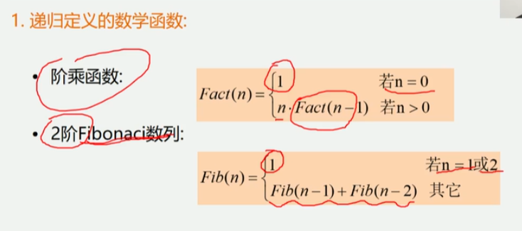
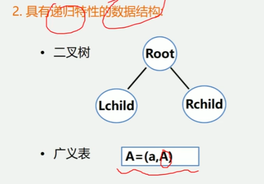
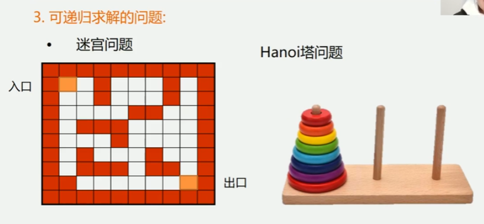
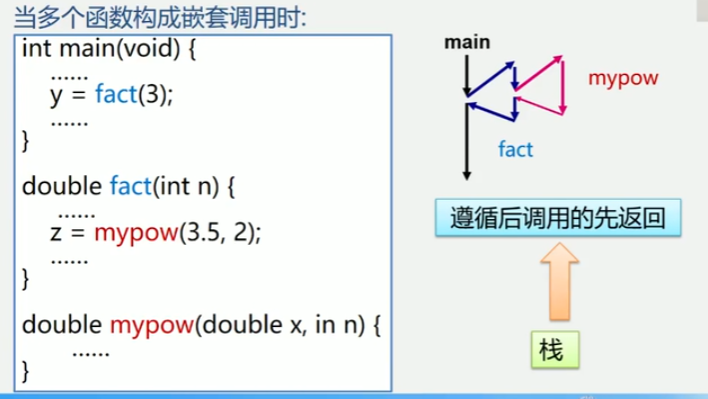
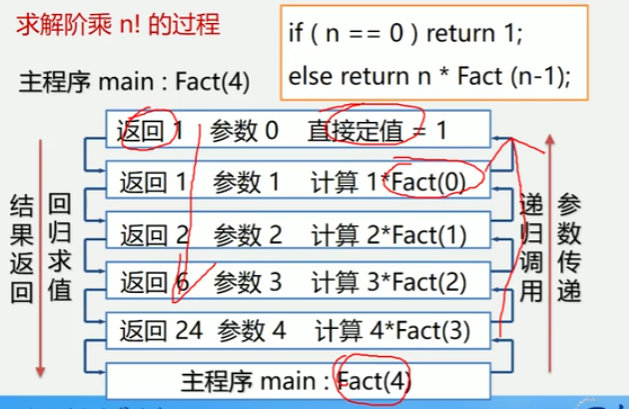
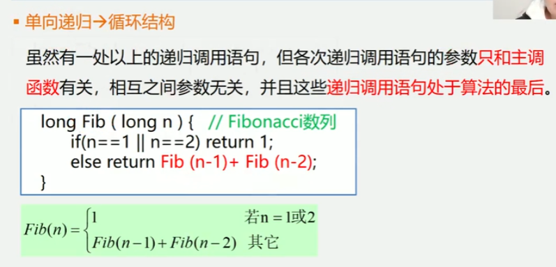
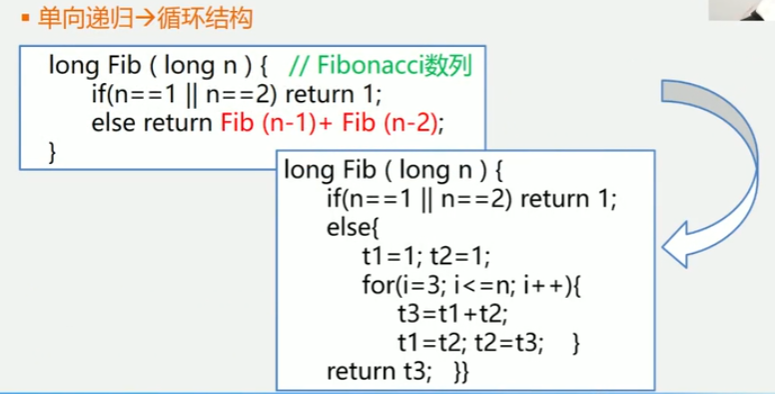
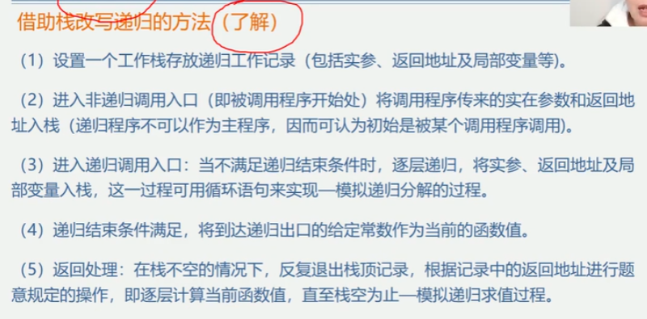

3.4 栈和递归
递归的定义
1.若一个对象部分地包含它自己, 或用它自己给自己定义, 则称这个对象是递归的
2.若一个过程直接地或间接地调用自己, 则称这个过程是递归过程
例如: 递归求n的阶乘
```
long Fact(long n) {
    if(n == 0) return 1; // 基本项
    else return n * Fact(n - 1); // 归纳项
}
```

以下三种情况常常用到递归方法
1.递归定义的数学函数
    阶乘函数
    2阶Fibonacci数列
    
2.具有递归特性的数据结构
    二叉树
    广义表
        
3.可递归求解的问题
    迷宫问题
    Hanoi塔问题

递归(递归的两部分递推和回归)问题 - 用分治法求解
分治法: 对于一个较为复杂的问题, 能够分解成几个相对简单的且解法相同或类似的子问题求解
必备的三个条件:
1.能将一个问题转变成一个新的问题, 而新问题与原问题的解法相同或类同, 不同的仅是处理的对象
且这些处理对象是变化有规律的
2.可以通过上述转化而使问题简化
3.必须有一个明确的递归出口, 或称递归的边界

分治法求解递归问题算法的一般形式:
```
void p(参数表) {
    if(递归结束条件) 可直接求解步骤; // 基本项
    else p(较小的参数); // 归纳项
}
```
1.函数调用过程
调用前, 系统完成:
    1.将实参, 返回地址等传递给被调用函数
    2.为被调用函数的局部变量分配存储区
    3.将控制转移到被调用函数的入口
调用后, 系统完成:
    1.保存被调用函数的计算结果
    2.释放被调用函数的数据区
    3.依照被调用函数保存的返回地址将控制转移到调用函数
    
当多个函数构成嵌套调用时:
```
int main(void) {
    ...
    y = fact(3);
    ...
}
double fact(int n) {
    ...
    z = mypow(3.5, 2);
    ...
}
double mypow(double x, int n) {
    ...
}
```


求解阶乘n!的过程
```
long Fact(long n) {
    if(n == 0) return 1; // 基本项
    else return n * Fact(n - 1); // 归纳项
}
```

递归函数调用的实现
"层次" 主函数        0层
      第1次调用     1层
      ...
      第i次调用     i层
"递归工作栈" - 递归程序运行期间使用的数据存储区
"工作记录" - 实在参数, 局部变量, 返回地址
调用的系统栈的变化状态.jpg)

递归的优缺点
优点: 结构清晰, 程序易读
缺点: 每次调用要生成工作记录, 保存状态信息, 入栈; 返回时要出栈, 恢复状态信息, 时间开销大
递归 -> 非递归
方法1: 尾递归、单向递归 -> 循环递归



方法2: 自用栈模拟系统的运行时栈
借助栈改写递归
1.递归程序在执行时需要系统提供栈来实现
2.仿照递归算法执行过程中递归工作栈的状态变化可写出相应的非递归程序
3.改写后的非递归算法与原来的递归算法相比, 结构不够清晰, 可读性较差
有的还需要经过一系列的优化
