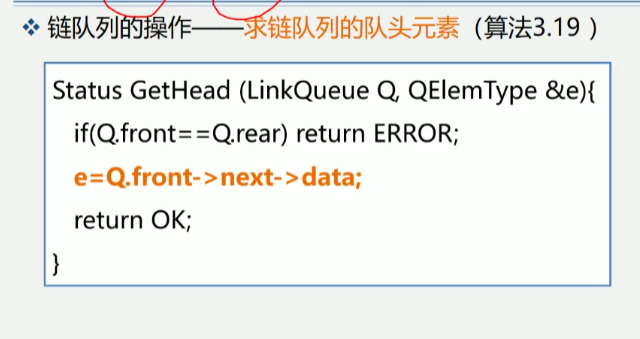

3.5 队列的表示和操作的实现
队列示意图

相关术语
1.队列(Queue)是仅在表尾进行插入操作, 在表头进行删除操作的线性表
2.表尾即an端, 称为队尾; 表头即a1端, 称为队头
3.它是一种先进显出(FIFO)的线性表
例如: 队列Q = (a1, a2, a3..., an-1, an)
             队头                  队尾
插入元素称为入队; 删除元素称为出队.
队列的存储结构为链表或顺序队(常用循环顺序队) 

队列的相关概念
1.定义 只能在表的一段进行插入运算, 在表的另一端进行删除运算的线性表(头删尾插)
2.逻辑结构 与同线性表相同, 仍为一对一关系
3.存储结构 顺序队或链队, 以循环顺序队列更常见
4.运算规则 只能在队首和队尾运算, 且访问结点时依照先进先出(FIFO)的原则
5.实现方式 关键是掌握入队和出队操作, 具体实现依顺序队或链队的不同而不同

队列的常见应用(需要使用有限资源的时候, 需要排队)
1.脱机打印输出: 按申请的先后顺序依次输出.
2.多用户系统中, 多个用户排成队, 分时地循环使用Cpu个主存
3.按用户的优先级排成多个队, 每个优先级一个队列
4.实时控制系统中, 信号按接收的先后顺序依次处理
5.网络电文传输, 按到达的时间先后顺序依次进行

3.5.1 队列的抽象数据类型定义


3.5.2 队列的顺序表示和实现
1.队列的物理存储可以用顺序存储结构, 也可以用链式存储结构, 相应地
队列的存储方式也分为两种, 即顺序存储和链式存储
2.队列的顺序表示-用一维数组base[MAXQSIZE]
```
#define MAXQSIZE 100 // 最大队列长度
typedef struct {
    QElemType *base; // 初始化的动态分配存储空间 指向数组的首元素也就是基地址
    int front; // 头指针 数组的下标
    int rear; // 尾指针
} SqQueue;
```

思考: 存在什么问题?
设数组大小为MAXQSIZE
rear=MAXQSIZE时, 发生溢出
若front=0
rear=MAXQSIZE时, 再入队-真溢出
front!=0
rear=MAXQSIZE时, 再入队-假溢出


解决假上溢出的方法
1.将队中元素依次向队头方向移动.
缺点: 浪费时间, 每移动一次, 队中元素都要移动
2.将队空间设想成一个循环的表, 即分配给队列的m个存储单元可以循环使用
当rear为MAXQSIZE时, 若向量的开始端空着, 又可从头使用空着的空间
当front为MAXQSIZE时, 也是一样


解决假上溢出的方法-引入循环队列
base[0]接在base[MAXQSIZE - 1]之后, 若rear + 1 == M, 则令rear=0;
实现方法: 利用模(mod, C语言中: %)运算.
插入元素:
    Q.base[Q.rear]=x;
    Q.rear=(Q.rear+1)%MAXQSIZE
删除元素:
    x=Q.base[s.front]
    Q.front=(Q.front+1)%MAXQSIZE
循环队列: 循环使用为队列分配的存储空间.


解决方案:
1.另外设一个标志以区别对空、队满
2.另设一个变量, 记录元素个数
3.少用一个元素空间
循环队列解决队满时判断方法-少用一个元素空间
队空: front = rear
队满: (rear+1)%MAXQSIZE==front


循环队列的类型定义
```
#define MAXQSIZE 100 // 最大队列长度
typedef struct {
    QElemType *base; // 动态分配存储空间
    int front; // 头指针, 若队列不空, 指向队列头元素
    int rear; // 尾指针, 若队列不空, 指向队列尾元素的下一个位置
} SqQueue;
```

算法3.11 循环队列的操作-队列的初始化
```
Status InitQueue(SqQueue &Q) {
    Q.base = new QElemType[MAXQSIZE]; // 分配数组空间
    // Q.base = (QElemType*)malloc(MAXQSIZE*sizeof(QElemType));
    if(!Q.base) exit(OVERFLOW); // 存储分配失败
    Q.front = Q.rear = 0; // 头指针尾指针为0, 队列为空
    return OK;
}
```

算法3.12 循环队列的操作-求队列的长度
```
int QueueLength(SqQueue Q) {
    return ((Q.rear - Q.front + MAXQSIZE) % MAXQSIZE);
}
```


算法3.13 循环队列的操作-循环队列入队
```
Status EnQueue(SqQueue &Q, QElemType e) {
    if((Q.rear+1)%MAXQSIZE==front) return ERROR; // 队满
    Q.base[Q.rear] = e; // 新元素加入队尾
    Q.rear = (Q.rear + 1) % MAXQSIZE; // 队尾指针+1
    return OK;
}
```

算法3.14 循环队列的操作-循环队列出队
```
Status DeQueue(SqQueue &Q, QElemType &e) {
    if(front = rear) return ERROR; // 对空
    e=Q.base[Q.front]; // 保存队头元素
    Q.front = (Q.front + 1) % MAXQSIZE; // 队头指针+1
    return OK;
}
```

算法3.15 循环队列的操作-取队头元素
```
QElemType GetHead(SqQueue Q) {
    if(Q.front!=rear) // 队列不为空 
    return Q.base[Q.front]; // 返回队头指针元素的值, 队头指针不变
}
```


3.5.3 链队-队列的链式表示和实现
若用户无法估计用队列的长度, 则宜采用链队列
链队列的类型定义
```
#define MAXQSIZE 100 // 最大队列长度
typedef struct {
    QElemType data;
    struct Qnode *next;
} QNode, *QueuePtr;

typedef struct {
    QueuePtr front; // 队头指针
    QueuePtr rear; // 队尾指针
} LinkQueue;
```


链队列运算指针变化状况
a.空队列
b.元素x入队列
c.y入队列
d.x出队列


算法3.16 链队列的操作-链队列初始化
```
Status InitQueue(LinkQueue &Q) {
    Q.front = Q.rear = (QueuePtr) malloc(sizeof(QNode));
    if(!Q.front) exit(OVERFLOW);
    Q.front -> next = NULL;
    return OK;
}
```


算法补充 链队列的操作-销毁链队列
算法思想: 从队头结点开始, 依次释放所有结点
```
Status DestoryQueue(LinkQueue &Q) {
    while(Q.front) {
        p=Q.front -> next;
        free(Q.front);
        Q.front=p;
        //  Q.rear=Q.front -> next;  free(Q.front);  Q.front=Q.rear;
    }
    return OK;
}
```


算法3.17 链队列的操作-将元素e入队
```
Status EnQueue(LinkQueue &Q, QElemType e) {
    p = (QueuePtr) malloc(sizeof(QNode));
    if(!p) exit(OVERFLOW);
    p -> data = e;
    p -> next = NULL;
    Q.rear -> next = p;
    Q.rear = p;
    return OK;
}
```


算法3.18 链队列的操作-链队列出队(链队列中front位置不变 一直指向头结点)
```
Status DeQueue(LinkQueue &Q, QElemType &e) {
    if(Q.front==Q.rear) return ERROR;
    p = Q.front -> next;
    e = p -> data;
    Q.front -> next = p -> next;
    // 头结点的下一结点是尾结点的时候 尾结点需要指向头结点
    if(Q.rear == p) Q.rear == Q.front;
    delete p;
    return OK;
}
```


算法3.19 链队列的操作-求链队列的队头元素
```
Status GetHead(LinkQueue Q, QElemType &e) {
    if(Q.front == Q.rear) {
        return ERROR;
    }
    e = Q.front -> next -> data;
    return OK;
}
```
