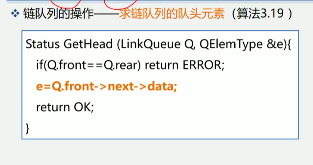

串、数据、广义表
第二章: 线性表
    线性结构, 可表示为: (a1, a2, ..., an)
第三章: 栈和队列
    操作受限的线性表
第三章: 串、数组、和广义表
    串: 内容受限的线性表
    数组、和广义表: 线性结构的推广
    
    
4.1 串
串的定义:
串(String) - 零个或多个任意字符组成的有限序列
s   =   "a1a2...an" (n>=0)
串名         串值
串长: n
空串: n=0
空串用 ∅ 表示

串的定义-几个术语:
1.子串: 串中任意个连续字符组成的子序列称为该串的子串
    一个串中任意个连续字符组成的子序列(含空串)称为该串的子串
    例如, "abcde"的子串有:
    "", "a", "ab", "abc", "abcd", "abcde"等
    真子串是指不包含自身的所有子串
2.主串: 包含子串的串相应地称为主串
3.字符位置: 字符在序列中的序号为该字符在串中的位置
4.子串位置: 子串第一个字符在主串中的位置
5.空格串:  由一个或多个空格组成的串, 与空串不同
例子: 字符串a、b、c、d
a = 'BEI'
b = 'JING'
c = 'BEIJING'
d = 'BEI JING'
它们的长度分别是: 3 4 7 8
c的子串是: a b
d的子串是: a b
a在c中的位置是: 1
a在b中的位置是: 1
b在c中的位置是: 4
b在d中的位置是: 5

串相等:
当且仅当两个串的长度相等并且各个对应位置上的字符都相同时, 这两个串才是相等的.
如:
"abcd" != "abd"
"abcd" != "abcde"
所有空串是相等的

    
    