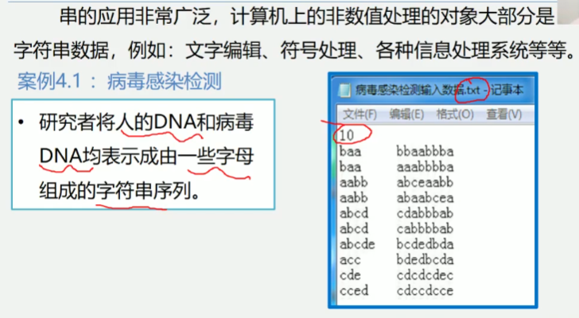
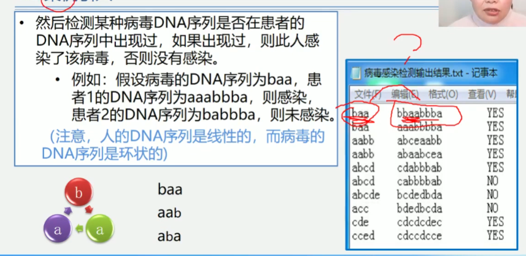

4.2 案例引入

串的应用非常广泛, 计算机上的非数值处理的对象大部分是字符串数据
例如: 文字编辑, 符号处理, 各种信息处理系统等等
案例4.1: 病毒感染检测
    研究者将人的DNA和病毒DNA均表示成由一些字母组成的字符串序列

然后检查某种病毒DNA序列是否在患者的DNA序列中出现过, 如果出现过, 则此人感染了该病毒
否则没有感染
例如:
    假设病毒的DNA序列为baa, 患者1的DNA序列为aaabbba, 则感染,
    患者2的DNA序列为babbba, 则未感染
    (注意, 人的DNA序列是线性的, 而病毒的DNA序列是环状的)

    
    