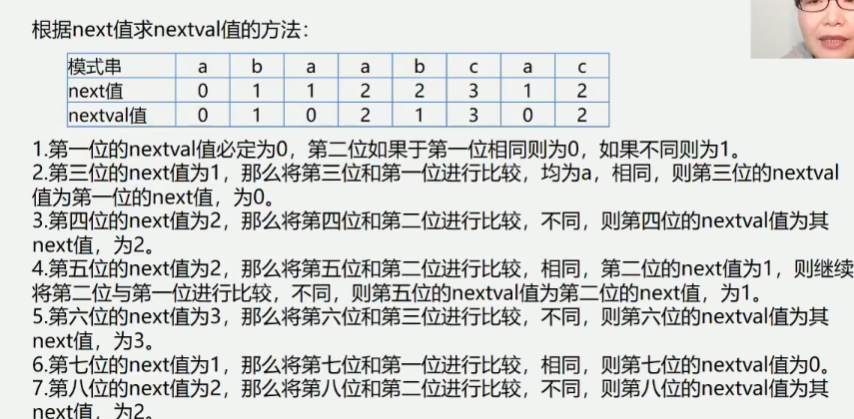

4.3 串的类型定义、存储结构及其运算
4.3.1 串的抽象数据类型定义
```
ADT String {
    数据对象: D = {ai | ai ∈ CharacterSet, i = 1,2,...,n,n>=0 }
    数据关系: R1 = {< ai-1, ai> | ai-1, ai ∈ D, i = 1,2,...,n}
    基本操作:
            (1) StrAssign(&T, chars) // 串赋值
            (2) StrCompare(S, T) // 串比较
            (3) StrLength(S) // 求串长
            (4) Concat(&T, S1, S2) // 串连结
            (5) SubStirng(&Sub, S, pos, len) // 求子串
            (6) StrCopy(&T, S) // 串拷贝
            (7) StrEmpty(S) // 串判空
            (8) ClearString(&S) // 清空串
            (9) Index(S, T, pos) // 子串的位置
            (10) Replace(&S, T, V) // 串替换
            (11) StrInsert(&S, pos, T) // 子串插入
            (12) StrDelete(&S, pos, len) // 子串删除
            (13) DestoryString(&S) // 串销毁
} ADT String
```
串中元素逻辑关系与线性表的相同, 串可以采用与线性表相同的存储结构
逻辑结构 -> 存储结构
串: 
    顺序存储结构: 顺序串
    链式存储结构: 链串
    
串的顺序存储结构
```
#define MAXLEN 255
typedef struct {
    char ch[MAXLEN+1]; // 存储串的一维数组 ch[0]为了处理方便 不存储元素
    int length; // 串的当前长度
} SString
```

4.3.2 串的链式存储结构
优点: 操作方便
缺点: 存储密度较低
存储密度 = 串值所占的存储 / 实际分配的存储
可将多个字符存放在一个结点中, 以克服其缺点(通常这样的一点结点叫做块)

```
串的链式存储结构-块链结构
#define CHUNKSIZE 80 // 块的大小可由用户定义
typedef struct Chunk{
    char ch[CHUNKSIZE+1];
    struct Chunk *next;
} SString

typedef struct {
    Chunk *head, *tail; // 串的头指针和尾指针
    int curlen; // 串的当前长度 
} LString; // 字符串的块链结构
```

4.3.3 串的模式匹配算法
算法目的: 确定主串中所含子串(模式串)第一次出现的位置(定位)
算法应用: 搜索引擎, 拼写检查, 语言翻译, 数据压缩
算法种类:
    1.BF算法(Brute-Force, 又称古典的、经典的、朴素的、穷举的)
    2.KMP算法(特点: 速度快)

Brute-Force简称为BF算法, 亦称简单匹配算法. 采用穷举法的思路
算法思路是从S的每一个字符开始依次与T的字符进行匹配


例如: 设目标串S="aaaaab", 模式串T="aaab", S的长度为n(n=6), T的长度为m(m=4)
BF算法的匹配过程如下:
匹配失败:
    i = (i - j + 1) + 1 = 2 (回溯)
        (i - j + 1) 回退到下标0, 因为0不存元素是从1开始, 所以+1
         + 1 上一次匹配失败所以再加一
    j = 1 (从头开始)


BF算法设计思想
Index(S, T, pos)
1.将主串的第pos个字符和模式串的第一个字符比较
2.若相等, 继续逐个比较后续字符
3.若不等, 从主串的下一个字符起, 重新与模式串的第一个字符比较
    1.直到主串的一个连续子串字符序列与模式串相等. 返回值为S中与T匹配
    的子序列第一个字符的序号, 即匹配成功
    2.否则, 匹配成功, 返回值0

算法4.1 BF算法描述
```
int Index_BF(SString S, SString T) {
    int i = 1, j = 1;
    // i > S.length 代表没有匹配到
    // j > T.length 代表匹配成功
    while(i <= S.length && j <= T.length) {
        if(s.ch[i] == t.ch[j]) {
            ++i; ++j; // 主串和子串依次匹配下一个字符
        } else {
            i = i - j + 2; // 主串、子串指针回溯重新开始下一个匹配
            j = 1;
        }
    }
    if(j >= T.length) return i - T.length; // 返回匹配的第一个字符的小标
    else return 0; // 模式匹配不成功
}

// 从传入的位置开始
int Index_BF(SString S, SString T, int pos) {
    int i = pos, j = 1;
    // i > S.length 代表没有匹配到
    // j > T.length 代表匹配成功
    while(i <= S.length && j <= T.length) {
        if(s.ch[i] == t.ch[j]) {
            ++i; ++j; // 主串和子串依次匹配下一个字符
        } else {
            i = i - j + 2; // 主串、子串指针回溯重新开始下一个匹配
            j = 1;
        }
    }
    if(j >= T.length) return i - T.length; // 返回匹配的第一个字符的小标
    else return 0; // 模式匹配不成功
}

BF算法的时间复杂度
例: S = '0000000001', T = '0001', pos = 1
若n为主串长度, m为子串长度, 最坏情况是
    主串前面n-m个位置都部分匹配到子串的最后一位, 即这n-m位各比较了m次
    最后m位也各比较了1次 (最后一个匹配成功需要的次数)
总次数位: (n - m) * m + m = (n-m+1)*m
若m<<n, 则算法时间复杂度O(n*m)
```

KMP(Knuth Morris Pratt) 算法
KMP算法是D.E.Knuth、J.H.Morris、和V.R.Pratt共同提出的, 简称KMP算法
该算法较BF算法有较大改进, 从而是算法效率有了某种程度的提高

利用已经部分匹配的结果而加快模式串的滑动速度?
且主串S的指针i不必回溯, 可提速到O(n+m)
https://www.cnblogs.com/yjiyjige/p/3263858.html

next[j] = K(函数存放j的下一个位置)
K - 1 = 已经匹配上的个数
![KMP算法next[j]函数.jpg](images/KMP算法next[j]函数.jpg)
```
int Index_KMP(SString S, SString T, int pos) {
    i = pos, j = 1;
    while(i < S.length && j < T.length) {
        if(j == 0 || S.ch[i] == T.ch[j]) {
            i++; j++;
        } else {
            j = next[j];
        }
    }
    if(j >= T.length) return i - T.length; // 匹配成功
    else return 0; // 返回不匹配标志
}

void get_next(SString T, int &next[]) {
    i = 1; next[1] = 0; j = 0;
    while(i < T.length) {
        if(j == 0 || T.ch[i] == T.ch[j]) {
            ++i; ++j;
            next[i] = j;
        } else {
            j = next[j];
        }
    }
}
```


```
void get_nextval(SString T, int &nextval[]) {
    i = 1; nextval[1] = 0; j = 0;
    while(i < T.length) {
        if(j == 0 || T.ch[i] == T.ch[j]) {
            ++i; ++j;
            if(T.ch[i] != T.ch[j]) {
                nextval[i] = j;
            } else {
                nextval[i] = nextval[j]
            }
        } else {
            j = nextval[j];
        }
    }
}
```