4.4 数组
数组: 按一定格式排列起来的, 具有相同类型的数据元素的集合
一维数组: 若线性表中的数据元素为非结构的简单元素, 则称为一维数组
一维数组的逻辑结构: 线性结构, 定长的线性表
声明格式: 数据类型  变量名称[长度]
例: int num[5] = {0,1,2,3,4};

二维数组: 若一维数组中的数据元素又是一维数组结构, 则称为二维数组
二维数组的逻辑结构:
    1.非线性结构 每一个数据元素既在一个行表中, 又在一个列表中
    2.线性结构 该线性表的每个数据元素也是一个定长的线性表

声明格式: 数据类型 变量名称[行数][列数];
        例子: int num[5][8] 表示五行八列

在C语言中, 一个二维数组类型也可以定义为一维数组类型(其分量类型为一堆数组类型), 即:
typedef elemtype array2[m][n];
等价于
typedef elemtype array1[n];
typedef array1 array2[m];

三维数组: 若二维数组中的元素又是一个一维数组, 则称作三维数组
n维数组: 若n-1维数组中的元素又是一个一维数组结构, 则称作n维数组
结论:
    线性表结构是数组结构的一个特例, 而数组结构又是线性表结构的扩展
数组特点: 数据固定-定义后, 维数和维界不再改变
数组基本操作: 
    除了结构的初始化和销毁之外,只有取元素和修改元素值的操作

4.4.1 数组的抽象数据结构
n维数组的抽象数据类型
n为数组的维数
bi为数组第i维的长度
ji为数组元素第i维的下标
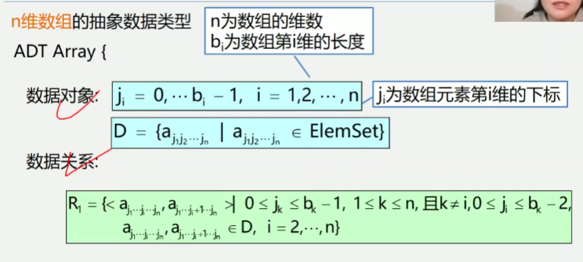

例: 二维数组的抽象数据类型的数据对象和数据关系的定义
n=2(维数为2, 二维数组)
b1: 第一维长度(行数) b2:第二维长度(列数)
aj1j2: 第一维下标为j1, 第二维下标为j2
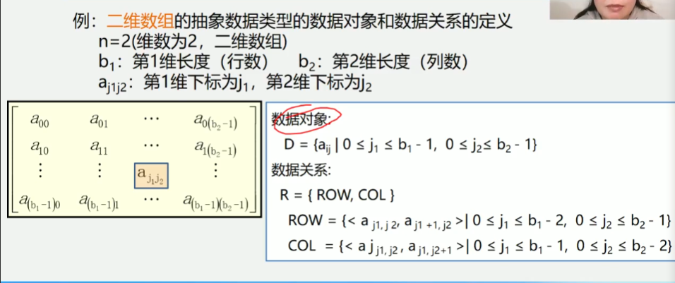

基本操作:
```
ADT String {
    基本操作:
        (1) InitArray(&A, n, bound1, ...boundn) // 构造数组A
        (2) DestoryArray(&A) // 销毁数组A
        (3) Value(A, &e, index1, ...indexn) // 取数组元素值
        (4) Assign(A, &e, index1, ...indexn) // 给数组元素赋值
} ADT String
```

4.4.2 数组的顺序存储
数组特点: 结构固定-维数和维界不变
数据基本操作: 初始化、销毁、取元素、修改元素值、一般不做插入和删除操作
所以: 一般都是采用顺序存储结构来表示数组
注意: 数组可以是多维的, 但是存储数据元素的内存单元地址是一维的, 因此
在存储数组结构之前, 需要解决将多维关系映射到一维关系的问题
例: 有数组定义: int a[5];
每个元素占用4字节, 假设a[0]存储在2000单元, a[3]地址是多少
LOC(0)=a=2000 L=4
LOC(3)=3 * 4 + 2000 = 2012
LOC(i)=
        LOC(0) = a, i = 0
        LOC(i-1) + L = a + i * L, i > 0;
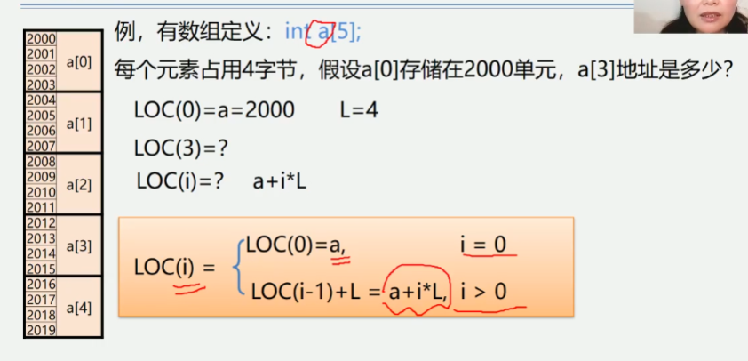

二维数组
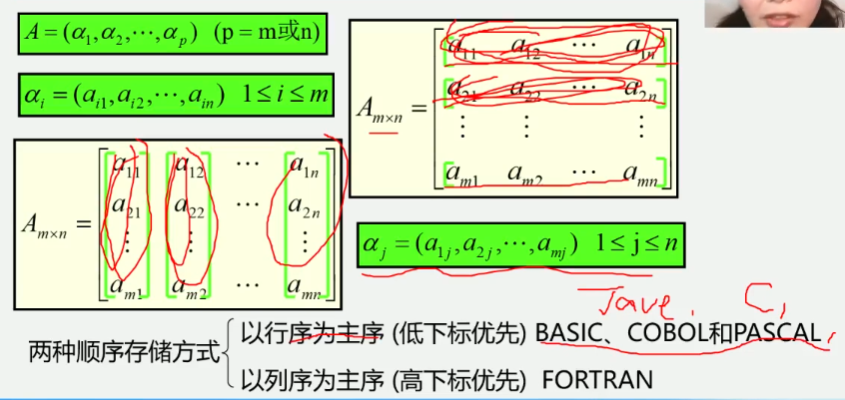
两种顺序存储方式:
    以行序为主序(低下标优先)C,JAVA,BASIC,COBOL,和PASCAL
    以列序为主序(高下标优先)FORTRAN

存储单元是一维结构, 而数组是个多维结构, 则用一组连续存储单元存放数组的数据元素
就有个次序约定问题
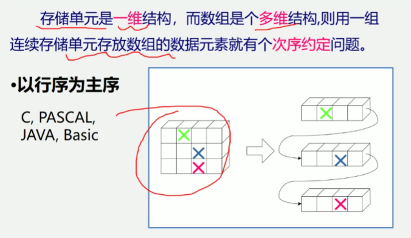
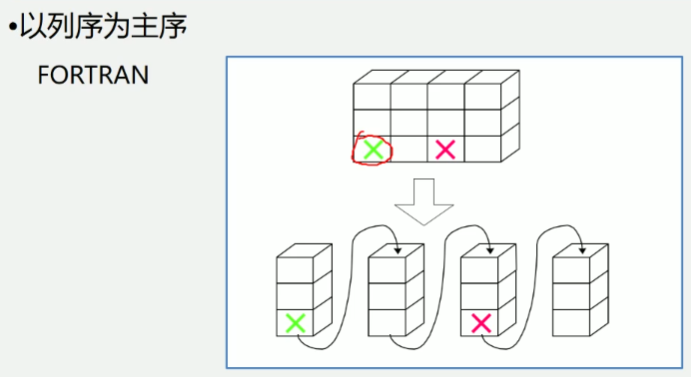

二位数组可有两种存储方式:
    1.以行序为主序
    2.以列序为主序
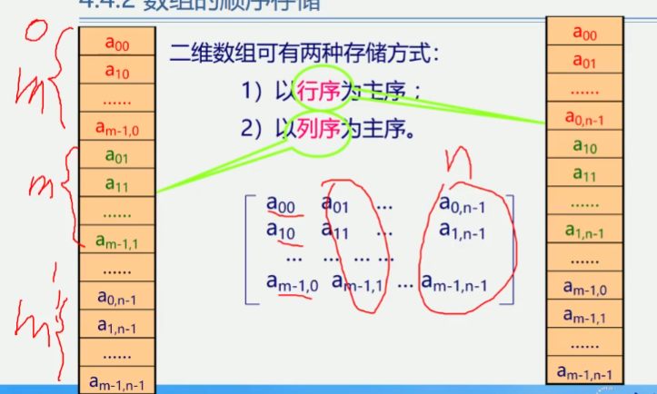
有二维数组A[m][n](A[0..m-1][0..n-1])
以行序为主序:
设数组开始存储位置LOC(0,0),存储每个元素需要L个存储单元
数组元素a[i][j]的存储位置是: LOC(i, j) = LOC(0,0) + (n * i + j) * L
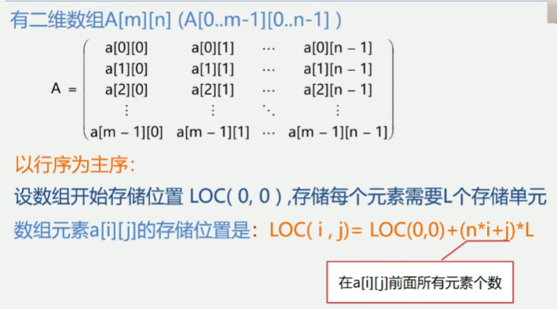

三维数组
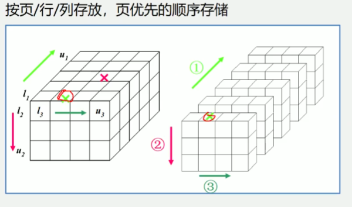
a[m1][m2][m3]各维元素个数为m1,m2,m3
下标为i1,i2,i3的数组元素的存储位置:
    LOC(i1,i2,i3) = a + i1*m2*m3 + i2*m3 + i3
i1*m2*m 前i1页总元素个数
i2*m3 第i1页的前i2行总元素个数
i3 第i2行前i3列元素个数

n维数组
各维元素个数为m1,m2,m3,...,mn
下标为i1,i2,i3,...,in的数组元素的存储位置:
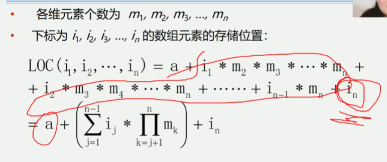
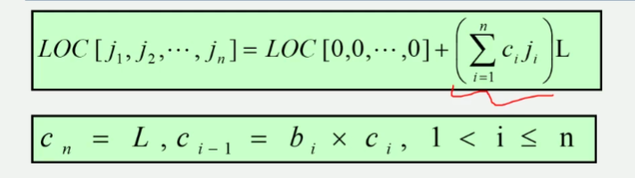

例: 设有一个二维数组A[m][n]按行优先顺序存储, 假设A[0][0]存放位置在644(10),
A[2][2]存放位置在676(10), 每个元素占一个空间, 问A[3][3](10)存放在什么位置
(脚注(10)表示用10进制表示)

设数据元素A[i][j]存放在起始地址为Loc(i,j)的存储单元中
因为 Loc(2,2) = Loc(0,0) + 2 * n + 2 = 644 + 2 * n + 2 = 676
所以 n = (676 - 2 - 644) / 2 = 15
所以 Loc(3,3) = Loc(0,0) + 3 * 15 + 3 = 644 + 45 + 3 = 692

4.4.3 特殊矩阵的压缩存储
矩阵: 一个由m * n个元素排成的m行n列的表
矩阵的常规存储: 将矩阵(二阶矩阵)描述为一个二维数组
矩阵的常规存储的特点:
    可以对其元素进行随机存取;
    矩阵运算非常简单; 存储密度为1
不适宜常规存储的矩阵: 值相同的元素很多且呈某种规律分布; 零元素多.
矩阵的压缩存储: 为多个相同的非零元素只分配一个存储空间;
对零元素不分配空间

1.什么是压缩存储?
若多个数据元素的值相同, 则值分配一个元素值的存储空间, 且零元素不占存储空间
2.什么样的矩阵能够压缩?
一些特殊矩阵: 对称矩阵, 对角矩阵, 三角矩阵, 稀疏矩阵等
3.什么叫稀疏矩阵?
矩阵中非零元素的个数较少(一般小于5%)

1.对称矩阵
特点: n * n 的矩阵a中, 满足如下性质:
    aij = aji (1 <= i, j <= n)
存储方法: 只存储下(或者上)三角(包括主对角线)的数据元素. 共占用n(n+1)/2个元素空间
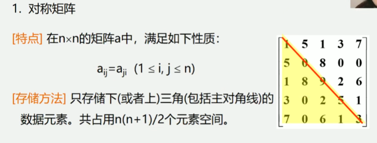
对称矩阵的存储结构:
对称矩阵上下三角中的元素数均为:
n(n+1)/2
可以以行序为主序将元素存放在一个一维数组sa[n(n+1)/2]中.


2.三角矩阵
特点: 对角线以下(或者以上)的数据元素(不包含对角线)全部为常数c
存储方法: 重复元素c共享一个元素存储空间, 共占用n(n+1)/2+1个元素
空间: sa[1..n(n+1)/2+1]
上三角矩阵:
    k=
        (i-1)*(2n-i+2)/2+j-i+1 i<=j
        n(n+1)/2+1 i>j
    k=
        i*(i-1)/2 + j i>=j
        n(n+1)/2 + 1 i<j
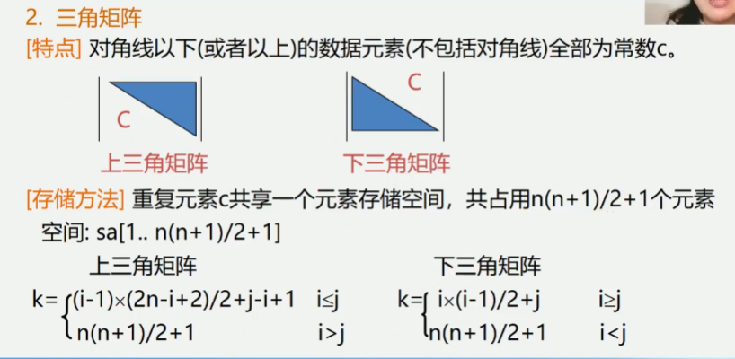
        
3.对角矩阵(带状矩阵)
特点: 在n*n的方阵中, 所有非零元素都集中在以主对角线为中心的带状区域中,
区域外的值全为0, 则称为对角矩阵, 常见的有三对角矩阵, 五对角矩阵、七对角矩阵等
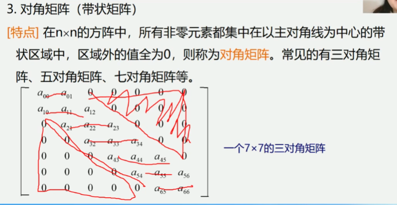
存储方法: 以对角线的顺序存储
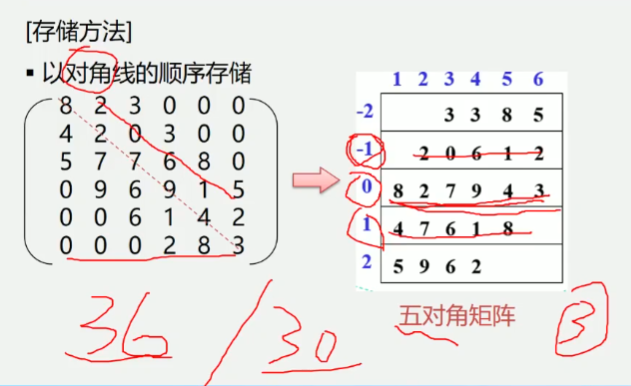

4.稀疏矩阵
设在m*n的矩阵中有t个非零元素. 令δ=t/(m*n), 当δ<=0.05时称为稀疏矩阵
三元组(i,j,aij)唯一确定矩阵的一个非零元素
压缩存储原则: 存各非零元的值、行列位置和矩阵的行列数
三元组的不同表示方法可以决定稀疏矩阵不同的压缩存储方法
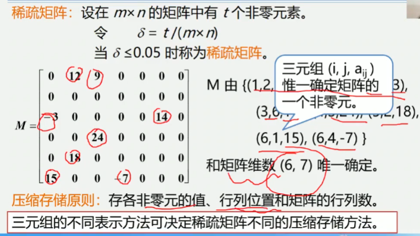

三元组顺序表 i, j, v
注意: 为更可靠描述, 通常再加一个"总体"信息: 即总行数, 总列数, 非零元素总个数
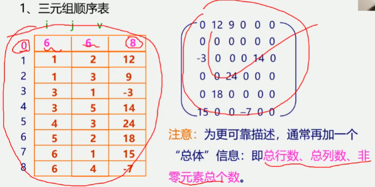

例: 试还原出下列三元组所表示的稀疏矩阵
i       j       value
6       2       2
2       1       12
3       1       3
4       4       4
5       3       5
6       1       16
还原
0       2       0       0
12      0       0       0
3       0       0       0
0       0       0       4
0       0       6       0
16      0       0       0

三元组顺序表又称有序的双下标法
三元组顺序表的优点: 非零元在表中按行序有序存储, 因此便于进行依行顺序处理的矩阵运算
三元组顺序表的缺点: 不能随机存取, 若按行号存取某一行中的非零元, 则需从头开始进行查找

稀疏矩阵的链式存储结构-十字链表
优点: 它能够灵活地插入因运算而产生的新的非零元素,
删除因运算而产生的新的零元素, 实现矩阵的各种运算.
在十字链表中, 矩阵的每一个非零元素用一个结点表示,该结点除(row, col, value)以外
还要两个域:
    right: 用于链接同一行中的下一个非零元素
    down: 用于链接同一列中的下一个非零元素
十字链表中结点的结构示意图
[row | col | value]
[  down  | right  ]
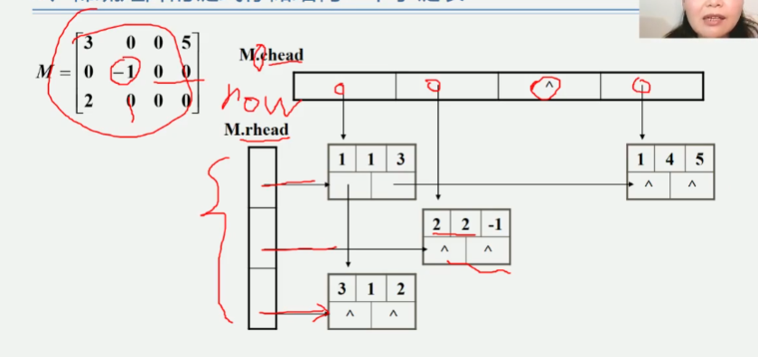
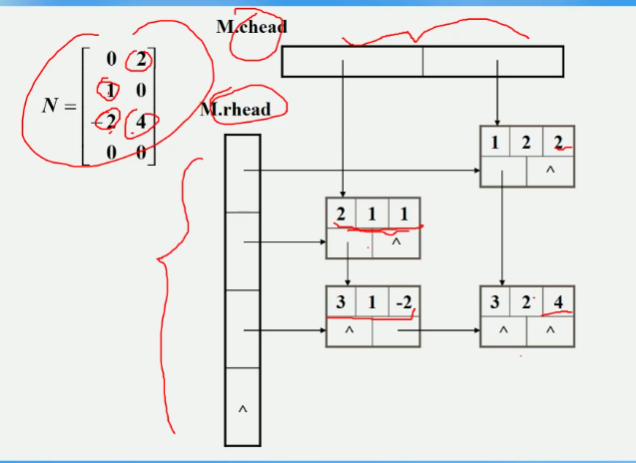
行的头指针指向每一行的第一个非零元素
列的头指针指向每一列的第一个非零元素
头指针也是数组存储
