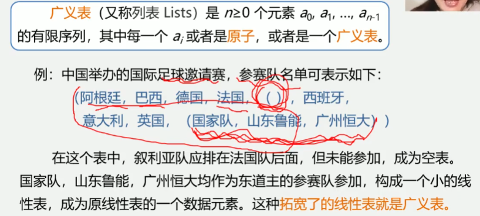

4.2 广义表

广义表(又称列表Lists) 是n>=0个元素a0,a1,...,an-1的有限序列,
其中每一个ai或者是原子(单一元素), 或者是一个广义表

广义表通常记作: LS = (a1,a2,...,an)
其中: LS为表名, n为表的长度, 每一个ai为表的元素.
习惯上: 一般用大写字母表示广义表, 小写字母表示原子.
表头: 若LS非空(n>=1), 则其第一个元素a1就是表头.
    记作head(LS) = a1. 注: 表头可以是原子, 也可以是子表
表尾: 除表头之外的其他元素组成的表
    记作 tail(LS) = (a2,...,an)
    注: 表尾不是最后一个元素, 而是一个子表
    
例: 1.A=() 空表, 长度为0
    2.B=(()) 长度为1, 表头、表尾均为()
    3.C=(a,(b,c)) 长度为2, 由原子a和子表(b,c)构成
    4.D=(x,y,z) 长度为3, 每一项都是原子, 表头为x, 表尾为(y,z)
    5.E(C,D) 长度为2, 每一项都是子表, 表头为C, 表尾为(D)
    6.F=(a,F) 长度为2, 第一项为原子, 第二项为它本身, 表头为a, 表尾为(F), F=(a1(a1(a1)))

广义表的性质
1.广义表中的数据元素有相对次序; 一个直接前驱和一个直接后继
2.广义表的长度定义为最外层所包含元素的个数
    如: C=(a,(b,c))是长度为2的广义表
3.广义表的深度定义为该广义表展开后所含括号的重数;
    A(b,c)的深度为1, B(A,d)的深度为2, C=(f,B,h)的深度为3
    注意: "原子"的深度为0; "空表"的深度为1;
4.广义表可以为其他广义表共享; 如: 广义表B就共享表A.
    在B中不必列出A的值, 而是通过名称来引用, B=(A)
5.广义表可以是一个递归的表, 如: F(a, F=(a1(a1(a1...))))
    注意: 递归表的深度是无穷值, 长度是有限值
6.广义表是多层次结构, 广义表的元素可以是单元素, 也可以是子表, 
而子表的元素还可以是子表, 可以用图形象地表示
例: D=(E,F) 其中:E=(a1(b1,c)) F=(d,(e))

广义表和线性表的区别
广义表可以看成是线性表的推广, 线性表是广义表的特例
    广义表的结构相当灵活, 在某种前提下, 它可以兼容线性表, 数组, 树, 有向图等各种常用的数据结构
    当二维数组的每行(或每列)作为子表处理时, 二维数组即为一个广义表
    另外, 树和有向图也可以用广义表来表示
    由于广义表不仅集中了线性表、数组、树、有向图等常见数据结构的特点, 而且可有效地利用存储空间
    因此在计算机的许多应用领域都有成功使用广义表的实例

广义表的运算
1.求表头GetHead(L): 非空广义表的第一个元素, 可以是一个单一元素, 也可以是一个子表
2.求表尾GetTail(L): 非空广义表除去表头元素以外其它元素构成的表, 表尾一定是一表
例如: D=(E, F) = ((a,(b,c)), F)
```
GetHead(D)=E GetTail(D)=(F)
GetHead(D)=a GetTail(D)=((b, c))
GetHead(((b,c)))=(b,c) GetTail(((b,c)))=()
GetHead((b,c))=b GetTail((b,c))=(c)
GetHead((c))=(c) GetTail((c))=()
```

广义表通常用链表存储, 因为数组每个元素都是同样的大小

    