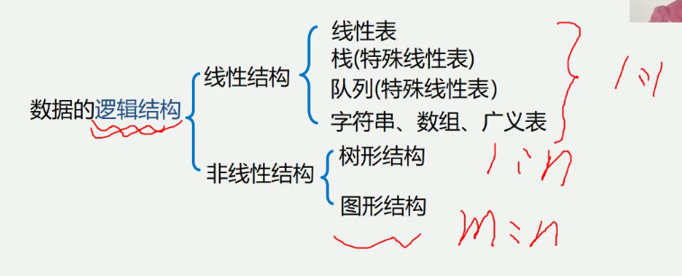
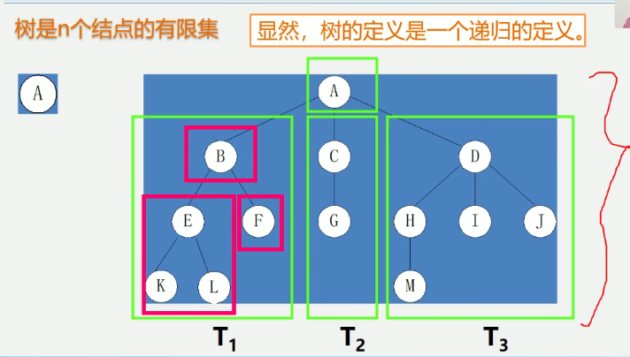
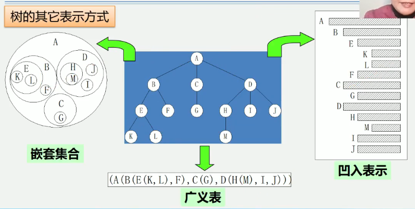
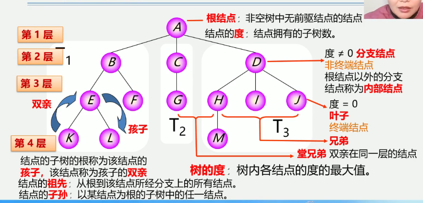
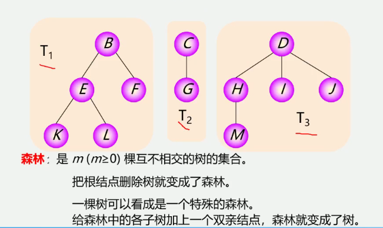
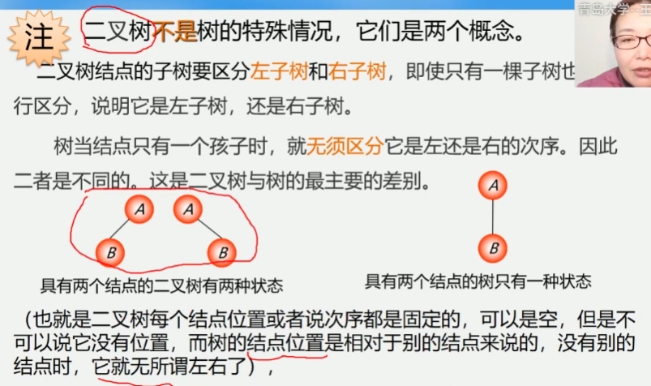
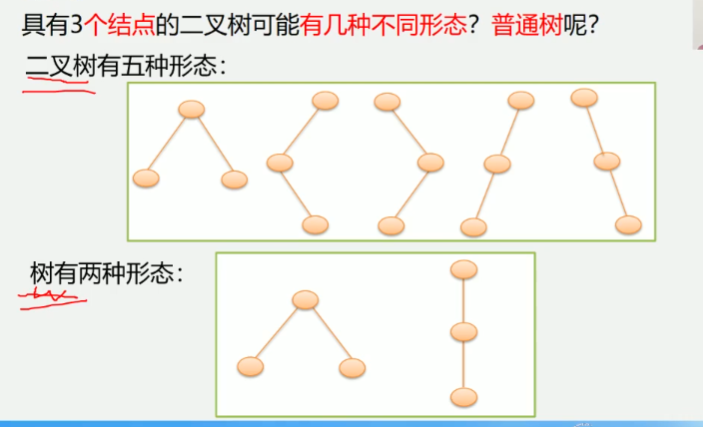
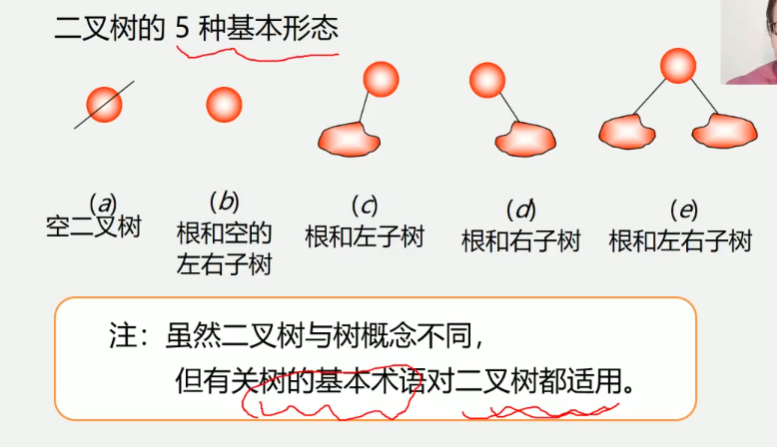

5.1 树和二叉树的定义

树形结构(非线性结构)
    结点之间有分支
    具有层次关系
    
例子
    自然界: 树
    人类社会: 家谱, 行政组织结构
    计算机领域: 
        编译: 用树表示源程序的语法结构
        数据库系统: 用树组织信息
        算法分析: 用树描述执行过程
        
5.1.1树的定义(递归的, 嵌套的)
树(Tree)是n(n>=0)个结点的有限集
    若n=0, 称为空树;
    若n>0, 则满足如下两个条件;
        1.有且仅有一个特定的称为根(Root)的结点;
        2.其余结点可分为m(m>=0)个互不相交的有限集T1, T2, T3, ...Tm,
        其中每一个集合本身又是一棵树, 并称为根的子树(SubTree)
        
树是有n个结点的有限集
显然, 树的定义是一个递归的定义

树的其他表示方式
可以用集合表示

5.1.2 树的基本术语
垂直关系:
结点: 数据元素以及指向子树的分支
根节点: 非空树中无前驱结点的结点
结点的度: 结点拥有的子树数
树的度: 树内各结点的度的最大值
    度=0 叶子, 终端结点
    度!=0 分支结点 非终端结点, 根据点以外的分支结点称为内部结点
结点的子树的根称为该结点的孩子, 该结点称为孩子的双亲
树的深度(高度): 树中结点的最大层次

水平关系:
兄弟: 共同的双亲称为兄弟结点
堂兄弟: 双亲再同一层的结点
结点的祖先: 从根到该结点所经分支上的所有结点
结点的子孙: 以某结点为根的子树中的任一结点

有序树: 树中结点的各子树从左至右有次序(最左边的为第一个孩子)
无序树: 树中结点的各子树无次序
森林: 是m(m>=0)棵互不相交的树的集合
    把根结点删除树就变成了森林
    一棵树可以看成是一个特殊的森林,给森林中的各子树加上一个双亲结点, 森林就变成了树
树一定是森林, 森林不一定是树

树结构和线性结构的比较
线性结构                树结构
第一个数据元素 无前驱     根结点(只有一个) 无双亲
最后一个数据元素 无后继    叶子结点(可以有多个) 无孩子
其他数据元素             其他结点-中间结点
一个前驱, 一个后继        一个双亲, 多个孩子
一对一                 一对多

5.1.3 二叉树的定义
为何要重点研究每结点最多只有两个"叉"的树?
    二叉树的结构最简单, 规律性最强
    可以证明, 所有树都能转为唯一对应的二叉树, 不失一般性
普通树(多叉树)若不转化为二叉树, 则运算很难实现
    二叉树在树结构的应用中起这非常重要的作用, 因为对二叉的许多
    操作算法简单, 而任何树都可以与二叉树相互转换, 这样就解决了
    树的存储结构及其算法中存在的复杂性
    
二叉树是n(n>=0)个结点的有限集, 它或者是空集(n=0),
或者由一个根结点及两颗互不相交的分别称作这个根的左子树和右子树
的二叉树组成
特点:
    1.每个结点最多由俩孩子(二叉树中不存在度大于2的结点)
    2.子树有左右之分, 其次序不能颠倒
    3.二叉树可以是空集合, 根可以有空的左子树或空的右子树

注意: 二叉树不是树的特殊情况, 它们是两个概念
    二叉树结点的子树要区分左子树和右子树, 即使只有一颗子树也要进行行区分
    说明它是左子树还是右子树
    树当结点只有一个孩子时, 就无须区分它是左还是右的次序, 因此
    二者是不同的, 这是二叉树与树的最主要的差别
    
也就是二叉树每个结点位置或者说次序都是固定的, 可以是空, 但是不能可以说
它没有位置, 而树的结点位置是相对于别的结点来说的, 没有别的结点时,
它就无所谓左右了

思考:
具有3个结点的二叉树可能有几种不同形态? 普通树呢?
二叉树有五种形态
树有两种形态

二叉树的5种基本形态
注意: 虽然二叉树与树概念不同, 但是有关树的基本术语对二叉树都适用

