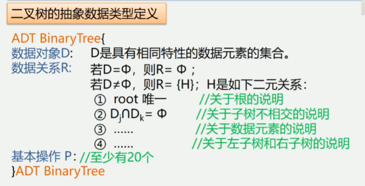

5.2 树和二叉树的抽象数据类型定义
二叉树的抽象数据类型定义(树相似)

CreateBiTree(&T, definition)
    初始条件: definition给出二叉树T的定义
    操作结果: 按definition构造二叉树T
PreOrderTraverse(T)
    初始条件: 二叉树T存在
    操作结果: 先序遍历T, 对每个结点访问一次
InOrderTraverse(T)
    初始条件: 二叉树T存在
    操作结果: 中序遍历T, 对每个结点访问一次
PostOrderTraverse(T)
    初始条件: 二叉树T存在
    操作结果: 后序遍历T, 对每个结点访问一次