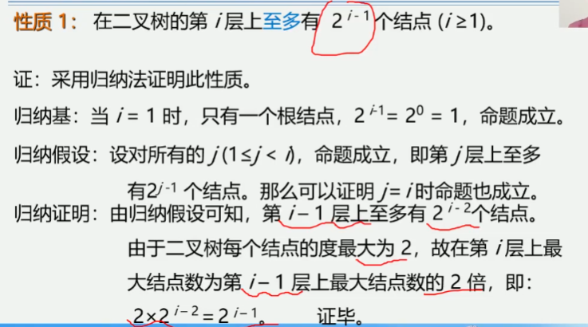
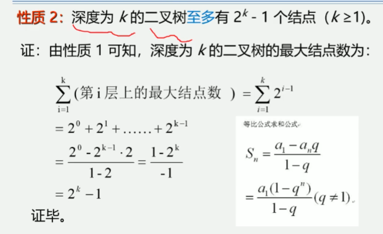
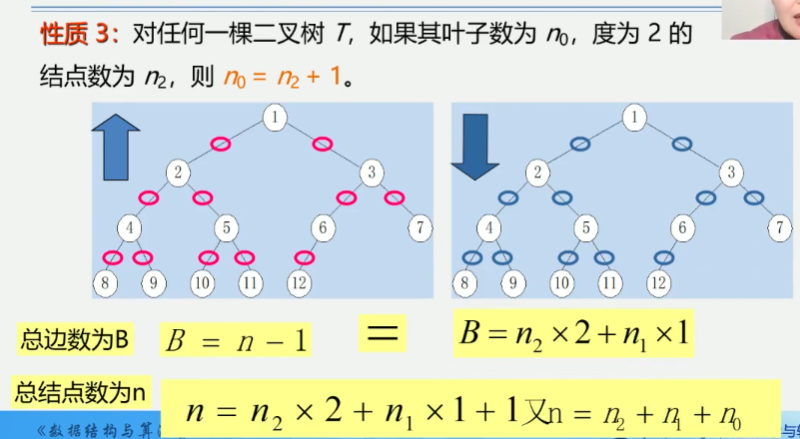

5.4 二叉树的性质和存储结构
性质1: 在二叉树的第i层上至多有2的i-1次方个结点(i>=1)

提问: 第i层上至少有几个结点
     1个节点

性质2: 深度为k的二叉树至多有2的k次方减一个结点(k>=1)

提问: 深度为k时至少有几个结点
     k个结点

性质3: 对任何一棵二叉树T, 如果其叶子树(没有后继结点, 没有子树, 没有孩子, 度为0)
为n0, 度为2的结点数为n2, 则n0=n2+1
n(结点总数)
n2(双结点个数)
n1(单节点个数)
n0(叶节点个数)
