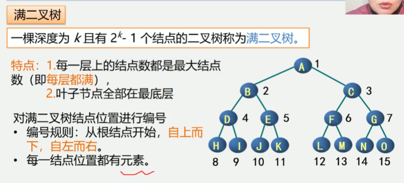

5.4 二叉树的性质和存储结构
性质1: 在二叉树的第i层上至多有2的i-1次方个结点(i>=1)

提问: 第i层上至少有几个结点
     1个节点

性质2: 深度为k的二叉树至多有2的k次方减一个结点(k>=1)

提问: 深度为k时至少有几个结点
     k个结点

性质3: 对任何一棵二叉树T, 如果其叶子树(没有后继结点, 没有子树, 没有孩子, 度为0)
为n0, 度为2的结点数为n2, 则n0=n2+1
n(结点总数)
n2(双结点个数)
n1(单节点个数)
n0(叶节点个数)


两种特殊形式的二叉树
为什么要研究这两种特殊形式: 因为它们在顺序存储方式下可以复原

满二叉树
一棵深度为k且有2的k次方减一个结点的二叉树称为满二叉树
特点: 
1.每一层上的结点数都是最大节点数(即每层都满)
2.叶子结点全部都在最底层
对满二叉树结点位置进行编号
    编号规则: 从根结点开始, 自上而下, 自左而右
    每一结点位置都有元素


满二叉树在同样深度的二叉树中结点个数最多
满二叉树在同样深度的二叉树中叶子结点个数最多


完全二叉树
深度为k具有n个结点的二叉树, 当且仅当其每一个结点都与深度为k的满二叉树中
编号为1~n的结点一一对应时, 称之为完全二叉树


是否是完全二叉树
1.yes 2.no 3.yes 4.no


注: 在满二叉树中, 从最后一个结点开始, 连续去掉任意个结点,
即是一颗完全二叉树
特点:
    1.叶子只可能分布在层次最大的两层上
    2.任一结点, 如果其右子树的最大层次为i
    则其左子树的最大层次必为i或i+1
满二叉树一定是完全二叉树
完全二叉树不一定是满二叉树


性质4: 具有n个结点的完全二叉树的深度为[log(2)(n)] + 1
注: [x]: 称作x的底, 表示不大于x的最大整数

性质4表明了完全二叉树结点数n与完全二叉树深度k之间的关系


性质5: 如果对一颗有n个结点的完全二叉树(深度为[log(2)(n)] + 1)的结点
按层序编号(从第1层到[log(2)(n)] + 1层, 每层从左往右), 则对任一结点i
(1<=i<=n), 有:
(1) 如果i=1, 则结点i是二叉树的根, 无双亲; 如果i>1, 则其双亲是结点[i/2]的底
(2) 如果2i>n, 则结点i为叶子结点, 无左孩子; 否则, 其左孩子是结点2i
(3) 如果2i+1>n, 则结点i无右孩子; 否则, 其右孩子是结点2i+1
性质5表明了完全二叉树中双亲结点编号与孩子结点编号之间的关系


二叉树的存储结构
顺序存储结构

链式存储结构
    二叉链表
    三叉链表

二叉树的顺序存储
实现: 按满二叉树的结点层次编号, 依次存放二叉树中的数据元素

```
// 二叉树顺序存储表示 bi(Binary Tree)
#define MAXTSIZE 100
Typeof TElemType SqBiTree[MAXTSIZE]
SqlBiTree bt;
```
如果不写0那么表示就是完全二叉树, 但是这个结构只是一个树结构
写0后可以从数组恢复回原来的树


二叉树的顺序存储缺点
最坏情况: 深度为k的且只有k个结点的单支数需要长度为2的k次方-1的一维数组
特点:
结点间的关系蕴含在其存储位置中浪费空间, 适于存满二叉树和完全二叉树


二叉树的链式存储结构
二叉树结点的特点
存储方式
结点结构[lchild|data|rchild]

```
// 二叉链表存储结构
typedef struct BiNode {
    TElemTyoe data;
    struct BiNode *lchild, *rchild; // 左右孩子指针
}BiNode, *BiTree;
```


在n个结点的二叉链表中, 有n+1个空指针域
分析: 必有2n个链域, 除根结点外, 每个结点有且仅有一个双亲,
所以只会有n-1个结点的链域存放指针, 指向非空子女结点
空指针数目 = 2n - (n-1) = n+1


三叉链表
[lchild|data|parent|rchild]
```
typedef struct TriTNode {
    Telem Type data;
    struct TriTNode *lchild, *parent, *rchild;
} TriTNode, *TriTree;
```

