5.5 遍历二叉树和线索二叉树

遍历定义-顺着某一条搜索路径巡防二叉树中的结点, 使得每个结点均被访问一次,
而且被访问一次(又称周游)
    "访问"的含义很广, 可以是对结点作各种处理, 如: 输出结点的信息, 修改结点的数据值等
    但要求这种访问不破坏原来的数据结构(不删除和新增)

遍历目的-得到树中所有结点的一个线性排列
遍历用途-它是树结构插入、删除、修改、查找和排序运算的前提, 是二叉树一切运算的基础和核心

依次遍历二叉树中的三个组成部分, 便是遍历了整个二叉树
假设: L: 遍历左子树 D: 访问根结点 R: 遍历右子树
则遍历整个二叉树方案共有: DLR,LDR,LRD,DRL,RDL,RLD六种
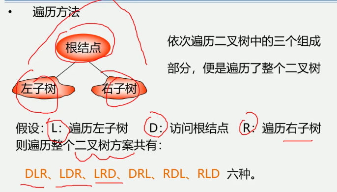

1.遍历二叉树的算法描述
若规定先左后右, 则只有前面三种情况:
DLR-先(根)序遍历
LDR-中(根)序遍历
LRD-后(根)序遍历
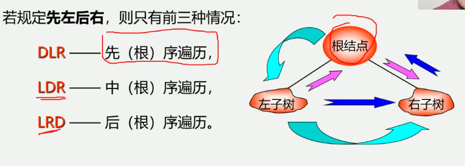

由二叉树的递归定义可知, 遍历左子树和遍历右子树可如同遍历二叉树一样"递归进行"
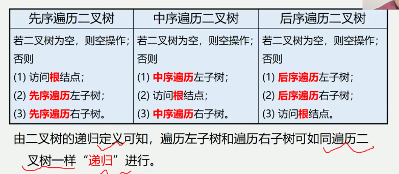

先序遍历二叉树的操作定义
若二叉树为空, 则空操作L; 否则
1.访问根结点;
2.先序遍历左子树
3.先序遍历右子树
先序遍历的顺序为ABC
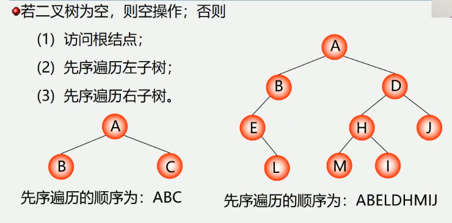

中序遍历二叉树的操作定义
若二叉树为空, 则空操作; 否则
1.中序遍历左子树;
2.访问根结点
3.中序遍历右子树
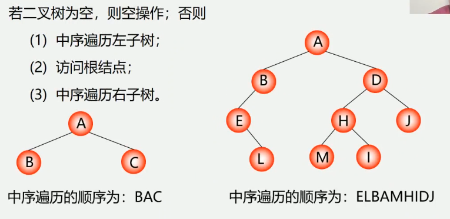

后序遍历二叉树的操作定义
若二叉树为空, 则空操作; 否则
1.后序遍历左子树
2.后序遍历右子树
3.访问根结点


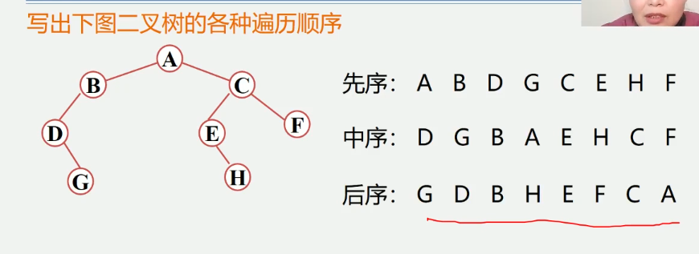
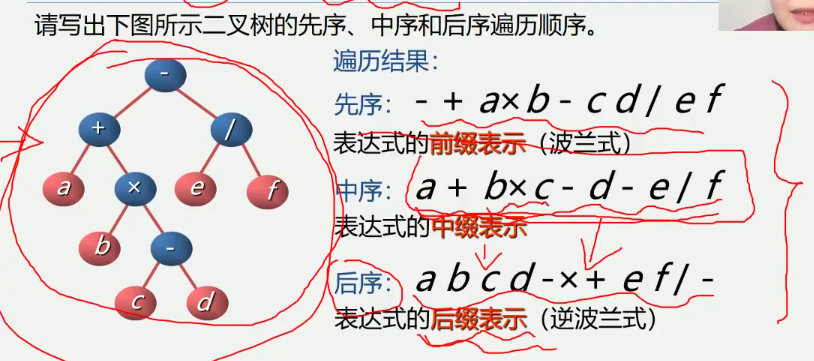


2.根据遍历序列确定二叉树
若二叉树中各结点的值均不相同, 则二叉树结点的先序序列, 中序序列和后序序列都是唯一的
由二叉树的先序序列和中序序列, 或由二叉树的后序序列和中序序列可以确定唯一一颗二叉树
知道先序和后续是不可以的 无法确定谁是根

例题-已知先序和中序序列求二叉树
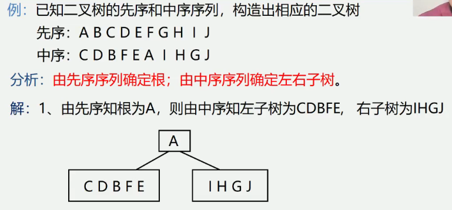
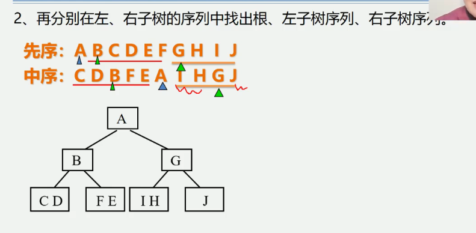
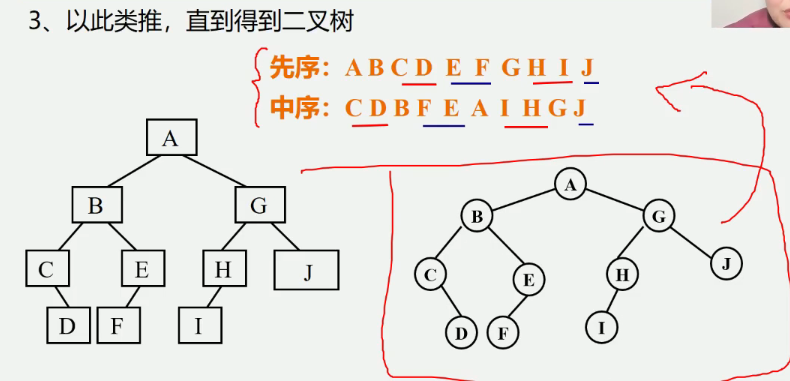

例题-已知中序和后序序列求二叉树
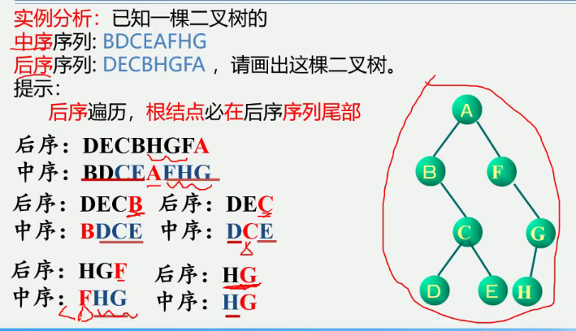

遍历的算法实现-先序遍历(二叉链表)
若二叉树为空, 则空操作;
若二叉树非空
    访问根结点(D)
    前序遍历左子树(L)
    前序遍历右子树(R)
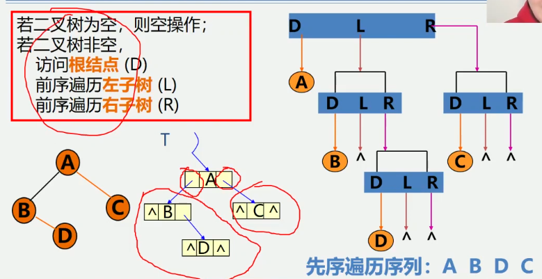
```
Status preOrderTraverse(BiTree T) {
    if(T == NULL) return OK; // 空二叉树
    else {
        visit(T); // 访问根结点
        preOrderTraverse(T -> lchild); // 递归遍历左子树
        preOrderTraverse(T -> rchild); // 递归遍历右子树
    }
}
```
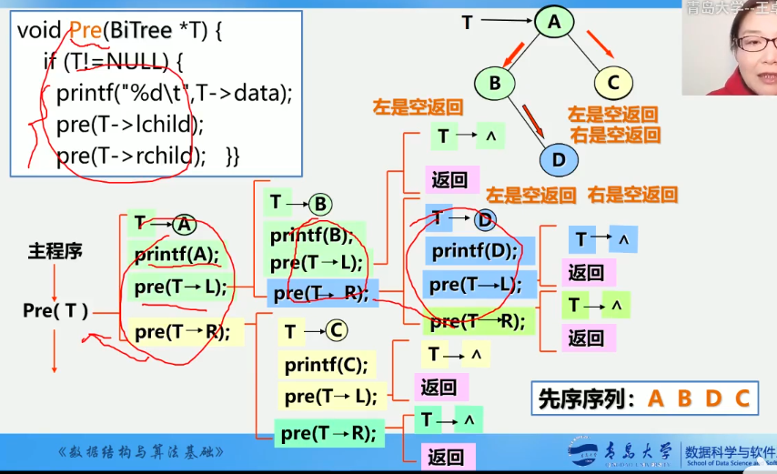


遍历的算法实现-中序遍历
若二叉树为空, 则空操作;
若二叉树非空
    中序遍历左子树(L)
    访问根结点(D)
    中序遍历右子树(R)
```
Status inOrderTraverse(BiTree T) {
    if(T == NULL) return OK; // 空二叉树
    else {
        inOrderTraverse(T -> lchild); // 递归遍历左子树
        visit(T); // 访问根结点
        inOrderTraverse(T -> rchild); // 递归遍历右子树
    }
}
```
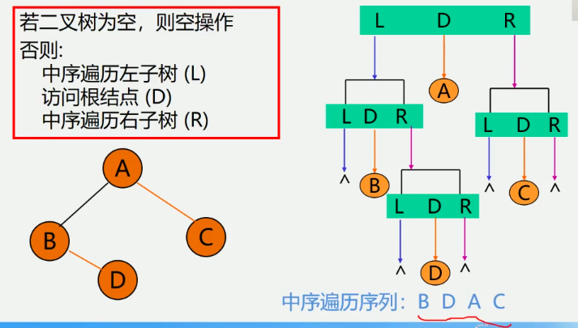

遍历的算法实现-后序遍历
若二叉树为空, 则空操作;
若二叉树非空
    后序遍历左子树(L)
    后序遍历右子树(R)
    访问根结点(D)
```
Status postOrderTraverse(BiTree T) {
    if(T == NULL) return OK; // 空二叉树
    else {
        postOrderTraverse(T -> lchild); // 递归遍历左子树
        postOrderTraverse(T -> rchild); // 递归遍历右子树
        visit(T); // 访问根结点
    }
}
```
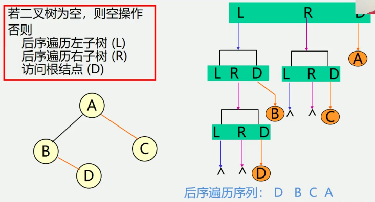

遍历算法的分析
如果去掉输出语句, 从递归的角度看, 三种算法是完全相同的,
或说这三种算法的访问路径是相同的, 只是访问结点的时机不同.
从虚线的出发点到终点的路径上, 每个结点经过3次.
第1次经过时访问=先序遍历
第2次经过时访问=中序遍历
第3次经过时访问=后序遍历
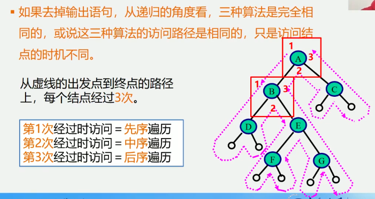
时间效率: O(n) 每个结点只访问一次
空间效率: O(n) 栈占用的最大辅助空间


遍历二叉树的非递归算法
中序遍历非递归算法
    二叉树中序遍历的非递归算法的关键: 在中序遍历过某结点的整个左子树后,
    如何找到该结点的根以及右子树
基本思想:
    1.建立一个栈
    2.根结点进栈, 遍历左子树
    3.根结点出栈, 输出根结点, 遍历右子树
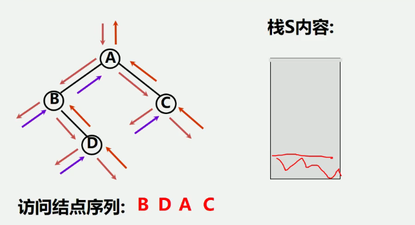

中序遍历的非递归算法(算法5.2)
```
Status InOrderTraverse(BiTree T) {
    BiTree p; InitStack(S); p=T;
    while(p || !StackEmpty(S)) {
        if(p) {
            Push(S,p);
            p = p -> lchild;
        } else {
            Pop(S, q);
            printf("%c", q -> data);
            p = q -> rchild;
        }
    }
    return OK;
}
```
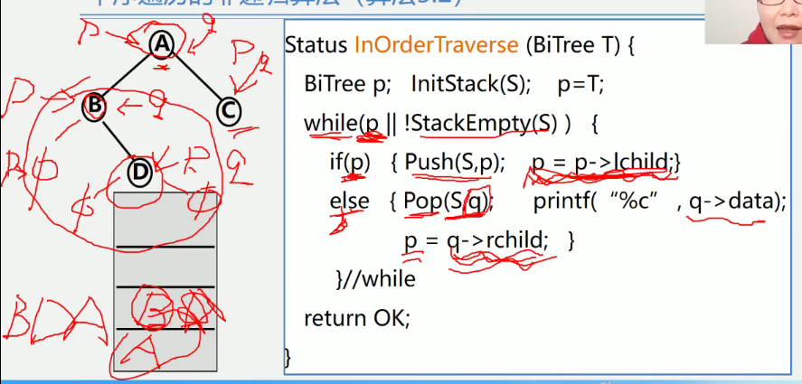

二叉树的层次遍历(队列实现, 也可以使用栈实现)
层次遍历结果: abfcdgeh
对于一颗二叉树, 从根结点开始, 按从上到下, 从左到右的顺序访问每一个结点
每一个结点仅仅访问一次
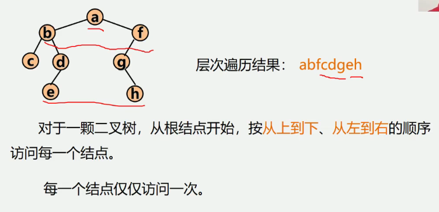
算法设计思路: 使用一个队列
1.将根结点进队;
2.队不空时循环: 从队列中出列一个结点*p, 访问它;
    若它有左孩子结点, 将左孩子结点进队;
    若它有右孩子结点, 将右孩子结点进队;
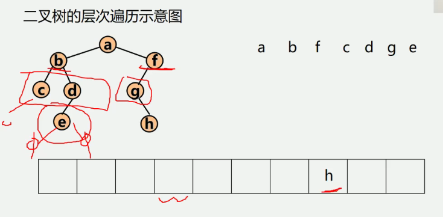
```
typedef struct{
    BTNode data[MaxSize]; // 存放队中元素
    int front, rear; // 队头和队尾指针
} SqQueue; // 顺序循环队列类型
```
二叉树层次遍历算法:
```
void LevelOrder(BTNode *b) {
    BTNode *p; SqQueue *qu;
    InitQueue(qu); // 初始化队列
    enQueue(qu, b); // 根结点指针进入队列
    while(!QueueEmpty(qu)) { // 队不为空, 则循环
        deQueue(qu, p); // 出队结点p
        printf("%c", p -> data); // 访问结点p
        if(p -> lchild!=NULL) {
            enQueue(qu, p -> lchild); // 有左孩子时将其进队
        }
        if(p -> rchild != NULL) {
            enQueue(qu, p -> rchild); // 有右孩子时将其进队
        }
    }
}
```

二叉树遍历算法的应用-二叉树的建立(算法5.3)
按先序遍历序列建立二叉树的二叉链表
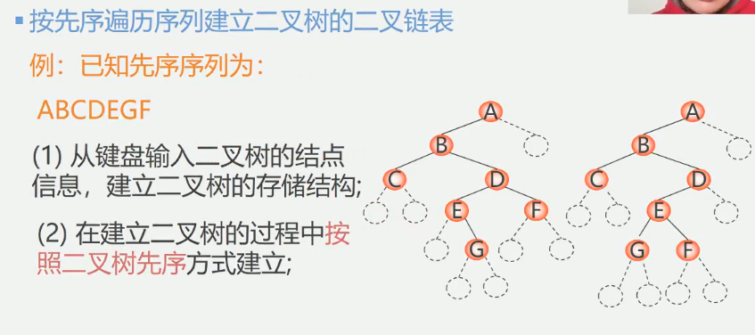
例: 已知先序序列为:
    ABCDEGF
1.从键盘输入二叉树的结点信息, 建立二叉树的存储结构
2.在建立二叉树的过程中按照二叉树先序方式建立
```
Status CreateBiTree(BiTree &T) {
    scanf(&ch); // cin >> ch;
    if(ch == "#") {
        T = NULL;
    } else {
        if(!(T = (BiTNode *)malloc(sizeof(BiTNode)))) {
            exit(OVERFLOW) // T = new BiTNode;
        }
        T -> data = ch; // 生成根结点
        CreateBiTree(T -> lchild) // 构造左子树
        CreateBiTree(T -> rchild) // 构造右子树
    }
    return OK;
}
```
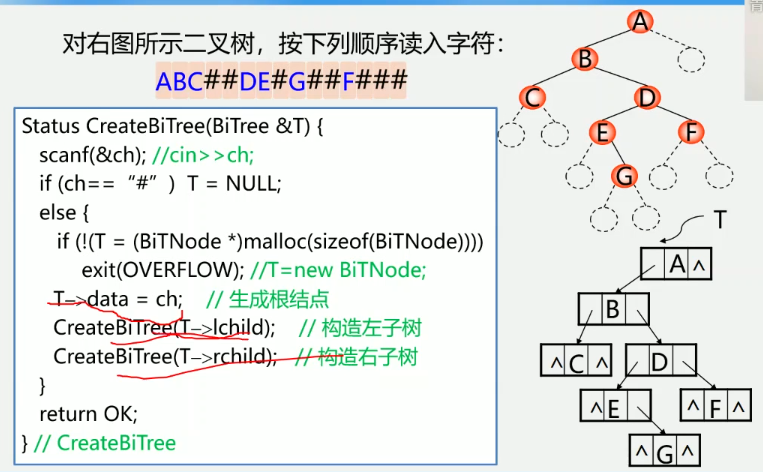

二叉树遍历算法的应用-复制二叉树(算法5.4)
如果是空树, 递归结束;
否则, 申请新结点空间, 复制根结点
    递归复制左子树
    递归复制右子树
```
int Copy(BiTree T, BiTree &NewT) {
    if(T == NULL) { // 如果是空树返回0
        NewT = NULL;
        return 0;
    } else {
        NewT = new BiTNode;
        NewT -> data = T -> data;
        Copy(T -> lChild, NewT -> lchild);
        Copy(T -> rChild, NewT -> rchild);
    }
}
```
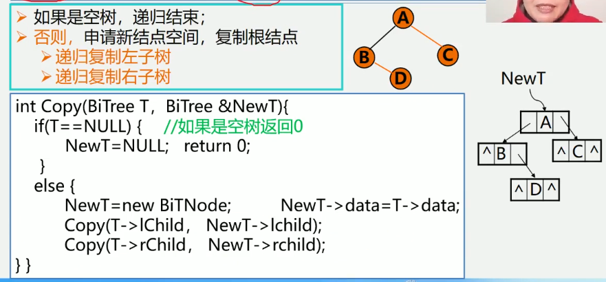

二叉树遍历算法的应用-计算二叉树深度(算法5.5)
如果是空树, 则深度为0;
否则, 递归计算左子树的深度记为m, 递归计算右子树的深度记为n,
二叉树的深度则为m与n的较大者加1;
```
int Depth(BiTree T) {
    if(T==NULL) {
        return 0; // 如果是空树返回0
    } else {
        m = Depth(T->lChild);
        n = Depth(T->rChild);
        if(m > n) {
            return (m+1);
        } else {
            return (n+1);
        }
    }
}
```
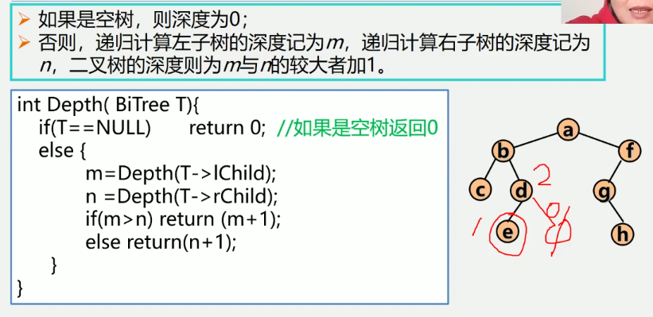

二叉树遍历算法的应用-计算二叉树结点总数(算法5.6)
如果是空树, 则结点个数为0;
否则, 结点个数为左子树的结点个数+右子树的结点个数再+1
```
int NodeCount(BiTree T) {
    if(T == NULL) {
        return 0;
    } else {
        return NodeCount(T -> lchild) + NodeCount(T -> rchild) + 1;
    }
}
```
[二叉树遍历算法的应用-计算二叉树结点总数.jpg](images/二叉树遍历算法的应用-计算二叉树结点总数.jpg)

二叉树遍历算法的应用-计算二叉树叶子结点数(补充)
如果是空树, 则结点个数为0;
否则, 结点个数为左子树的结点个数+右子树的结点个数
```
int LeadCount(BiTree T) {
    if(T == NULL) { // 如果是空树返回0
        return 0;
    } 
    if(T -> lchild == NULL && T -> rchild == NULL){
        return 1; // 如果是叶子结点返回1
    } else {
        return LeadCount(T -> lchild) + LeadCount(T -> rchild);
    }
}
```
[二叉树遍历算法的应用-计算二叉树叶子结点数.jpg](images/二叉树遍历算法的应用-计算二叉树叶子结点数.jpg)


线索二叉树
问题: 为什么要研究线索二叉树?
当用二叉链表作为二叉树的存储结构时,可以很方便地找到某个结点的左右孩子; 
但一般情况下, 无法直接找到该结点再某种遍历序列中的前驱和后继结点
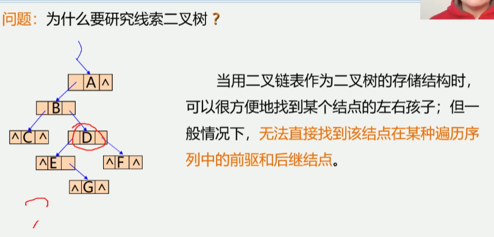
提出的问题:
    如何寻找特定遍历序列中二叉树结点的前驱和后继
解决的方法:
    1.通过遍历寻找-费时间
    2.再增设前驱, 后继指针域-增加了存储负担
    3.利用二叉链表中的空指针域
    
回顾: 二叉树链表中空指针域的数量:
    具有n个结点的二叉链表中, 一共有2n个指针域;
    因为n个结点中有n-1个孩子, 即2n中指针域中,
    有n-1个用来指示结点的左右孩子, 其余n+1个指针域为空
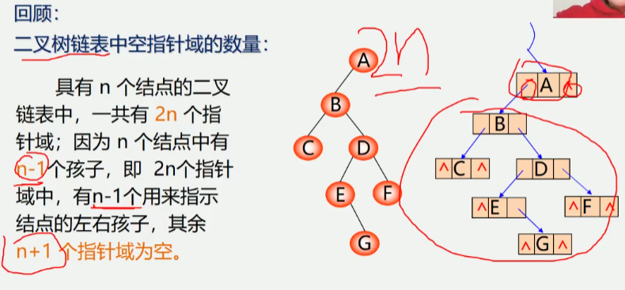

利用二叉链表中的空指针域
    如果某个结点的左孩子为空, 则将空的左孩子指针域改为指向其前驱;
    如果其结点的右孩子为空, 则将空的右孩子指针域改为指向其后继
    -这种改变指向的指针称为"线索"
    加上了线索的二叉树称为(线索二叉树Threaded Binary Tree)
    对二叉树按某种遍历次序使其变为线索二叉树的过程叫线索化
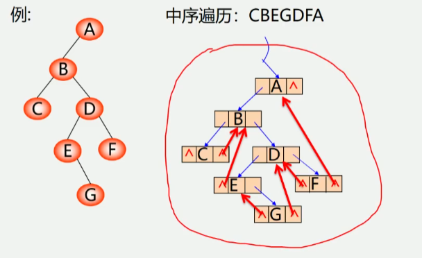

为区分lchild和rchild指针到底是指向孩子的指针, 还是指向前驱或者
后继指针, 对二叉链表中每个结点增设两个标志域ltag和rtag, 并约定:
    ltag = 0 lchild指向该结点的左孩子
    ltag = 1 lchild指向该结点的前驱
    rtag = 0 rchild指向该结点的左孩子
    rtag = 1 rchild指向该结点的后继
这样, 结点的结构为:
[lchild|ltag|data|rtag|rchild]
```
typedef struct BiThrNode {
    int data;
    int ltag, rtag;
    struct BiThrNode *lchild, rchild;
} BiThrNode, *BiThrTree;
```

先序线索二叉树
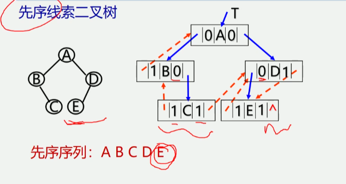
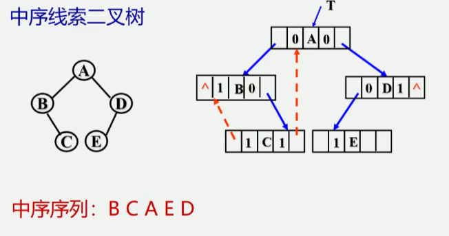
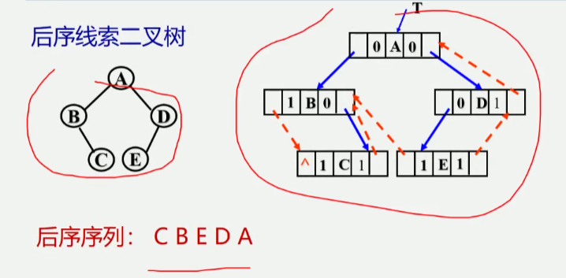


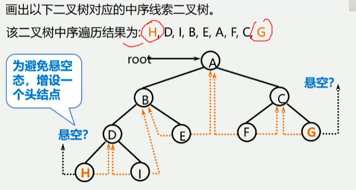
增设了一个头结点:
ltag=0, lchild指向根结点,
rtag=1, rchild指向遍历序列中最后一个结点
遍历序列中第一个结点的lc域和最后一个结点的rc域都指向头结点
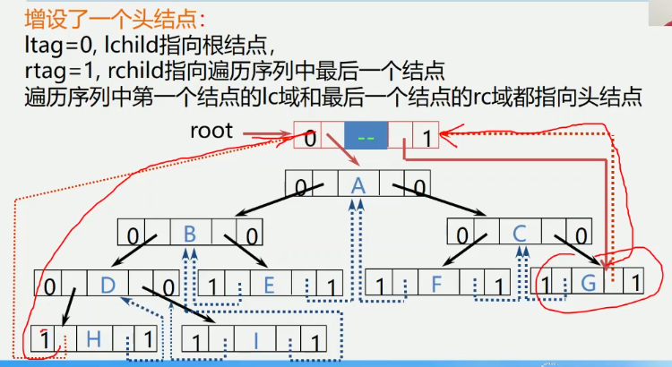

