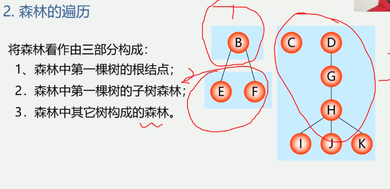
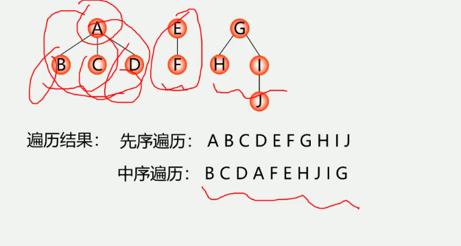

5.6 树和森林


5.6.1 树的存储结构
1.双亲表示法
实现: 定义结构数组, 存放树的结点, 每个结点含两个域
    数据域: 存放结点本身信息
    双亲域: 指示本结点的双亲结点在数组中的位置


特点: 找双亲容易, 找孩子难

C语言的类型描述
结点结构:[data|parent]
```
typedef struct PTNode {
    TElemType data;
    int parent; // 双亲位置域
} PTNode;
树结构
#define MAX_TREE_SIZE 100
typedef struct {
    PTNode nodes[MAX_TREE_SIZE];
    int r,n // 根结点的位置和结点个数
} PTree;
```


2.孩子链表
把每个结点的孩子结点排列起来, 看成一个线性表, 用单链表存储,
则n个结点有n个孩子链表(叶子的孩子链表为空表).
而n个头指针又组成一个线性表, 用顺序表(含n个元素的结构数据)存储

C语言的类型描述
```
孩子结点结构:[child|next]
typedef struct CTNode {
    struct CTNode *next;
    int child; // 双亲位置域
} *ChildPtr;
双亲结点结构:[data|firstchild]
typedef struct {
    TElemType data;
    ChildPtr firstchild; // 孩子链表头指针
} CTBox;
树结构
typedef struct {
    CTBox nodes[MAX_TREE_SIZE];
    int n,r; // 结点树和根结点的位置
} CTree;
```


3 孩子兄弟表示法(二叉树表示法, 二叉链表表示法)
实现: 用二叉链表作树的存储结构, 链表中的每个结点的两个指针域分别指向其
第一个孩子结点和下一个兄弟结点
```
typedef struct CSNode {
    Elemtype data;
    struct CSNode *firstchild, *nextsibling;
} CSNode, *CSTree;
```


树与二叉树的转换
1.将树转化为二叉树进行处理, 利用二叉树的算法来实现对树的操作
2.由于树和二叉树都可以用二叉链表作存储结构, 则以二叉链表作媒介可以
导出树与二叉树之间的一个对应关系
给定一棵树, 可以找到唯一的一颗二叉树与之对应


将树转换为二叉树
1.加线: 在兄弟之间加一连线
2.抹线: 对每个结点, 除了其左孩子外, 去除其与其余孩子之间的关系
3.旋转: 以树的根结点为轴心, 将整数顺时针转45度
树边二叉树: 兄弟相连留长子


将二叉树转换为树
1.加线: 若p结点是双亲结点的左孩子, 则将p的右孩子, 右孩子的右孩子...
沿分支找到的所有右孩子, 都与p的双亲用线连起来
2.抹线: 抹掉原二叉树中双亲与右孩子之间的连线
3.调整: 将结点按层次排列, 形成树结构
二叉树变树: 左孩右右连双亲, 去掉原来右孩线


5.6.2 森林与二叉树的转化
森林转换为二叉树(二叉树与多棵树之间的关系)
1.将各棵树分别转换为二叉树
2.将每棵树根结点为二叉树的根, 再以根结点为轴心, 顺时针选择构成二叉树结构
森林变二叉树: 树变二叉根相连


二叉树转换成森林
1.抹线: 将二叉树中根结点与其右孩子连线, 及沿右分支搜索到的所有右孩子间连线全部抹掉,
使之变成孤立的二叉树
2.还原: 将孤立的二叉树还原成树
二叉树变森林:
去掉全部右孩线, 孤立二叉再还原


5.6.3 树与森林的遍历
1.树的遍历(三种方式)
    先根(次序)遍历
        若树不空, 则先访问根结点, 然后一次先根遍历各棵子树
    后根(次序)遍历
        若树不空, 则先依次后根遍历各棵子树, 然后访问根结点
    按层次遍历:
        若树不空, 则自上而下自左至右访问树中每个结点
   

2.森林的遍历
将森林看作由三部分构成:
1.森林中第一棵树的根结点;
2.森林中第一棵树的子树森林;
3.森林中其他树构成的森林;

先序遍历
若森林不空, 则
1.访问森林中第一棵树的根结点
2.先序遍历森林中第一棵树的子树森林;
3.先序遍历森林中(除第一颗树之外)其余树构成的森林
即: 依次从左至右对森林中的每一棵树进行先根遍历

中序遍历
若森林不空, 则
1.中序遍历森林中第一棵树的子树森林;
2.访问森林中第一棵树的根结点;
3.中序遍历森林中(除第一棵树之外)其余树构成的森林
即: 依次从左至右对森林中的每一棵树进行后根遍历
